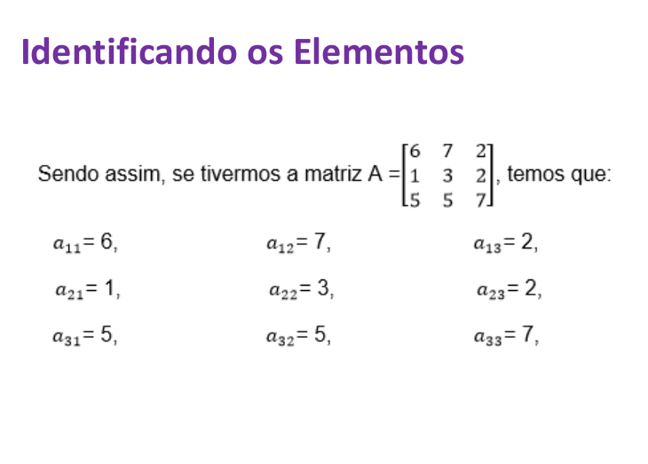
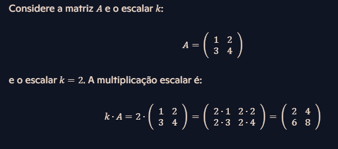
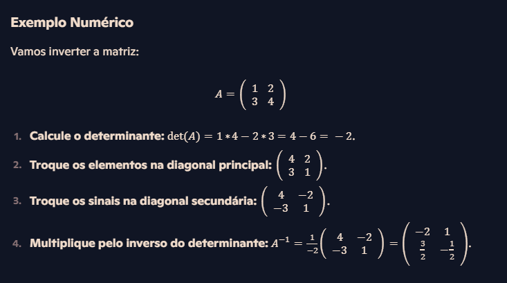
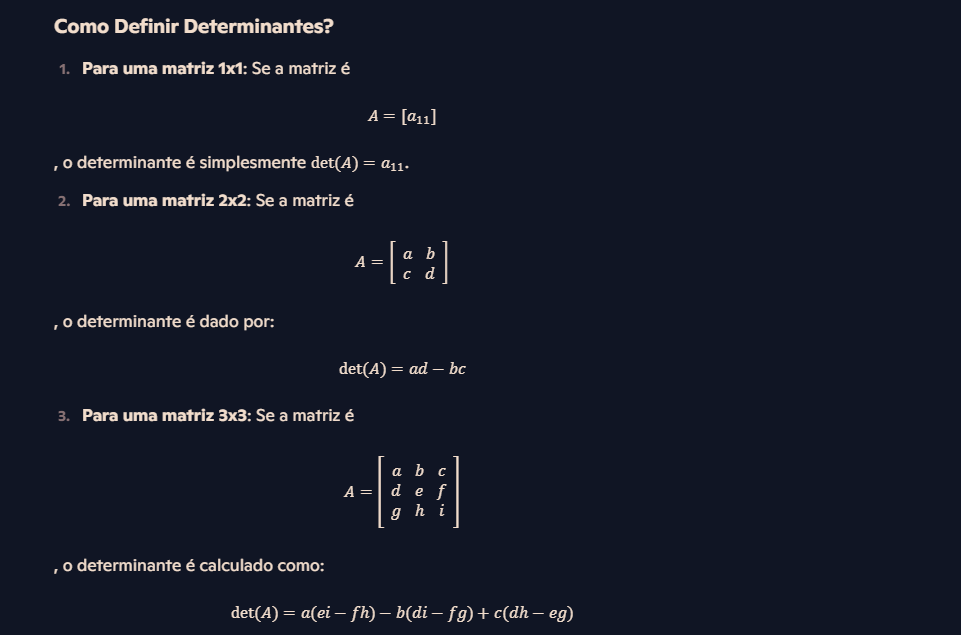
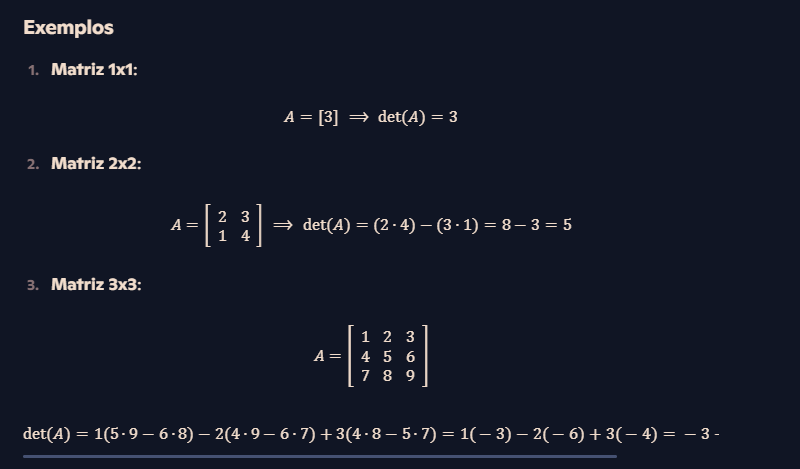
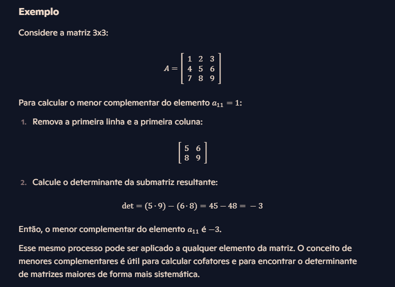
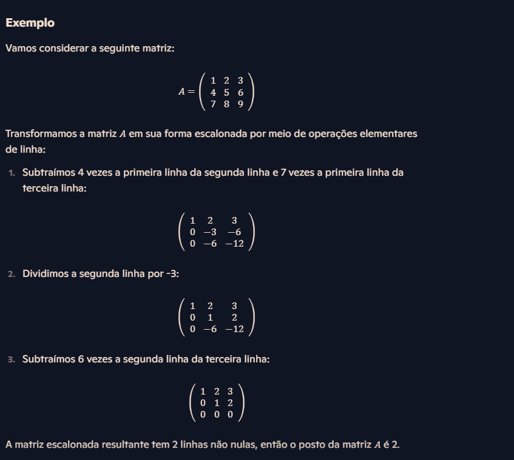

# Álgebra linear

Álgebra linear é o ramo da matemática que estuda vetores, matrizes e transformações lineares. Ela aparece na física, na engenharia, na ciência da computação, na economia e na estatística.

## Conceitos

- **Vetores:** na geometria, objetos com magnitude e direção. De modo mais geral, são os elementos de um espaço vetorial.
- **Matrizes:** tabelas retangulares de números. Representam sistemas de equações lineares e transformações lineares.
- **Sistemas lineares:** conjuntos de equações lineares resolvidos ao mesmo tempo, em busca dos valores das incógnitas.
- **Transformações lineares:** funções entre vetores que preservam a soma e a multiplicação por escalar.
- **Autovalores e autovetores:** escalares e vetores associados a uma transformação linear (ou a uma matriz) que descrevem as direções em que a transformação só estica ou encolhe o vetor.

## Matrizes

Matrizes são tabelas de números organizadas em linhas e colunas. Servem para representar sistemas lineares, transformações lineares e outras operações.

### Definição

Uma matriz é uma coleção de números, chamados elementos, dispostos em m linhas e n colunas. Uma matriz com m linhas e n colunas é do tipo m × n.

```
        | a11  a12  a13 |
A =     | a21  a22  a23 |
        | a31  a32  a33 |
```

O símbolo aᵢⱼ é o elemento da linha i e da coluna j.



A matriz acima tem 3 linhas e 3 colunas. É uma matriz 3 × 3, ou matriz quadrada de ordem 3.

### Tipos

- **Matriz quadrada:** o número de linhas é igual ao número de colunas.

```
| 1  0 |
| 0  1 |
```

- **Matriz diagonal:** matriz quadrada em que todo elemento fora da diagonal principal é zero. O exemplo abaixo é a identidade 3 × 3, que também é diagonal.

```
| 1  0  0 |
| 0  1  0 |
| 0  0  1 |
```

- **Matriz transposta:** a matriz obtida ao trocar linhas por colunas. Se A é m × n, a transposta Aᵀ é n × m.

```
| a  b |      | a  c |
| c  d |  =>  | b  d |
```

- **Matriz retangular:** o número de linhas é diferente do número de colunas. Abaixo, A é 2 × 3 e B é 3 × 2.

```
A = | 1  5  6 |    B = | 1  3 |
    | 5  6  7 |        | 6  4 |
                       | 8  7 |
```

- **Matriz linha e matriz coluna:** a matriz linha tem uma única linha; a matriz coluna tem uma única coluna.

```
A = | 1  2 |    B = | 5 |
                    | 2 |
```

- **Matriz identidade:** matriz quadrada com 1 na diagonal principal e 0 fora dela. É o elemento neutro da multiplicação de matrizes.

```
| 1  0 |
| 0  1 |
```

- **Matriz triangular superior e triangular inferior:** na triangular superior, os elementos abaixo da diagonal principal são zero. Na triangular inferior, os elementos acima da diagonal são zero. No exemplo, A é triangular superior e B é triangular inferior.

```
A = | 3  9 |    B = | 1  0  0 |
    | 0  8 |        | 5  4  0 |
                    | 3  0  7 |
```

### Operações

- **Adição:** duas matrizes só podem ser somadas se tiverem o mesmo tipo (m × n). Soma-se elemento a elemento.

```
| 1  2 |   | 5  6 |   |  6   8 |
| 3  4 | + | 7  8 | = | 10  12 |
```

- **Multiplicação de matrizes:** o produto AB existe quando o número de colunas de A é igual ao número de linhas de B. O elemento da linha i e da coluna j de AB é a soma dos produtos entre a linha i de A e a coluna j de B. Se A é m × n e B é n × p, o produto é m × p.


- **Multiplicação por escalar:** multiplica-se cada elemento da matriz pelo mesmo número.



- **Transposição:** troca-se cada linha pela coluna de mesmo índice. No exemplo, B = Aᵀ.

```
A = | 1  2  3 |         | 1  4 |
    | 4  5  6 |    =>   | 2  5 |
                        | 3  6 |
```

- **Inversão:** a inversa de uma matriz quadrada A é a matriz A⁻¹ tal que A · A⁻¹ = A⁻¹ · A = I, em que I é a identidade. A tem inversa exatamente quando é quadrada e o determinante é diferente de zero.



### Aplicações

- **Sistemas de equações lineares:** resolver várias equações ao mesmo tempo.
- **Transformações lineares:** rotacionar, escalar e refletir vetores.
- **Computação e engenharia:** gráficos, aprendizado de máquina e otimização.

## Determinantes

O determinante é um número associado a uma matriz quadrada. Ele indica, entre outras coisas, se a matriz tem inversa: a matriz é invertível quando o determinante é diferente de zero.



Para matrizes de ordem maior que 3, o determinante pode ser calculado pela expansão de Laplace (expansão em cofatores). O método reduz a matriz a determinantes de submatrizes menores, até chegar às ordens em que a conta é direta.



### Menor complementar

O menor complementar de um elemento aᵢⱼ é o determinante da submatriz que resta depois de apagar a linha i e a coluna j.



### Cofator

O cofator do elemento aᵢⱼ é o menor complementar desse elemento com um sinal:

Cᵢⱼ = (−1)^(i+j) · Mᵢⱼ

Mᵢⱼ é o menor complementar. O sinal (−1)^(i+j) vale +1 quando i+j é par e -1 quando i+j é ímpar. Os cofatores entram no cálculo do determinante e da matriz inversa.

A matriz abaixo é a do exemplo. O cofator calculado é o do elemento a₂₂ = 5.


1. Apagam-se a linha 2 e a coluna 2, que se cruzam no 5. A submatriz que resta é o menor complementar.


2. O determinante dessa submatriz 2 × 2 é

```
(1 · 9) - (3 · 7) = 9 - 21 = -12
```

3. O sinal do cofator na posição (2, 2) é (−1)^(2+2) = (−1)^4 = +1.


4. O cofator é o determinante multiplicado por esse sinal: (+1) · (-12) = -12.


O cofator de a₂₂ é -12.


## Sistemas lineares

Um sistema linear é um conjunto de equações lineares com incógnitas em comum. A solução é o conjunto de valores que satisfaz todas as equações ao mesmo tempo.

```
x - 2y + 4z = 10
```

Nessa equação:

- **Variáveis (incógnitas):** x, y e z.
- **Coeficientes:** 1, -2 e 4, nesta ordem. São os números que multiplicam as incógnitas.
- **Termo independente:** 10. É o número que não multiplica variável nenhuma.

Com duas incógnitas, uma equação linear descreve uma reta: os coeficientes definem a direção e o termo independente desloca a reta. Com três incógnitas, a equação descreve um plano.

A solução de uma equação é o conjunto de valores das incógnitas que a tornam verdadeira. Num sistema, esses valores precisam servir para todas as equações. Pode haver uma solução, infinitas soluções ou nenhuma. Os métodos usuais são substituição, eliminação e, quando a matriz dos coeficientes é invertível, a matriz inversa.

### Matriz completa

A matriz completa (matriz aumentada) junta os coeficientes e os termos independentes. Na figura, o sistema é

```
2x + 3y = 5
4x -  y = 1
```

e a matriz aumentada correspondente é

```
| 2   3  |  5 |
| 4  -1  |  1 |
```

À esquerda da barra ficam os coeficientes de x e de y. À direita, os termos independentes.


### Matriz incompleta

A matriz incompleta (matriz dos coeficientes) guarda só os coeficientes, sem a coluna dos termos independentes. No mesmo sistema:

```
| 2   3 |
| 4  -1 |
```


### Matriz escalonada

[Matriz escalonada: artigo da UFSC em PDF](http://mtm.ufsc.br/~gatcosta/GA-Fis-e-Eng/Escalonamento.pdf)

Uma matriz escalonada tem forma de degrau. Nesta convenção:

- Em cada linha não nula, o primeiro elemento não nulo é 1. Esse elemento é o pivô.
- Abaixo de cada pivô, os elementos da coluna são zero.
- O pivô de cada linha fica à direita do pivô da linha de cima.
- Linhas inteiramente nulas ficam na parte de baixo.

```
1  2  3
0  1  4
0  0  1
```

Na forma escalonada reduzida, os elementos acima de cada pivô também são zero.

### Exemplo sem solução

Sistema:

```
x + 2y = 1
2x + 4y = 4
```

Matriz aumentada:

```
1  2  |  1
2  4  |  4
```

Multiplica-se a segunda linha por 1/2:

```
1  2  |  1
1  2  |  2
```

Subtrai-se a primeira linha da segunda:

```
1  2  |  1
0  0  |  1
```

A segunda linha diz que 0 = 1. Essa contradição mostra que o sistema não tem solução. Nas equações:

```
x + 2y = 1
0 = 1
```

## Teorema de Rouché-Capelli

O teorema de Rouché-Capelli diz que um sistema linear tem solução se, e somente se, o posto da matriz dos coeficientes é igual ao posto da matriz aumentada.

- Se os postos são iguais, o sistema tem solução (uma ou infinitas).
- Se os postos são diferentes, o sistema não tem solução.

### Posto

O posto de uma matriz é o número de linhas linearmente independentes, que coincide com o número de colunas linearmente independentes. É a dimensão do espaço gerado pelas linhas (ou pelas colunas).

Para obtê-lo, escalona-se a matriz por operações elementares de linha. O posto é o número de linhas não nulas da forma escalonada.



- **Posto completo:** o posto é igual ao menor valor entre o número de linhas e o de colunas.
- **Posto incompleto:** o posto é menor que esse valor.

### Exemplo

Sistema:

```
x + 2y +  z = 1
2x + 3y +  z = 2
3x + 5y + 2z = 3
```

Matriz dos coeficientes:

```
1  2  1
2  3  1
3  5  2
```

Matriz aumentada:

```
1  2  1  |  1
2  3  1  |  2
3  5  2  |  3
```

Depois do escalonamento, a matriz dos coeficientes fica

```
1   2   1
0  -1  -1
0   0   0
```

Há duas linhas não nulas, então o posto é 2.

A matriz aumentada fica

```
1   2   1  |  1
0  -1  -1  |  0
0   0   0  |  0
```

O posto também é 2.

Os postos coincidem, então o sistema tem solução. Há 3 incógnitas e o posto é 2, menor que 3, então sobra uma incógnita livre e as soluções são infinitas. O sistema é possível e indeterminado. Uma descrição das soluções, com z livre:

```
x = 1 + z
y = -z
z = z
```

### Classificação

1. **Possível e determinado.** Há uma única solução. O posto da matriz dos coeficientes é igual ao posto da matriz aumentada, e esse posto é igual ao número de incógnitas.

```
x + y = 2
2x - y = 1
```

```
1   1          1   1  |  2
2  -1          2  -1  |  1
```

O posto das duas matrizes é 2, igual ao número de incógnitas. A solução é única: x = 1, y = 1.

2. **Possível e indeterminado.** Há infinitas soluções. Os dois postos são iguais, e esse valor é menor que o número de incógnitas.

```
x + y = 2
2x + 2y = 4
```

```
1  1          1  1  |  2
2  2          2  2  |  4
```

O posto das duas matrizes é 1, e há 2 incógnitas. As equações descrevem a mesma reta, então há infinitas soluções.

3. **Impossível.** Não há solução. O posto da matriz dos coeficientes é diferente do posto da matriz aumentada.

```
x + y = 1
2x + 2y = 3
```

```
1  1          1  1  |  1
2  2          2  2  |  3
```

O posto dos coeficientes é 1 e o da matriz aumentada é 2. As equações descrevem retas paralelas, que não se cruzam.

Resumo:

- **Possível e determinado:** posto dos coeficientes = posto da aumentada = número de incógnitas.
- **Possível e indeterminado:** posto dos coeficientes = posto da aumentada, e esse posto é menor que o número de incógnitas.
- **Impossível:** posto dos coeficientes ≠ posto da aumentada.

## Espaços vetoriais

Um espaço vetorial é um conjunto de vetores no qual estão definidas a soma de vetores e a multiplicação por escalar, e essas operações obedecem aos axiomas abaixo.

### Definição

Um espaço vetorial V sobre um corpo K (em geral os números reais ℝ ou os complexos ℂ) é um conjunto com duas operações, a adição de vetores e a multiplicação por escalar, que satisfazem:

1. **Adição comutativa:** u + v = v + u, para todos u, v ∈ V.
2. **Adição associativa:** (u + v) + w = u + (v + w), para todos u, v, w ∈ V.
3. **Elemento neutro da adição:** existe um vetor 0 ∈ V tal que u + 0 = u, para todo u ∈ V.
4. **Inverso aditivo:** para cada u ∈ V, existe -u ∈ V tal que u + (-u) = 0.
5. **Distributividade do escalar sobre a soma de vetores:** a(u + v) = au + av, para todos a ∈ K e u, v ∈ V.
6. **Distributividade da soma de escalares:** (a + b)u = au + bu, para todos a, b ∈ K e u ∈ V.
7. **Associatividade da multiplicação por escalar:** a(bu) = (ab)u, para todos a, b ∈ K e u ∈ V.
8. **Elemento neutro da multiplicação por escalar:** 1 · u = u, para todo u ∈ V, em que 1 é o neutro multiplicativo de K.

A soma de dois vetores de V continua em V, e o produto de um escalar de K por um vetor de V também continua em V. As operações são fechadas.

### Exercícios

Itens marcados como verdadeiros:

- [v] A. O elemento neutro de um espaço vetorial é único.
- [v] B. Para qualquer número α, α · 0 = 0.
- [v] C. Quaisquer que sejam a, b ∈ ℝ e v ∈ V, (a - b) · v = a · v - b · v.
- [v] D. Sendo α ∈ ℝ e v ∈ V, a igualdade α · v = 0 vale se, e somente se, α = 0 ou v = 0.
- [v] E. O conjunto dos números reais é um espaço vetorial sobre ele mesmo.
- [v] F. Para todo v ∈ V, 0 · v = 0.
- [v] G. Para todo α ∈ ℝ e todo v ∈ V, (-α) · v = α · (-v) = -(α v).
- [v] H. O conjunto das matrizes m × n com entradas reais, M(m×n, ℝ), é um espaço vetorial sobre ℝ.
