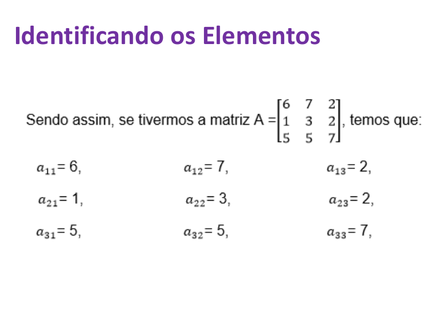
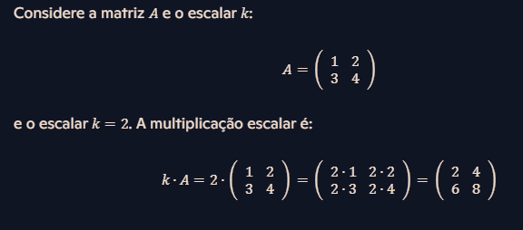
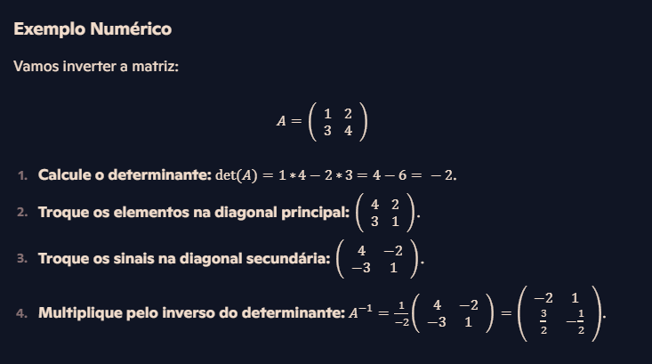
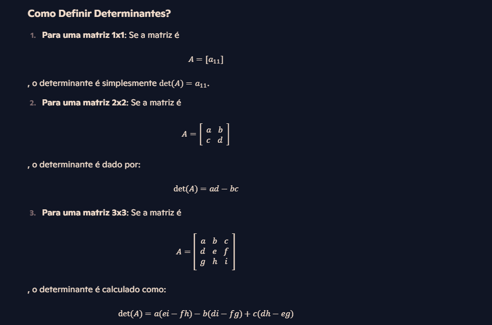
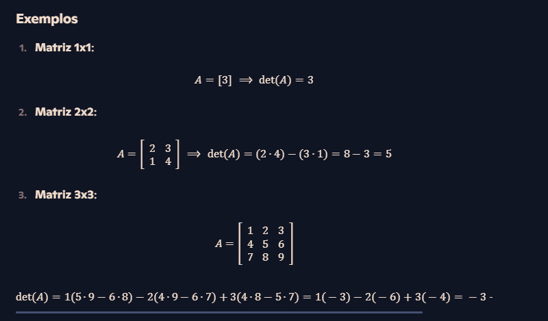
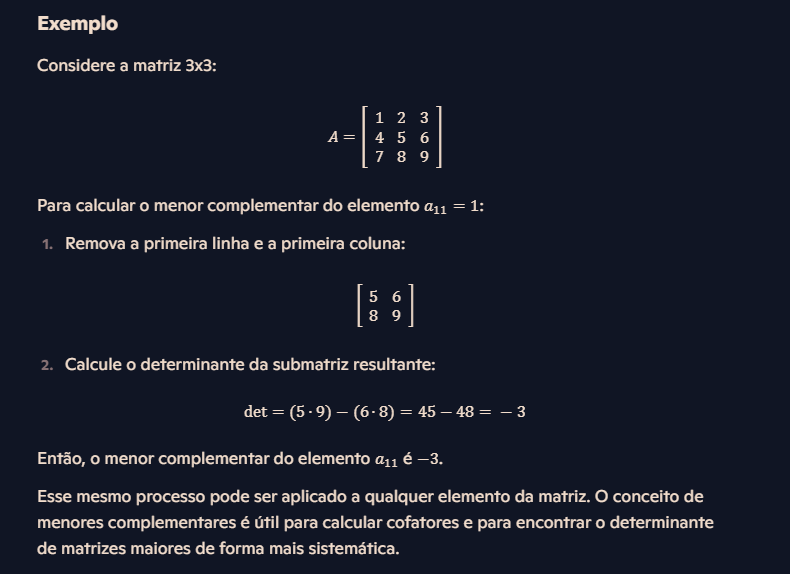

# Anotações sobre meus estudos de algebra linear

Algebra Linear é um ramo da matemática que lida com vetores, matrizes e transformações lineares. É fundamental em muitas areas, como física, engenharia, ciencia da computação, economia e estatistica.

### Conceitos chave em Algebra Linear.
- Vetores: Objetos que tem megnitude e direção. Eles podem ser representados em várias dimensões.
- Matrizes: Estruturas retangulares de numeros que podem representar sistemas de equações lineares ou tranformações lineares.
- Sistemas Lineares: Conjunto de equações lineares que podem ser resolvidos para encontrar valores de variaveís.
- Transformações Líneares: Funções que mapeiam vetores para outros vetores de uma maneira que preserva operações de adição e multiplicação por escalar.
- Autovalores e Autovetores: Valores e vetores associados a matrizes que são fundamentais em muitos problemas de Algebra linear.


## Matrizes:
matrizes são tabelas de numeros organizadas em linhas e colunas. Elas são usadas para representar sistemas de equações lineares, realizar transformações lineares e outras operações matematicas.

### 1. Definição
Uma matriz é uma coleção de numeros dispostos em um retangulo, chamados elementos, organizados em linhas (horizontais) e colunas (verticais).

```
|a11 a12 a13|
|a21 a22 a23|
|a31 a32 a33|

```

Nessa matriz de exemplo, Aij representam o elemento na linha {i} e coluna {j}.



### 2. Operação com matrizes:
- Adição: Duas matrizes só podem ser somadas se tiverem o mesmo tamanho, somando elemento a elemento
````
A =|1 2| + B = |5 6|    C = |1+5 2+6|== | 6  8|
   |3 4|       |7 8|        |3+7 4+8|   |10 12|
````
- Multiplicação de matrizes: As duas matrizes só podem ser multiplicadas se o numero de colunas da matriz "A" for o mesmo do numero de linhas da matriz "B". Multiplique o primeiro elemento da primeira linha, com o primeiro


- Multiplicação por escalar: A multiplicação escalar envolve um unico numero (escalar) e uma matriz. Cada elemento da matriz é multuiplicado pelo escalar.



- Transposição de matrizes: A transposição de matrizes envolve trocar suas linhas por culonas.
````
A = |1 2 3|;      B |1 4|
    |4 5 6|   =>    |2 5|
                    |3 6|
````
- Inversao de matrizes: A inversão de uma matriz A é uma matriz A-¹ que resulta na matriz identidade I. Nem todas as matrizes tem inversa, para isso ela deve ser uma matriz quadrada, ou seja, ter o mesmo numero de linhas e colunas e deve ter uma determinante diferente de zero.




### 3. Tipos especificos de matrizes:
- Matriz quadrada: Quando a matriz apresenta o mesmo numero de linhas e colunas.

```
|1 0 |
|0 1 |
```
- Matriz diagonal: Uma matriz qiadrada onde todos os elementos fora da diagonal principal são zero.
```
|1 0 0|
|0 1 0|
|0 0 1|
```
- Matriz Transposta: A matriz obtida ao trocar as linhas e colunas de uma matriz original.

```
|a b| => |a c|
|c d|    |b d|
```
- Matriz retangular: Uma matriz em que o numero de linhas difere do numero de colunas.
````
A = |1 5 6|;    B |1 3|
    |5 6 7|       |6 4|
                  |8 7|
````
- Matriz de linha e uma matriz coluna: Uma matriz linha é uma que tem apenas uma linha, e uma matriz coluna é uma que contem apenas uma coluna.
```
A = |1 2|; B = |5|
               |2|
```
- Matriz unidade ou identidade: é uma matriz quadrada em que os elementos da diagonal principal são iguais a 1 e os que estao fora são igual a zero.
```
|1 0|
|0 1|
```
- Matriz triangular superior e matriz triangular inferior:
```
A = |3 9|;    B= |1 0 0|
    |0 8|        |5 4 0|
                 |3 0 7|
```


### 4. Aplicações:
- Sistemas de equações lineares: Resolver multiplas equações simultaneas.
- Transformações Lineares: Rotacionar, escalar e transformar vetores.
- Ciencia da computaç~eo e engenharia: Usadas em graficos de computadores, aprendizado de maquina e otimizaçao.


## Determinantes:
O determinante é uma função matemática associada a matrizes quadradas (matrizes com o mesmo numero de linhas e colunas) em algebra linear. Ele é um valor escalar que pode ser usado para determinar certas propriedades da matriz, como a invertibilidade (se a matriz tem ou nao ma inversa).



Para matrizes maiores que 3x3, o determinante pode ser calculado ultilizando a regra de Laplace ou expansão em cofatores. Este método envolve dividir a matriz em submatrizes menores até que possamos aplicar as definições anteriores.



### Menor complementar
O menor complementar esta relacionado a forma de calcular o determinante de matrizes de uma ordem superior.


### Definindo o menor complementar
O menor completmentar de um elemento a_(ij) de uma matriz é o determinante da submatriz que resulta da exclusão da linha i e da coluna j onde o elemento a_(ij) esta localizado. Em outras palavras, para encontrar o menor complementar de um elemento em uma matriz, você deve remover a linha e a coluna desse elemento e calcular o determinante da matriz menor resultante.




### Cofator:
O cofator é um conceito ligado diretamente ao menor complementar. Ele é essencial para o calculo de determinantes e também para encontrar a inversa de uma matriz.

### Definição de cofator
O cofator C_(ij) de um elemento a_(ij) de uma matriz é o menor complementar de A_(ij), multiplicado por (-1). Assim não fica muito facil de entender, então vamos pro processo desde o inicio. O processo tem 4 partes. Vamos usar uma matriz 3x3.


A partir dessa matriz "A_(ij)", vamos encontrar o cofator do elemento na posição (2,2), que é o numero 5.

- 1. Primeiramente vamos remover as colunas que contem o elemento 5, que é o elemento so qual vamos buscar o cofator. Isso resultará na matriz menor complementar.


- 2. Calculando o determinante da matriz menor complementar:
````
   Determinante = (1x9) - (3x7) = 9-21 = -12
````

- 3. Aplicando o sinal: O sinal é dado por (-1)¬i+j, onde i e j são os indices do elemento. Nesse caso, i=2 e j=2:


- 4. Multiplicando o determinante pelo sinal e encontrando o cofator do elemento (2,2):


Então, o cofator do elemento 5 na matriz A é -12. Isso pode ser visto dessa forma:

