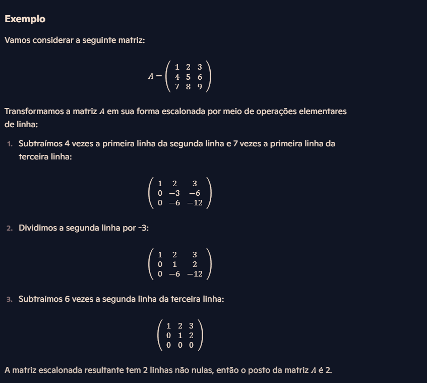

# Anotações sobre meus estudos de algebra linear

Algebra Linear é um ramo da matemática que lida com vetores, matrizes e transformações lineares. É fundamental em muitas areas, como física, engenharia, ciencia da computação, economia e estatistica.

### Conceitos chave em Algebra Linear.
- Vetores: Objetos que tem megnitude e direção. Eles podem ser representados em várias dimensões.
- Matrizes: Estruturas retangulares de numeros que podem representar sistemas de equações lineares ou tranformações lineares.
- Sistemas Lineares: Conjunto de equações lineares que podem ser resolvidos para encontrar valores de variaveís.
- Transformações Líneares: Funções que mapeiam vetores para outros vetores de uma maneira que preserva operações de adição e multiplicação por escalar.
- Autovalores e Autovetores: Valores e vetores associados a matrizes que são fundamentais em muitos problemas de Algebra linear.


## Matrizes:
matrizes são tabelas de numeros organizadas em linhas e colunas. Elas são usadas para representar sistemas de equações lineares, realizar transformações lineares e outras operações matematicas.

### 1. Definição
Uma matriz é uma coleção de numeros dispostos em um retangulo, chamados elementos, organizados em "m" linhas (horizontais) e "n" colunas (verticais).

```
 Matriz A = |a11 a12 a13| Essa matriz pode ser chamada de A(m.n)
            |a21 a22 a23| ou seja, a matriz A tem "m" linhas vezes "n" colunas.
            |a31 a32 a33|

```

Nessa matriz de exemplo, Aij representam o elemento na linha {i} e coluna {j}.


Note que a matriz a cima tem 3 linhas e 3 colunas, sendenominada de matriz 3x3, ou matriz quadrada de ordem 3.

### 3. Tipos especificos de matrizes:
- Matriz quadrada: Quando a matriz apresenta o mesmo numero de linhas e colunas.

```
|1 0 |
|0 1 |
```
- Matriz diagonal: Uma matriz qiadrada onde todos os elementos fora da diagonal principal são zero. 3x2
```
|1 0 0|
|0 1 0|
|0 0 1|
```
- Matriz Transposta: A matriz obtida ao trocar as linhas e colunas de uma matriz original.

```
|a b| => |a c|
|c d|    |b d|
```
- Matriz retangular: Uma matriz em que o numero de linhas difere do numero de colunas.
````
A = |1 5 6|;    B |1 3|
    |5 6 7|       |6 4|
                  |8 7|
````
- Matriz de linha e uma matriz coluna: Uma matriz linha é uma que tem apenas uma linha, e uma matriz coluna é uma que contem apenas uma coluna.
```
A = |1 2|; B = |5|
               |2|
```
- Matriz unidade ou identidade: é uma matriz quadrada em que os elementos da diagonal principal são iguais a 1 e os que estao fora são igual a zero.
```
|1 0|
|0 1|
```
- Matriz triangular superior e matriz triangular inferior:
```
A = |3 9|;    B= |1 0 0|
    |0 8|        |5 4 0|
                 |3 0 7|
```


### 2. Operação com matrizes:
- Adição: Duas matrizes só podem ser somadas se tiverem o mesmo tamanho, somando elemento a elemento
````
A =|1 2| + B = |5 6|    C = |1+5 2+6|== | 6  8|
   |3 4|       |7 8|        |3+7 4+8|   |10 12|
````
- Multiplicação de matrizes: As duas matrizes só podem ser multiplicadas se o numero de colunas da matriz "A" for o mesmo do numero de linhas da matriz "B". Multiplique o primeiro elemento da primeira linha, com o primeiro


- Multiplicação por escalar: A multiplicação escalar envolve um unico numero (escalar) e uma matriz. Cada elemento da matriz é multuiplicado pelo escalar.


- Transposição de matrizes: A transposição de matrizes envolve trocar suas linhas por culonas.
````
A = |1 2 3|;      B |1 4|
    |4 5 6|   =>    |2 5|
                    |3 6|
````
- Inversao de matrizes: A inversão de uma matriz A é uma matriz A-¹ que resulta na matriz identidade I. Nem todas as matrizes tem inversa, para isso ela deve ser uma matriz quadrada, ou seja, ter o mesmo numero de linhas e colunas e deve ter uma determinante diferente de zero.


### 3.


### 4. Aplicações:
- Sistemas de equações lineares: Resolver multiplas equações simultaneas.
- Transformações Lineares: Rotacionar, escalar e transformar vetores.
- Ciencia da computaç~eo e engenharia: Usadas em graficos de computadores, aprendizado de maquina e otimizaçao.


## Determinantes:
O determinante é uma função matemática associada a matrizes quadradas (matrizes com o mesmo numero de linhas e colunas) em algebra linear. Ele é um valor escalar que pode ser usado para determinar certas propriedades da matriz, como a invertibilidade (se a matriz tem ou nao ma inversa).


Para matrizes maiores que 3x3, o determinante pode ser calculado ultilizando a regra de Laplace ou expansão em cofatores. Este método envolve dividir a matriz em submatrizes menores até que possamos aplicar as definições anteriores.


### Menor complementar
O menor complementar esta relacionado a forma de calcular o determinante de matrizes de uma ordem superior.


### Definindo o menor complementar
O menor completmentar de um elemento a_(ij) de uma matriz é o determinante da submatriz que resulta da exclusão da linha i e da coluna j onde o elemento a_(ij) esta localizado. Em outras palavras, para encontrar o menor complementar de um elemento em uma matriz, você deve remover a linha e a coluna desse elemento e calcular o determinante da matriz menor resultante.


### Cofator:
O cofator é um conceito ligado diretamente ao menor complementar. Ele é essencial para o calculo de determinantes e também para encontrar a inversa de uma matriz.

### Definição de cofator
O cofator C_(ij) de um elemento a_(ij) de uma matriz é o menor complementar de A_(ij), multiplicado por (-1). Assim não fica muito facil de entender, então vamos pro processo desde o inicio. O processo tem 4 partes. Vamos usar uma matriz 3x3.


A partir dessa matriz "A_(ij)", vamos encontrar o cofator do elemento na posição (2,2), que é o numero 5.

- 1. Primeiramente vamos remover as colunas que contem o elemento 5, que é o elemento so qual vamos buscar o cofator. Isso resultará na matriz menor complementar.


- 2. Calculando o determinante da matriz menor complementar:
````
   Determinante = (1x9) - (3x7) = 9-21 = -12
````

- 3. Aplicando o sinal: O sinal é dado por (-1)¬i+j, onde i e j são os indices do elemento. Nesse caso, i=2 e j=2:


- 4. Multiplicando o determinante pelo sinal e encontrando o cofator do elemento (2,2):


Então, o cofator do elemento 5 na matriz A é -12. Isso pode ser visto dessa forma:


## Sistema Línear

Um sistema linear consiste em um conhjunto de equações lineares que tem variáveis desconhecidas em comum. Basicamente, você esta procurando valores que satisfaçam todas as equações ao mesmo tempo. Aqui está um exemplo simples de um sistema linear:

````
x - 2y + 4z = 10
````
- Variaveis: x, z, e y
- Coeficientes: 2, 4
- Termno Independente: 10

### Coeficiente
Os coeficientes são os numeros que multiplicam as variaveis em uma equação. No exemplo a cima, 1, 2 e 4 são os coeficiente de y e z, respectivamente. Eles determinam a inclinação na linha do grafico.

### Variaveis (Incognitas)
As variáveis são os elementos desconhecidos que estamos tentando encontrar. No Exemplo anterior, x, y, z são essas variaveis. Em um sistema linear as variaveis podem ser qualquer numero e são os valores que satisfazem todas as equações do sistema simultaneamente.

### Termo Independente
O termo independente é o valor que aparece sozinho na equação, sem multiplicação por uma variavel. No exemplo dado, 10 é o termo independente. Este valort determina a interseção da linha do eixo correspondente no grafico.

### Solução da Equação
A solução da equação é o conjunto de valores para as variaveis que tornam a equação verdadeira. Em um sistema de equações lineares, a solução é o conjunto de valores que satisfaz todas as equações do sistema ao mesmo tempo. Dependendo do sistema pode haver uma solução unica, infinitas ou nenhuma. Para encontrar a solução de um sistema linear pode ser usado métodos como substituição, eliminação ou matriz inversa.

### Matriz completa
Uma matriz completa (ou matriz aumentada) de um sistema linear é uma matriz que inclui tanto os coeficiantes das variaveis quanto os termos independentes das equações. Exemplo:


Os numeros a esquerda da barra representam os coeficientes das variaveis x e y, e os nmumeros á direita da barra representam os termos independentes.

### Matriz incompleta

Uma matriz incompleta (ou matriz dos coeficientes) inclui apenas os coeficientes das variaveis nas equações, sem os termos independentes. Ussando o mesmo exemplo:


Ela considera apenas os coeficientes das variaveis x e y, ignorando os termos independentes.

### Matriz Escalonada
[Matriz escalonada: Artigo da UFSC em PDF](http://mtm.ufsc.br/~gatcosta/GA-Fis-e-Eng/Escalonamento.pdf)
Uma matriz escalonada é uma matriz que tem forma  de um "degrau" ou "escada", onde cada linha subsequente possui pelo menos um zero a mais a esquerda do que a linha anterior. Criterios de uma matriz escalonada:

- Linha nao nula: Se uma linha nao é inteiramente composta por zeros, o primeiro numero nao zero deve ser 1 (chamado de pivô).

- Zeros abaixo do pivô: todos os numeros a baixo do pivô são zeros.

- Posição dos pivos: O pivo de cada linha deve estar a direita do puivo da linha anterior.

- Linhas nulas:n Qualquer linha que seja completamente composta de zeros deve estar na aprte inferior da matriz.
````
  1 2 3
  0 1 4
  0 0 1
````

### Solução de um sistema linear

resolvendo um sistema linear:

- Escreva a matriz aumentada
````
1 2 | 1
2 4 | 7
````

- Aplique transformações elementares de linha para obter uma matriz escalonada. Noso objetivo é zerar o elemento abaixo do pivô (primeiro elemento da primeira coluna).

````
1 2 | 1                                                1 2 | 1
2 4 | 4    Aqui multiplicaremos a linha 2 por 1/2      1 2 | 2

1 2 | 1                                                 1 2 | 1
1 2 | 2    Aqui vamos subtrair a linha 2 pela linha 1   0 0 | 1

````

- Observação: Aqui percebemos que o resultado da segunda linha é 0 = 1, o que é uma contradição. Isso significa que o resultado da contradição é inconsistente e nao tem solução.

-  Vamos reproduzir  o sistema linear a partir da matriz escalonada.
````
  x + 2.y = 1
0.x + 0.y = 1
````
Isso significa que o sistema linear aui apresentado nao tem solução.

## Teorema de Rouché-Capelli

O teorema de Rouche-Capelli afirma que um sistema de equalções lineares tem solução se, e somente se, o posto da matriz dos coeficientes (matriz incompleta) é igual ao posto da matriz aumentada (matriz completa) é igual ao posto da matriz aumentada (matriz completa). Se os postos são iguais, entao o sistema tem uma ou infinitas soluções; se os postos são diferentes, o sistema nao tem solução.

- Exemplo:
````
x + 2y+ z = 1
2x + 3y +z = 2
3x + 5y +2z = 3
````

- Matriz incompleta:
````
1 2 1
2 3 1
3 5 2 
````

- Matriz completa
````
1 2 1 | 1
2 3 1 | 2
3 5 2 | 3
````
### O posto da matriz
O poto da matriz é o numero de linhas  (ou colunas) linearmente independente em uma matriz. Em outras palavras, o posto indica a dimensão do espaço gerado pelas linhas (ou colunas) da matriz. O conceito de posto é fundamental na algebra linear, pois ajuda a determinar várias propriedades das matrizes e dos sistemas de equalções lineares.

### determinando o posto da matriz

Para encontrar o psoto de uma matriz, geralmente transformamos a matriz em sua forma escalonada (ou escalonada reduzida) por meio de operações elementares de linha. O numero de linha nao nulas na matriz escalonada é o posto da matriz.



- Posto Completo: Uma matriz tem posto completo se o posto for igual ao menor valor entre o numero de linhas e colunas da matriz. Nesse caso, a matriz é de posto completo.

- Posto incompleto: Se o posto for menor que o menor valor entre o numero de linhas e colunas, a matriz é de postto incompleto.

### Calcular os postos das matrizes:
Para calcular o posto, transformamos as matrizes em suas formas escalonadas.

- matriz completa escalonada
````
1  2  1
0 -1 -1
0  0  0
````
O posto da matriz imcompleta A é 2 (duas linhas nao nulas).
- Matriz incompleta escalonada
````
1  2  1  |  1
0 -1 -1  |  0
0  0  0  |  0
````
O posto da matriz completa  também é 2 (duas linhas nao nulas)

### Aplicar o teorema de Rouche-capeli
Como o posto da matriz dos coeficientes (2) é igual ao posto da matriz aumentada (2), o sistema é compativel determinado (tem solução unica).

- 1. Sistema Possivel e Determinado: Um sistema é possivel e determinado quando ele possui uma splução unica. Isso ocorre quando oi posto da matriz dos coeficientes (matriz incompleta) é igual ao posto da matriz completa, e esse posto é igual ao numero de variaveis do sistema. Considere o exemplo:
````
   x +  y =  2
  2x -  y =  1

A matriz dos coeficientes e a matriz aumentada são:
  1  1
  2 -1
e
  1  1  |  2
  2 -1  |  1
````

O posto de ambas as matrizes é 2, igual ao numero de variaveis (2), entao o sistema tem uma solução unicos.

- 2. Sistema Possivel e Indeterminado: Um sistema possivel e indeterminado é quando ele possui infinitas soluções. Isso ocorre quando o posto matriz dos coeficientes é igual ao posto da matriz aumentada, mas esse posto é menor que o numero de variaveis do sistema.
````
   x +  y  =  2
  2x -  2y =  2

A matriz dos coeficientes e a matriz aumentada são:
  1  1
  2  2
e
  1  1  |  1
  2  2  |  2
````

O posto de ambas as matrizes é 1 (menor que o numero de variaveis que é 2), entao o sistema tem nfinitas soluções. A equações são dependentes e representam a mesma reta.

- 3. Sistema Impossivel
Um sistema é impossivel quando ele não possui solução. isso ocorre quando o posro da matriz dos coeficientes pe diferente do posro da matriz aumentada.
````
   x +  y =  1
   x -  y =  2

A matriz dos coeficientes e a matriz aumentada são:
  1  1
  2  1
e
  1  1  |  1
  2  1  |  2
````

O posto da matriz dos coeficientes é 1, mas o posto da matriz aumentada é 2, entao o sistema é inconsistente e nao temn solução. As equações representam retas paralelas que nunca se intersectam.

- Sistema Possível e Determinado: Posto (matriz coeficientes) = Posto (matriz aumentada) = Número de variáveis

- Sistema Possível e Indeterminado: Posto (matriz coeficientes) = Posto (matriz aumentada) < Número de variáveis

- Sistema Impossível: Posto (matriz coeficientes) ≠ Posto (matriz aumentada).

## Espaços Vetoriais

Os Espaços Vetoriais são estruturas matemáticas fundamentais em algebra linear e em diversas áreas da ciência. Um espaço Vetorial é um conjunto de vetores que pode ser adicionados entre si e multiplicado por escalares, obedece a certas regras especificas.

### Definição Formal

Um espaço vetorial `V` sobre um corpo `K` (geralmente s numeros reais `R` ou os números complexos `C`) é um conjunto de elementos chamados vetores, juntamente com duas operações: adição de vetores e multiplicação por escalares, que satisfazem os seguintes axiomas:

- 1. Adição Comutativa: ` u + v = v + u ` para todos ` u, v, ∈ V `.
- 2. Adição Associativa: `(u + v) + w = u + (v + w) ` para todos ` u, v, w, ∈ V `.
- 3. Elemento Neutro da Adição: Existe um vetor zero `0 ∈ V` tal que `u + 0 = u` para todo `u ∈ V`.
- 4. Elemento Inverso da Adição: Para cada vetor `v ∈ V`, existe um vetor `-u ∈ V` tal que `u + (-u) = 0`.
- 5. Multiplicação por Escalar: `a(u + v) = au + av e (a + b)u = au + bu` para todos `a, b, ∈ K e u, v ∈ V`.
- 6. Associatividade da Multiplicação por Escalar: `a(bu) = (ab)u ` para todos `a, b ∈ K e u ∈ V`.
- 7. Elemento Neutro da Multiplicação por Escalar: `1u = u` para todos `u ∈ V`, onde `1` é o elemento neutro multiplicativo do corpo `K`.

### Propriedades Fundamentais dos Espaços Vetoriais

Os espaços vetoriais têm várias propriedades fundamentais que são essenciais para sua definição e uso. Essas propriedades garantem que os vetores em um espaço vetorial possam ser manipulados de forma consistente e previsível.

- 1. Fechamento sob Adição: Para quais quer vetores `u,v ∈ V`, o vetor `u + v` também pertence a `V`.
- 2. Comutativa da Adição: Para quaisquer vetores `u, v ∈ V`, vale que `u + v = v + u`.
- 3. Associatividade da Adição: Para quaisquer vetores `u, v, w ∈ V`, vale que `(u + v) + w = u + (v + w)`.
- 4. Existencia do Elemento Neutro da Adição: Existe um vetor `0 ∈ V` (chamado de vetor nulo) tal que para todo `v ∈ V, v + 0 = v`.
- 5. Existencia do inverso aditivo: Para cada `v ∈ V`, exite um vetor `-v ∈ V` tal que `v + (-v) = 0`.
- 6. Fechamento sob a multiplicação por escalar: Para qualquer escalar `a (do corpo associado)` e qualquer vetor `v ∈ V`, o vetor `a * v` pertence a `V`.
- 7. Distributividade do Escalar Sobre a Adição de Vetores: Para quaisquer escalares `a` e vetores `u, v ∈ V`, vale que `a * (u + v) = a.u + a * v`.
- 8. Distributividade do escalar sobre a adição de escalares: Para quaisquer escalares `a, b` e vetor `v ∈ V` vale que `(a + b) * v = a * v + b * v.`.

### Resolução de Exercicios Sobre Espaços Vetoriais

- [v]A. O elemento neutro de um espaço vetorial é unico.
- [v]B. Para qualquer numero α, temos que `α.0 = 0`.
- [v]C. Quaisquer que sejam `a, b ∈ ℝ e v ∈ V`, temos que `(a - b) * v = a * v - b * v`.
- [v]D. Sendo `α ∈ ℝ` e `v ∈ V`, a igualdade `α * v = 0`, só é valida se tivermos `α = 0` ou `v = 0`.
- [v]E. O conjunto dos numeros reais é um espaço vetorial sobre ele mesmo.
- [v]F. Para todo `v ∈ V, 0.v = 0`.
- [v]G. Para todo `α ∈ ℝ` e todo `v ∈ V, (-α) * v = α * (-v) = - (αv)`.
- [v]H. O conjunto M[m x n(ℝ)] é um espaço vetorial sobre ℝ.


