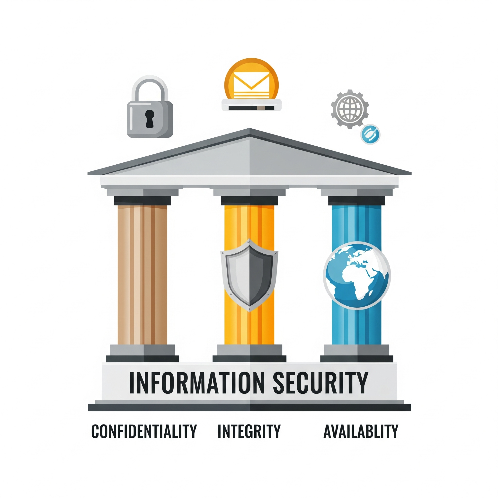
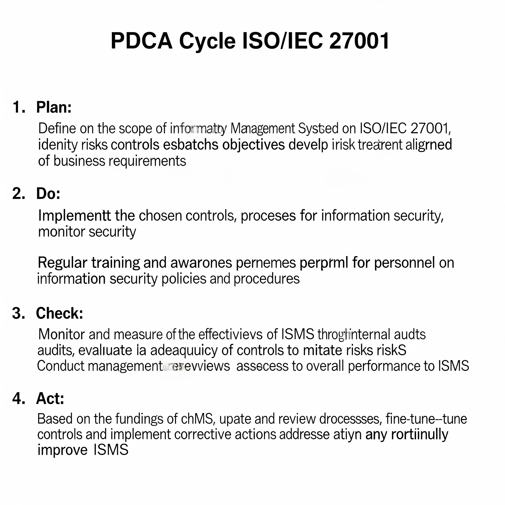
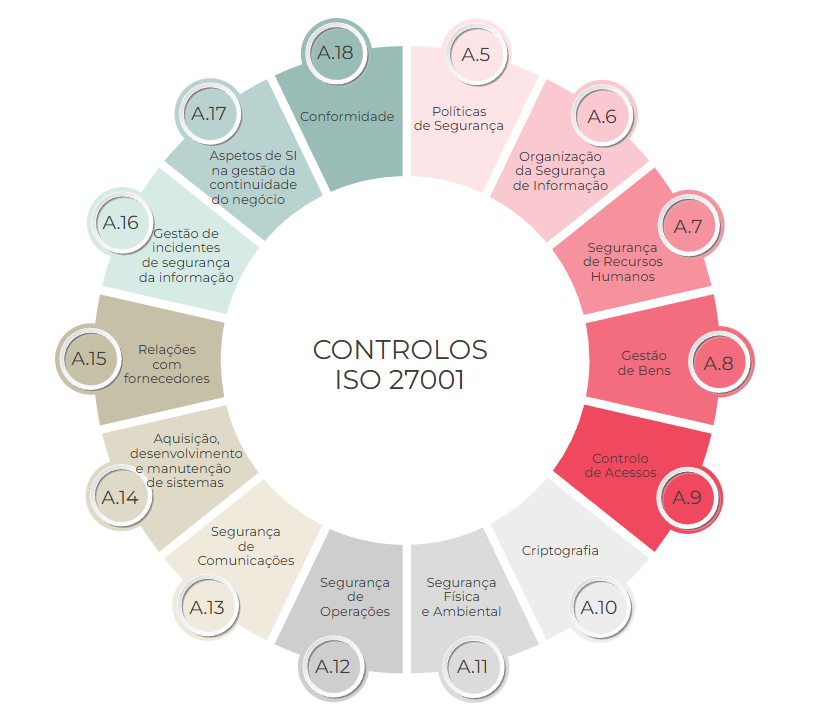
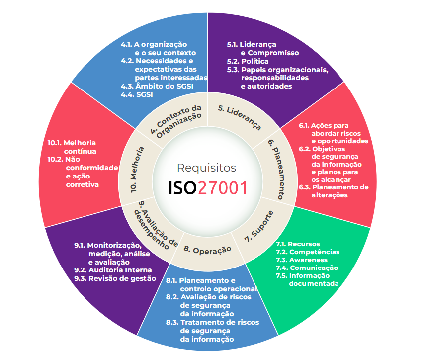

# Norma ISO/IEC 27001

A ISO/IEC 27001 é uma norma de segurança da informação reconhecida internacionalmente, desenvolvida pelo orgão de certificação [International Organization for Standardization](https://www.iso.org/home.html) (ISO) e a [International Eletrotechnical Commission](https://www.iec.ch/homepage) (IEC). A norma ISO/IEC 27001 foi publicada pela primeira vez em 2005, sendo o resultado da evolução de uma norma britânica anterior, a BS 7799-2, publicada originalmente em 1999. A ISO juntamente com a IEC trabalharam juntas para desenvolver a ISO/IEC 27001 como um padrão internacional para sistemas de gestão de segurança da informação (SGSI).

## O que é a ISO/IEC 27001?

A norma internacional ISO/IEC 27001 estabelece os requisitos para criação, implementação, manutenção e melhorias continua de um **Sistema de Gestão de Segurança da Informação (SGSI)**, em ingles **Information Security Management System (ISMS)**. Ela é como um manual de melhores práticas que orienta uma organização a proteger suas informações de forma sistemática e estruturada. Ela não especifica quais tipos de ferramentas devem ser usadas, mas sim, como uma empresa deve gerenciar a segurança de forma completa.

O principal objetivo da norma é proteger os 3 pilares essenciais da informação:

- 1. **Confidencialidade**: Garantir que a informação seja acesivel apenas por pessoas autorizadas.
- 2. **Integridade**: Assegurar que as informações e seus metodos de processamento sejam precisos e completos, protegendo contra alterações não autorizadas.
- 3. **Disponibilidade**: Garantir que os usuarios autorizados tenham acesso a informação e aos ativos relacionados sempre que nescessário.

## Como funciona a ISO/IEC 27001?

A implementação da norma 27001 não é um projeto com inicio, meio e fim, mas sim um ciclo continuo de gestão. Ela funciona com base no modelo **PDCA (Plan-Do-Check-Act)**, um ciclo de melhoria continua:

- 1. **Plan - Planejamento**: Essa é a fase em que é definido o escopo do SGSI, onde se estabelece a pilitica de segurança da informação, define a metodologia de avaliação de riscos e, o mais importante, identifica e avalia os riscos de segurança. Com base nessa avaliação, a empresa define os controles (medidas de segurança) nescessários para mitigar esses riscos. A norma possui uma lista de controle de referencia em seu Anexo A, que abordam áreas como controle de acesso, criptografia, segurança fisica, etc.

Creditos: https://www.27001.pt/

- 2. **Do - Fazer**: Essa é a fase onde se implementa o que foi planejado:
    - Implementação de controles de segurança definidos.
    - Realiza treinamentos de concientização para os funcionários.
    - Gerencia a operação diária de segurança da informação.
    - Cria Cria e mantem a documentação nescessária (politicas, procedimentos, registros).

- 3. **Check - Checar**: Nesse ponto, a organização monitora e revisa a eficácia do SGSI para garantir que ele está funcionando como esperado. Isso inclui:
    - Auditorias Internas: Verificações periódicas para garantir que os processos estão em conformidade com a norma.
    - Analise Critica pela Direção: A gestão da empresa revisa o desempenho do SGSI, analisando resultados das auditorias, incidentes ocorridos e decidir sobre as proximas ações.
    - Monitoramento de métrica: Acompanhar indicadores de desempenho para medir a eficácia dos controles.

- 4. **Act - Agir**: Com base nos resultados da fase de verificação, a organização toma ações corretivas e preventivaspara resolver problemas e melhorar o SGSI. Se a auditoria encpontrou uma falha, ela é corrigida nessa fase, ou se um risco surgiu, ele é tratado. Este passo garante que o sistema de gestao nao fique estagnado e evolua constantemente para lidar com novas ameaças.

Após passar por este ciclo e amadurecer seus processos, a empresa pode contratar um organismo certificador independente e credenciado para realizar uma auditoria externa. Se a empresa demonstrar que seu SGSI está em conformidade com todos os requisitos da norma, ela recebe a certificação ISO/IEC 27001, que geralmente é validada por três anos, mantendo auditorias e manutenções anuais.

Estudar depois https://www.serasaexperian.com.br/blog-pme/iso-27001/