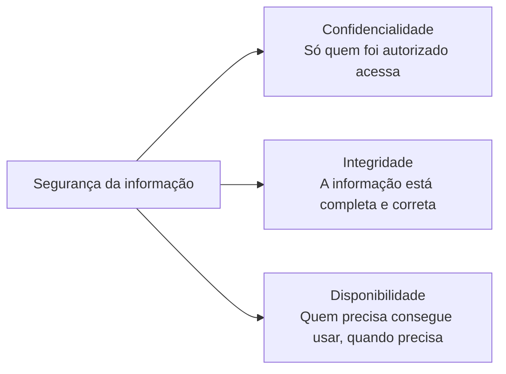
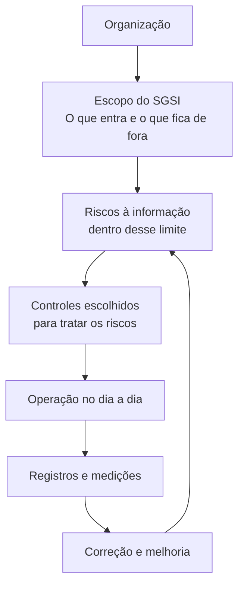
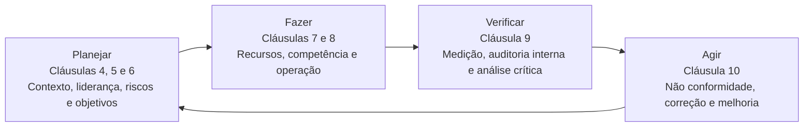
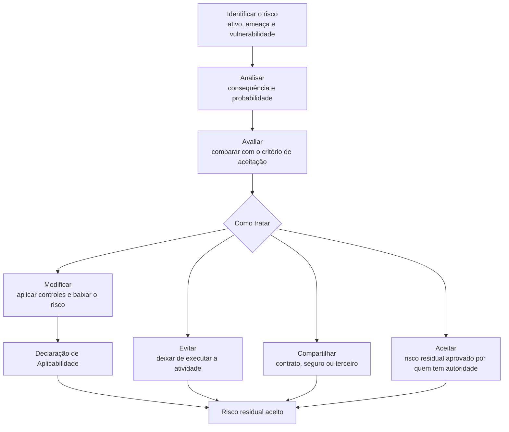
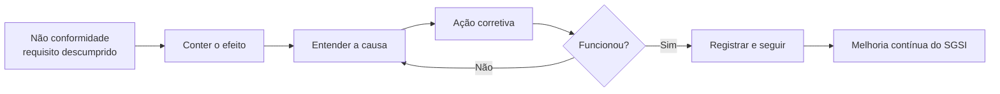
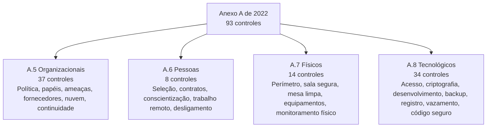
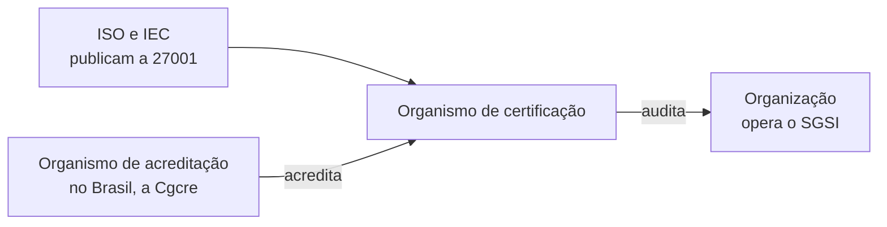
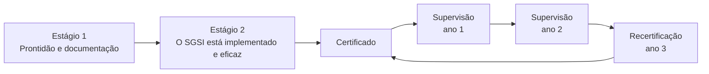

# ISO/IEC 27001

A ISO/IEC 27001 define os requisitos para criar, operar, manter e melhorar um **Sistema de Gestão da Segurança da Informação (SGSI)**. Em inglês, o nome é *Information Security Management System* (ISMS).

A norma é publicada em conjunto pela [ISO](https://www.iso.org/home.html) (*International Organization for Standardization*) e pela [IEC](https://www.iec.ch/homepage) (*International Electrotechnical Commission*). Essas duas organizações escrevem a norma. Elas não certificam empresas. Quem audita e emite o certificado é um organismo de certificação acreditado.

A primeira edição saiu em 2005, a partir da norma britânica BS 7799-2 (1999). A edição de 2013 organizou o texto nas cláusulas 4 a 10 e colocou 114 controles em 14 grupos no Anexo A. A edição de 2022, a vigente, manteve as cláusulas 4 a 10, acrescentou o planejamento de mudanças e reorganizou o Anexo A em 93 controles e 4 temas. O título passou a incluir cibersegurança e proteção da privacidade, mas o objeto certificável continua sendo o SGSI.

A 27001 diz **o que** o sistema de gestão precisa cumprir. Ela não escolhe firewall, antivírus nem um modelo único de planilha de risco. O detalhamento de cada controle está na ISO/IEC 27002, que é um guia e não é, por si só, certificável.

## O que a segurança da informação protege

Para a família 27000, segurança da informação é preservar a confidencialidade, a integridade e a disponibilidade da informação. Outras propriedades podem entrar no mesmo cuidado, como autenticidade, responsabilidade, não repúdio e confiabilidade.

```mermaid
flowchart LR
  SI["Segurança da informação"]
  SI --> C["Confidencialidade\nSó quem foi autorizado acessa"]
  SI --> I["Integridade\nA informação está completa e correta"]
  SI --> D["Disponibilidade\nQuem precisa consegue usar, quando precisa"]
```

- **Confidencialidade.** A informação não vaza para quem não tem necessidade de conhecê-la. Exemplos de falha: planilha de salários em pasta aberta, senha compartilhada, backup sem controle de acesso.
- **Integridade.** A informação e o modo de processá-la não são alterados de forma indevida, nem por engano nem de propósito. Exemplos de falha: registro financeiro adulterado, arquivo corrompido, atualização sem rastro de quem mudou.
- **Disponibilidade.** Pessoas e sistemas autorizados usam a informação quando ela é necessária. Exemplos de falha: servidor fora do ar sem contingência, backup que não restaura, link único sem alternativa.

Os três pilares se equilibram. Criptografar tudo aumenta a confidencialidade e pode dificultar a disponibilidade se a chave se perder. Abrir o sistema para todos aumenta a disponibilidade e derruba a confidencialidade.

## O que é o SGSI

O SGSI é o conjunto de políticas, processos, responsabilidades, controles e registros com que a organização trata o risco à informação. O ciclo não termina na implantação: o sistema é medido, corrigido e ajustado.

A norma serve para qualquer tipo de organização e para qualquer suporte da informação: papel, sistema, conversa, serviço em nuvem. O que muda é o **escopo**. Uma empresa pode certificar só o datacenter, só um produto ou a organização inteira. Fora do escopo, a norma não está sendo declarada.

```mermaid
flowchart TB
  Org["Organização"] --> Escopo["Escopo do SGSI\nO que entra e o que fica de fora"]
  Escopo --> Riscos["Riscos à informação\ndentro desse limite"]
  Riscos --> Controles["Controles escolhidos\npara tratar os riscos"]
  Controles --> Operacao["Operação no dia a dia"]
  Operacao --> Evidencia["Registros e medições"]
  Evidencia --> Melhoria["Correção e melhoria"]
  Melhoria --> Riscos
```

## Como ler o funcionamento: PDCA e cláusulas

A edição de 2013 apresentava o SGSI com o ciclo **PDCA** (*Plan, Do, Check, Act*). A edição de 2022 não usa mais esses quatro nomes no texto, mas a lógica continua nas cláusulas 4 a 10: planejar, executar, avaliar e melhorar.

```mermaid
flowchart LR
  P["Planejar\nCláusulas 4, 5 e 6\nContexto, liderança, riscos e objetivos"]
  D["Fazer\nCláusulas 7 e 8\nRecursos, competência e operação"]
  C["Verificar\nCláusula 9\nMedição, auditoria interna e análise crítica"]
  A["Agir\nCláusula 10\nNão conformidade, correção e melhoria"]
  P --> D --> C --> A --> P
```

### Planejar

A organização define o terreno em que o SGSI vai viver.

- O contexto interno e o externo: mercado, leis, tecnologia, cultura, contratos.
- As partes interessadas e o que elas exigem: clientes, reguladores, sócios, empregados, fornecedores.
- O escopo, com fronteiras e interfaces, inclusive o que depende de terceiros.
- A política de segurança da informação.
- A metodologia de avaliação e de tratamento de riscos, os critérios de aceitação e o que será feito com cada risco.
- Os objetivos de segurança e, na edição de 2022, o planejamento das mudanças do próprio SGSI.

O Anexo A entra aqui como catálogo de referência. A organização não é obrigada a ligar todos os controles. É obrigada a analisar todos e justificar os que não se aplicam.

### Fazer

O que foi decidido passa a existir na operação.

- Controles implantados e mantidos.
- Competência e conscientização de quem trabalha sob o controle da organização.
- Comunicação interna e externa sobre o SGSI.
- Informação documentada: o que a norma exige por escrito e o que a organização precisa para o sistema funcionar.
- Execução da avaliação e do tratamento de riscos nos intervalos planejados e quando o contexto muda.

### Verificar

A organização confere se o SGSI produz o resultado previsto.

- Monitoramento e medição: indicadores definidos antes, com método e responsável.
- Auditoria interna: pessoas independentes da atividade auditada verificam conformidade com a norma e com as regras da própria organização.
- Análise crítica pela direção: a alta direção olha auditorias, incidentes, riscos, objetivos e recursos, e decide o que muda.

### Agir

O que a verificação mostrou vira ação. Não conformidade é um descumprimento de requisito. A organização corrige o efeito, elimina a causa quando faz sentido e confere se a ação funcionou. A melhoria contínua usa esses aprendizados, as mudanças de risco e as oportunidades, para o SGSI não ficar parado diante de ameaça nova.

## Mapa dos requisitos

As cláusulas 0 a 3 são introdução, referências e termos. Os requisitos certificáveis começam na cláusula 4. O diagrama abaixo é o da edição de 2022.

```mermaid
flowchart TB
  Centro["Requisitos do SGSI"]
  Centro --> C4["4 Contexto"]
  Centro --> C5["5 Liderança"]
  Centro --> C6["6 Planejamento"]
  Centro --> C7["7 Apoio"]
  Centro --> C8["8 Operação"]
  Centro --> C9["9 Avaliação de desempenho"]
  Centro --> C10["10 Melhoria"]

  C4 --> C41["4.1 Contexto interno e externo"]
  C4 --> C42["4.2 Partes interessadas"]
  C4 --> C43["4.3 Escopo"]
  C4 --> C44["4.4 O SGSI e seus processos"]

  C5 --> C51["5.1 Comprometimento da direção"]
  C5 --> C52["5.2 Política"]
  C5 --> C53["5.3 Papéis, responsabilidades e autoridades"]

  C6 --> C61["6.1 Riscos e oportunidades"]
  C6 --> C62["6.2 Objetivos e planos"]
  C6 --> C63["6.3 Planejamento de mudanças"]

  C7 --> C71["7.1 Recursos"]
  C7 --> C72["7.2 Competência"]
  C7 --> C73["7.3 Conscientização"]
  C7 --> C74["7.4 Comunicação"]
  C7 --> C75["7.5 Informação documentada"]

  C8 --> C81["8.1 Controle operacional"]
  C8 --> C82["8.2 Executar a avaliação de riscos"]
  C8 --> C83["8.3 Executar o tratamento de riscos"]

  C9 --> C91["9.1 Monitorar e medir"]
  C9 --> C92["9.2 Auditoria interna"]
  C9 --> C93["9.3 Análise crítica pela direção"]

  C10 --> C101["10.1 Melhoria contínua"]
  C10 --> C102["10.2 Não conformidade e ação corretiva"]
```

Na edição de 2013 não havia a cláusula 6.3, e a ordem da cláusula 10 era invertida: primeiro a não conformidade, depois a melhoria contínua.

## 4. Contexto da organização

A organização identifica questões internas e externas que afetam o resultado que ela espera do SGSI. Internas: estrutura, processos, cultura, sistemas, competência. Externas: leis, clientes, ameaças do setor, dependência de fornecedores.

### Partes interessadas

Parte interessada é quem influencia o SGSI ou é afetado por ele. A organização lista quais são relevantes e quais requisitos delas entram no sistema. Um requisito legal, como a LGPD para dados pessoais, pode virar obrigação do SGSI se o tratamento desses dados estiver no escopo.

### Escopo

O escopo descreve o limite do SGSI: unidades, locais, processos, sistemas e interfaces. Dependência de terceiro entra na descrição, porque um processo interno pode parar ou vazar por causa de um fornecedor. Escopo largo demais dificulta a evidência. Escopo estreito demais deixa de fora o risco que a organização diz proteger.

### O sistema

A organização estabelece, implementa, mantém e melhora o SGSI, com os processos necessários e a interação entre eles. Política sem processo, ou processo sem dono, não fecha a cláusula 4.4.

## 5. Liderança

A alta direção responde pelo SGSI. Delegar a operação a uma área técnica não transfere essa responsabilidade.

O comprometimento aparece quando a direção:

1. Garante que a política e os objetivos existem e combinam com a estratégia.
2. Integra os requisitos do SGSI aos processos da organização, em vez de deixá-los num documento à parte.
3. Disponibiliza recursos: pessoas, tempo, orçamento, ferramentas.
4. Comunica por que a gestão da segurança e a conformidade importam.
5. Acompanha se o SGSI chega aos resultados pretendidos.
6. Orienta e apoia as pessoas a contribuir.
7. Promove a melhoria contínua.
8. Apoia os demais papéis de gestão nas áreas sob responsabilidade deles.

### Política

A política de segurança da informação é a declaração de direção. Ela precisa:

- ser adequada ao propósito da organização;
- incluir os objetivos de segurança ou o caminho para defini-los;
- assumir o compromisso de cumprir os requisitos aplicáveis;
- assumir o compromisso de melhoria contínua do SGSI;
- existir como informação documentada;
- ser comunicada dentro da organização;
- estar disponível para as partes interessadas, quando isso for apropriado.

Política genérica, copiada e desconhecida de quem opera o processo, não atende o requisito.

### Papéis, responsabilidades e autoridades

A direção define e comunica quem garante que o SGSI está conforme os requisitos e quem relata o desempenho à própria direção. O nome do cargo varia. O que a norma pede é a autoridade atribuída e conhecida.

## 6. Planejamento

### Riscos e oportunidades

A organização planeja ações para os riscos e as oportunidades que podem afetar o SGSI, integra essas ações aos processos e avalia se funcionaram.

Dentro disso há dois processos obrigatórios, e os dois ficam documentados.

**Avaliação de riscos de segurança da informação.** A organização define critérios de risco, inclusive o que ela aceita. Identifica os riscos de perder confidencialidade, integridade ou disponibilidade. Analisa as consequências e a chance de ocorrerem. Compara o resultado com os critérios e prioriza o tratamento.

**Tratamento de riscos.** Para cada risco relevante, escolhe uma ou mais saídas, seleciona controles, escreve a Declaração de Aplicabilidade e obtém a aprovação do plano e da aceitação dos riscos residuais.

```mermaid
flowchart TD
  Id["Identificar o risco\nativo, ameaça e vulnerabilidade"]
  An["Analisar\nconsequência e probabilidade"]
  Av["Avaliar\ncomparar com o critério de aceitação"]
  Tr{"Como tratar"}
  Mod["Modificar\naplicar controles e baixar o risco"]
  Ev["Evitar\ndeixar de executar a atividade"]
  Comp["Compartilhar\ncontrato, seguro ou terceiro"]
  Ace["Aceitar\nrisco residual aprovado por quem tem autoridade"]
  SoA["Declaração de Aplicabilidade"]
  Res["Risco residual aceito"]

  Id --> An --> Av --> Tr
  Tr --> Mod --> SoA --> Res
  Tr --> Ev --> Res
  Tr --> Comp --> Res
  Tr --> Ace --> Res
```

A norma não impõe a fórmula “probabilidade vezes impacto”. Impõe que os critérios existam, sejam consistentes e produzam resultados comparáveis ao longo do tempo.

A **Declaração de Aplicabilidade** percorre os controles do Anexo A. Para cada um, registra se ele se aplica, a justificativa da inclusão ou da exclusão e se já está implementado. Excluir um controle porque é caro ou trabalhoso não é justificativa. Excluir porque a atividade correspondente não existe no escopo pode ser.

### Objetivos

Os objetivos de segurança da informação são coerentes com a política, mensuráveis quando for praticável, monitorados, comunicados, atualizados e documentados. Para cada objetivo, a organização define o que será feito, quais recursos entram, quem é o responsável, o prazo e como o resultado será avaliado.

### Mudanças

Na edição de 2022, quando o SGSI muda, a mudança é planejada. Isso evita alterar escopo, controle ou processo sem ver o efeito no risco.

## 7. Apoio

- **Recursos.** O que o SGSI precisa para existir e melhorar.
- **Competência.** Quem executa trabalho que afeta a segurança da informação é competente por educação, treinamento ou experiência. A competência fica registrada.
- **Conscientização.** As pessoas sob o controle da organização conhecem a política, a sua parte no SGSI e o que acontece se os requisitos não forem cumpridos.
- **Comunicação.** A organização define o que comunicar, quando, a quem e por qual meio.
- **Informação documentada.** Inclui o que a norma pede por escrito e o que a organização julga necessário. Documento criado é identificado, revisado e controlado. Documento externo usado pelo SGSI também é controlado.

Informação documentada que a norma exige, em linhas gerais: escopo, política, processo e resultados da avaliação e do tratamento de riscos, Declaração de Aplicabilidade, objetivos, evidência de competência, resultados de monitoramento, programa e resultados de auditoria interna, resultados da análise crítica e evidência de não conformidades e ações corretivas.

## 8. Operação

A cláusula 6 desenha os processos. A cláusula 8 os executa.

- A organização planeja, implementa e controla os processos necessários, e guarda informação documentada suficiente para ter confiança de que foram executados como previsto.
- A avaliação de riscos roda em intervalos planejados e quando há mudança significativa. Os resultados ficam documentados.
- O plano de tratamento é executado, e os resultados também ficam documentados.

Mudou um sistema crítico ou entrou um fornecedor novo: a avaliação não espera o ciclo anual se a própria regra da organização diz que mudança significativa dispara uma nova análise.

## 9. Avaliação de desempenho

### Monitoramento, medição, análise e avaliação

A organização decide o que medir, o método, quando medir, quem mede e quem analisa. Guarda evidência do resultado. Medir só o número de ataques bloqueados, sem ligar isso a um objetivo, não mostra se o SGSI funciona.

### Auditoria interna

Há um programa de auditorias: frequência, métodos, responsabilidades e requisitos. Os auditores são imparciais em relação ao que auditam. O resultado é reportado à direção relevante e fica registrado. A auditoria interna procura falha enquanto ainda dá tempo de corrigir. Ela não substitui a auditoria do certificador.

### Análise crítica pela direção

A alta direção revisa o SGSI em intervalos planejados. Entram, entre outros dados, o estado das ações da revisão anterior, mudanças no contexto, retorno das partes interessadas, grau de cumprimento dos objetivos, resultados de auditoria e de medição, não conformidades, ações corretivas, resultados de avaliação e tratamento de riscos e oportunidades de melhoria. Saem decisões sobre melhorias e sobre necessidade de mudar o SGSI, inclusive recursos.

## 10. Melhoria

A organização melhora de forma contínua a adequação, a suficiência e a eficácia do SGSI.

Diante de uma não conformidade, ela reage, contém o efeito, avalia a causa, implementa a ação necessária e verifica se a ação foi eficaz. A ação é proporcional ao efeito do problema. O registro mostra a natureza da não conformidade, a ação tomada e o resultado.

```mermaid
flowchart LR
  NC["Não conformidade\nrequisito descumprido"] --> Contencao["Conter o efeito"]
  Contencao --> Causa["Entender a causa"]
  Causa --> Acao["Ação corretiva"]
  Acao --> Eficaz{"Funcionou?"}
  Eficaz -->|Sim| Registro["Registrar e seguir"]
  Eficaz -->|Não| Causa
  Registro --> Melhoria["Melhoria contínua do SGSI"]
```

## Anexo A

O Anexo A é normativo: faz parte do que a organização precisa considerar. Os controles são meios de modificar o risco. A escolha nasce da avaliação, não de uma lista marcada por completo sem análise.

Há uma separação útil:

- As cláusulas 4 a 10 são requisitos do **sistema de gestão**. O certificador verifica todos.
- O Anexo A é o conjunto de **controles de referência**. Cada controle pode ser aplicável ou não, com justificativa na Declaração de Aplicabilidade.

### Edição de 2022: quatro temas, 93 controles

A ISO/IEC 27002:2022 explica como implementar esses controles. A 27001 só os lista e exige que sejam considerados.

```mermaid
flowchart TB
  A["Anexo A de 2022\n93 controles"]
  A --> Org["A.5 Organizacionais\n37 controles\nPolítica, papéis, ameaças, fornecedores, nuvem, continuidade"]
  A --> Pes["A.6 Pessoas\n8 controles\nSeleção, contratos, conscientização, trabalho remoto, desligamento"]
  A --> Fis["A.7 Físicos\n14 controles\nPerímetro, sala segura, mesa limpa, equipamentos, monitoramento físico"]
  A --> Tec["A.8 Tecnológicos\n34 controles\nAcesso, criptografia, desenvolvimento, backup, registro, vazamento, código seguro"]
```

Exemplos do que a edição de 2022 passou a tratar com controle próprio: inteligência de ameaças, segurança no uso de serviços em nuvem, prontidão de TIC para continuidade, monitoramento da segurança física, gestão de configuração, eliminação de informação, mascaramento de dados, prevenção de vazamento, filtragem web e codificação segura.

### Edição de 2013: 14 grupos, 114 controles

Material antigo, inclusive muitas figuras de curso, ainda mostra o Anexo A de 2013. Os assuntos continuam na edição nova. O que mudou foi o agrupamento: vários controles foram fundidos e outros foram criados.

```mermaid
flowchart TB
  A["Anexo A de 2013\n114 controles em 14 grupos"]
  A --> G1["A.5 Políticas de segurança da informação"]
  A --> G2["A.6 Organização da segurança da informação"]
  A --> G3["A.7 Segurança em recursos humanos"]
  A --> G4["A.8 Gestão de ativos"]
  A --> G5["A.9 Controle de acesso"]
  A --> G6["A.10 Criptografia"]
  A --> G7["A.11 Segurança física e do ambiente"]
  A --> G8["A.12 Segurança das operações"]
  A --> G9["A.13 Segurança das comunicações"]
  A --> G10["A.14 Aquisição, desenvolvimento e manutenção de sistemas"]
  A --> G11["A.15 Relação com fornecedores"]
  A --> G12["A.16 Gestão de incidentes"]
  A --> G13["A.17 Continuidade do negócio"]
  A --> G14["A.18 Conformidade"]
```

## Certificação

Depois que o SGSI está em operação e já produziu evidência, a organização pode contratar um organismo de certificação acreditado. A acreditação é o que liga esse organismo a um organismo de acreditação. No Brasil, a acreditação de organismos de certificação de sistemas de gestão fica com a Coordenação Geral de Acreditação do Inmetro (Cgcre).

```mermaid
flowchart LR
  Norma["ISO e IEC\npublicam a 27001"]
  Acred["Organismo de acreditação\nno Brasil, a Cgcre"]
  Cert["Organismo de certificação"]
  Emp["Organização\nopera o SGSI"]

  Norma --> Cert
  Acred -->|acredita| Cert
  Cert -->|audita| Emp
```

O ciclo usual de certificação de sistema de gestão dura três anos:

```mermaid
flowchart LR
  E1["Estágio 1\nProntidão e documentação"] --> E2["Estágio 2\nO SGSI está implementado e eficaz"]
  E2 --> Certificado["Certificado"]
  Certificado --> S1["Supervisão\nano 1"]
  S1 --> S2["Supervisão\nano 2"]
  S2 --> Rec["Recertificação\nano 3"]
  Rec --> Certificado
```

O estágio 1 confere se o sistema está montado: escopo, política, avaliação de riscos, Declaração de Aplicabilidade e demais informações documentadas. O estágio 2 confere se isso funciona na prática. As supervisões anuais verificam trechos do sistema e o tratamento das não conformidades. Antes de completar três anos, a recertificação percorre o SGSI de novo.

Uma não conformidade maior, daquelas que mostram que o sistema não cumpre um requisito, trava a certificação até a correção. Não conformidade menor entra num plano de ação acompanhado.

O certificado declara conformidade do SGSI com a 27001 dentro do escopo escrito. Ele não declara que a organização é invulnerável nem que todos os controles do Anexo A estão ligados.

## Onde esta norma se encontra com as outras

- **ISO/IEC 27000.** Vocabulário e visão da família.
- **ISO/IEC 27002.** Orientação para implementar os controles do Anexo A.
- **ISO/IEC 27005.** Orientação para o processo de risco de segurança da informação. A 27001 exige o processo. A 27005 sugere um modo de conduzi-lo.
- **ISO 31000.** Gestão de riscos em geral, não só de segurança da informação. O conceito de risco como efeito da incerteza nos objetivos vem dessa linha. Há anotações em `ISO-IEC-31000.md`.
- **LGPD.** Lei brasileira de dados pessoais. Quando o escopo trata dado pessoal, os requisitos da lei entram pelas partes interessadas e pelos controles de privacidade, acesso, retenção e incidente. Há anotações em `LGPD-2025.md`.
