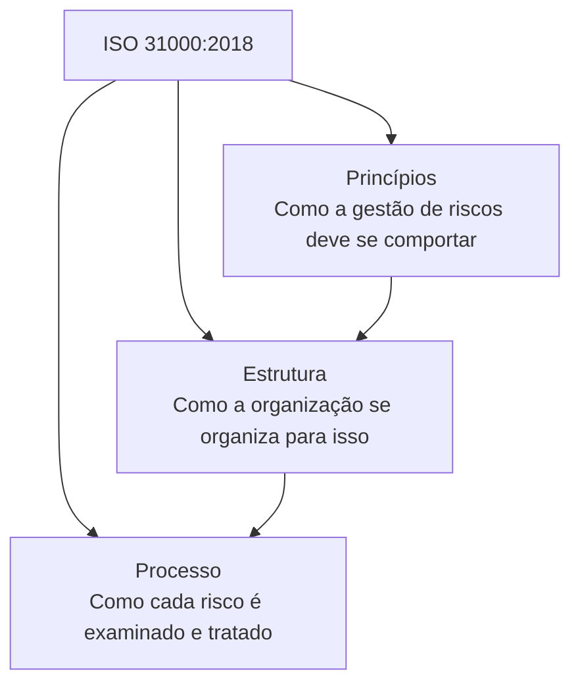
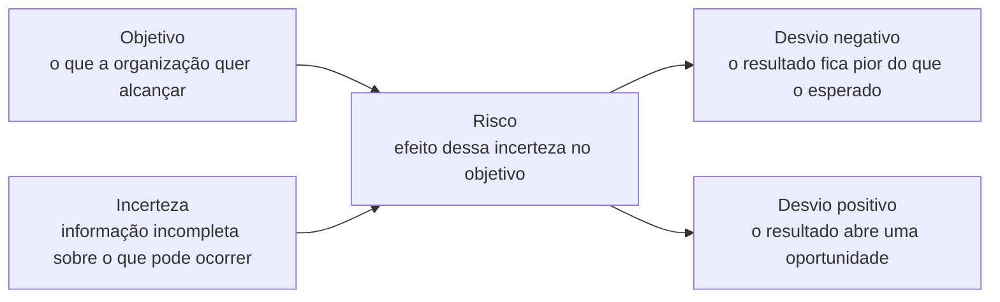
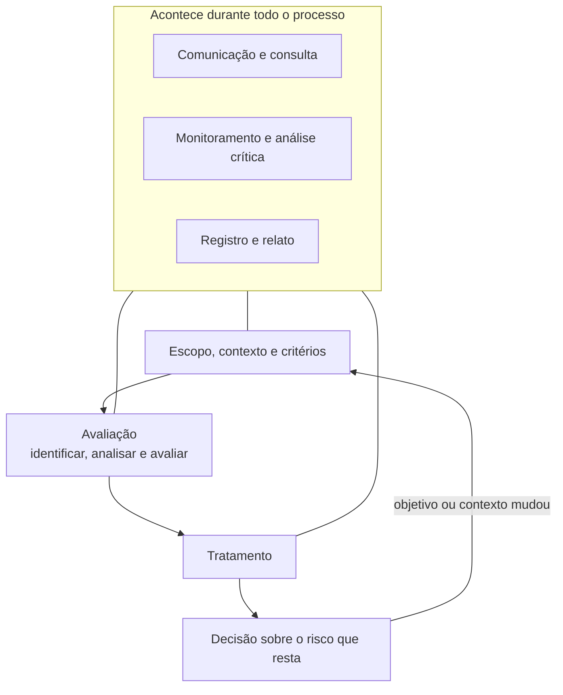
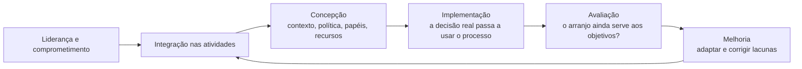
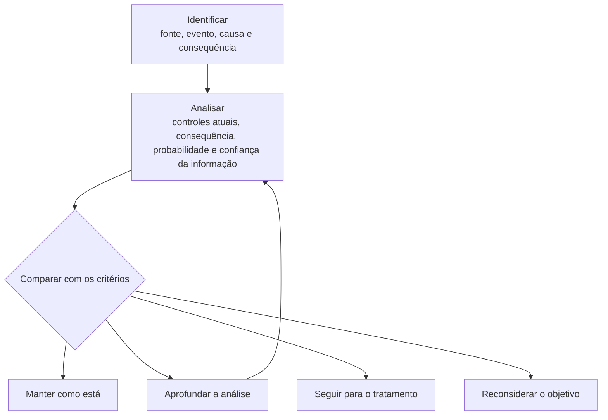
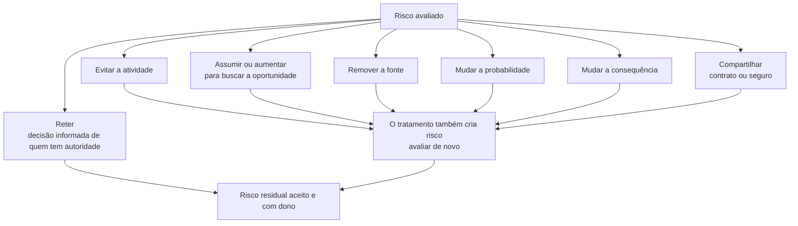

# ISO 31000

A norma vigente é a **ISO 31000:2018**, *Risk management — Guidelines* (gestão de riscos — diretrizes). Ela é publicada pela [ISO](https://www.iso.org/home.html), no comitê ISO/TC 262. O nome oficial é ISO 31000, sem IEC. A IEC entra em outras normas da mesma família, como a ISO/IEC 31010, que descreve técnicas de avaliação.

A primeira edição é de 2009. A de 2018 é a segunda e continua sendo a norma publicada. Uma terceira edição está em elaboração e ainda não substituiu a de 2018. Material de curso antigo pode listar 11 princípios. A edição de 2018 condensou isso em 8.

## O que é

A ISO 31000 é um guia para a organização gerir risco de forma integrada às suas atividades e às suas decisões. Ela tem três partes:

- **Princípios.** As características de uma gestão de riscos que cria e protege valor.
- **Estrutura.** O arranjo da organização para que essa gestão exista de verdade: direção, papéis, recursos, integração e melhoria.
- **Processo.** O modo de examinar um risco, decidir o que fazer com ele e acompanhar o resultado.

Risco, na norma, é o **efeito da incerteza nos objetivos**.

Esse efeito é um desvio em relação ao que se esperava. O desvio pode ser negativo, positivo ou os dois ao mesmo tempo. Um atraso que estoura o prazo é risco. Uma demanda maior que a prevista, se o objetivo é crescer, também é risco: há incerteza sobre se a organização consegue aproveitá-la.

A incerteza é falta de informação, mesmo que parcial, sobre um evento, suas consequências ou a chance de ele acontecer. Sem objetivo, essa definição não fecha. O risco é sempre risco **para algum objetivo**: entregar um projeto, cumprir a lei, manter um serviço no ar, proteger a informação, preservar caixa.

Quatro palavras acompanham essa definição e não são sinônimos:

- **Fonte de risco.** O que, sozinho ou combinado, pode dar origem ao risco. Exemplo: dependência de um único fornecedor.
- **Evento.** Uma ocorrência ou uma mudança de circunstâncias. Exemplo: o fornecedor interrompe a entrega.
- **Consequência.** O que esse evento faz com o objetivo. Exemplo: a obra para e o contrato atrasa.
- **Probabilidade.** A chance de algo acontecer. A norma aceita análise qualitativa, quantitativa ou as duas.
- **Controle.** Medida que mantém ou modifica o risco. Exemplo: segundo fornecedor homologado.
- **Risco residual.** O que ainda resta depois do tratamento.

A norma vale para qualquer organização e para qualquer tipo de risco: estratégico, financeiro, operacional, de segurança, de projeto, ambiental, de reputação. Ela não é de um setor só.

## Para que serve

Serve para a organização tomar decisão com os olhos abertos sobre o que pode afastá-la, ou aproximá-la, dos objetivos. O propósito declarado da gestão de riscos é criar e proteger valor. Isso inclui melhorar o desempenho, sustentar a inovação e aumentar a chance de atingir o que foi planejado.

Na prática, a norma é usada para:

- falar de riscos diferentes com a mesma linguagem, para que um risco de caixa e um risco de segurança possam ser comparados na mesma mesa;
- definir, antes da análise, o que será considerado grave e o que pode ser aceito;
- escolher tratamento com responsável, prazo e recurso, em vez de uma lista de problemas sem dono;
- ligar o risco à governança: a direção vê o que foi aceito e por quê;
- revisar a decisão quando o contexto muda, em vez de congelar uma planilha anual.

A ISO 31000 orienta. Ela não impõe controles prontos, não fixa uma matriz de calor e não é uma norma de requisitos para certificação. Quem quiser um sistema de gestão certificável de segurança da informação usa a ISO/IEC 27001. A 31000 pode servir de base para o processo de risco que a 27001 exige.

## Como funciona

O funcionamento tem duas camadas. A **estrutura** deixa a organização capaz de gerir risco todos os dias. O **processo** é o que se aplica a uma atividade, a um projeto ou a uma decisão. Os princípios valem para as duas.

Comunicação, monitoramento e registro atravessam o processo inteiro. Eles não são a primeira etapa e a última de um checklist que se faz uma vez.

### Princípios

Uma gestão de riscos eficaz, nesta norma:

1. **É integrada.** Entra nas atividades e nas decisões. Um relatório produzido à parte, que ninguém usa para decidir, não realiza o princípio.
2. **É estruturada e abrangente.** O mesmo tipo de pergunta, feito de modo sistemático, produz resultados que dá para comparar de um ciclo para o outro.
3. **É personalizada.** O arranjo se adapta ao contexto interno e externo, ao porte e aos objetivos. Copiar o manual de outra organização quebra este princípio.
4. **É inclusiva.** As partes interessadas certas participam, para que o conhecimento delas entre na análise e para que entendam por que uma decisão foi tomada.
5. **É dinâmica.** Antecipa, percebe e responde à mudança. Risco de ontem, com objetivo de ontem, não serve para a decisão de hoje.
6. **Usa a melhor informação disponível.** Entram dados históricos, dados atuais e expectativa futura. A limitação dessa informação faz parte do que se comunica. Informação incompleta ainda pode sustentar uma decisão, desde que a lacuna esteja visível.
7. **Considera fatores humanos e culturais.** Percepção, viés, excesso de confiança e cultura de culpa mudam o que as pessoas enxergam e o que elas registram.
8. **Melhora de forma contínua.** A organização aprende com a experiência e ajusta princípios, estrutura e processo.

### Estrutura

A estrutura é o que faz a gestão de riscos deixar de ser um evento isolado. A eficácia dela depende de estar na governança, inclusive na tomada de decisão. O apoio da direção é condição para isso.

- **Liderança e comprometimento.** A direção alinha a gestão de riscos à estratégia e à cultura, emite um compromisso (política ou declaração), garante recursos e atribui autoridade, responsabilidade e prestação de contas.
- **Integração.** O risco entra no propósito, na estratégia, no planejamento, nos processos e nos relatórios. Cada pessoa que decide também gere o risco da sua decisão. A área de riscos apoia. Ela não substitui quem decide.
- **Concepção.** A organização entende o próprio contexto, explicita o compromisso, distribui papéis, separa recursos e define como vai consultar e comunicar.
- **Implementação.** Há um plano com tempo e recurso. Fica claro onde, quando, como e por quem as decisões são tomadas. Se o processo de decisão ignora o risco, o processo de decisão é que muda.
- **Avaliação.** De tempos em tempos, a organização mede se a gestão de riscos continua adequada e se apoia o alcance dos objetivos.
- **Melhoria.** Lacuna vira plano, com responsável, e volta para a implementação.

### Processo

#### Comunicação e consulta

As partes interessadas entram durante o processo, não só na apresentação final. A consulta traz conhecimento de quem vive a atividade. A comunicação explica a base da decisão e o que se espera das pessoas. Sem isso, o registro existe e a decisão segue outro caminho.

#### Escopo, contexto e critérios

Antes de listar riscos, a organização fecha três coisas.

- **Escopo.** Qual decisão, qual atividade, qual objetivo, qual prazo, o que está dentro e o que está fora.
- **Contexto.** O ambiente externo (lei, mercado, partes interessadas) e o interno (governança, cultura, contratos, sistemas, capacidade).
- **Critérios de risco.** O quanto e que tipo de risco a organização pode ou não assumir em relação aos objetivos. Os critérios dizem como a importância de um risco será julgada. Eles refletem valores, objetivos e recursos, e também obrigações legais. São definidos cedo e revistos quando deixam de fazer sentido.

O critério vem antes da avaliação. Comparar a análise com um critério inventado depois do resultado torna a decisão arbitrária.

#### Avaliação de riscos

A avaliação tem três momentos.

1. **Identificação.** Encontrar, reconhecer e descrever riscos que podem ajudar ou impedir o objetivo. A descrição inclui fontes, eventos, causas e consequências. Entram ameaças e oportunidades, efeitos tangíveis e intangíveis.
2. **Análise.** Compreender o risco: consequência, probabilidade, complexidade, ligação com outros riscos, fator tempo e a eficácia dos controles que já existem. O resultado pode ser um nível de risco. A análise declara o grau de confiança e o que a informação não cobre. Opinião, viés e percepção influenciam o resultado. Por isso a norma pede que essas limitações apareçam.
3. **Avaliação.** Comparar a análise com os critérios e decidir se é preciso agir. As saídas possíveis incluem não fazer nada além do que já existe, tratar, analisar com mais profundidade, manter os controles atuais ou reconsiderar o objetivo.

Controlar o que já existe entra na análise. Descrever o risco como se nenhum controle funcionasse infla o cenário. Supor que o controle funciona, sem olhar evidência, esconde o cenário.

#### Tratamento

Tratar é escolher e executar uma ou mais opções, ver se funcionaram e decidir se o risco que resta é aceitável. Se não for, o tratamento continua.

As opções podem ser combinadas:

- evitar o risco, não começando ou não continuando a atividade que o gera;
- assumir ou aumentar o risco para perseguir uma oportunidade;
- remover a fonte;
- mudar a probabilidade;
- mudar a consequência;
- compartilhar o risco, por contrato, seguro ou parceria;
- reter o risco por decisão informada.

O plano de tratamento registra a razão da escolha, o benefício esperado, quem responde, as ações, os recursos, como o desempenho será medido, as restrições, o que será reportado e quando as ações devem ocorrer.

Aceitar o risco residual é uma decisão de quem tem autoridade para aquilo. Ficar em silêncio não é aceitação.

#### Monitoramento e análise crítica

O processo e os seus resultados são acompanhados de forma periódica ou contínua. O monitoramento responde se o controle ainda funciona, se o risco mudou e se o tratamento fez o que prometeu. Responsáveis por monitorar ficam definidos.

#### Registro e relato

O registro guarda atividades e resultados para decidir, para aprender e para prestar contas. O relato alimenta a governança e a conversa com a direção e com os órgãos de supervisão. O que se documenta depende da necessidade da organização, da sensibilidade da informação, de exigências legais e do proveito de reutilizar aquilo depois. Registro demais, que ninguém lê, não melhora a decisão.

## Pontos de atenção

1. **Risco aqui não é só ameaça.** A definição inclui o desvio positivo. Tratar a norma como uma lista de perigos deixa a oportunidade de fora e muda o sentido do texto.
2. **Todo risco aponta para um objetivo.** “Risco de invasão”, sozinho, ainda não é a definição da norma. O risco aparece quando se diz qual objetivo a invasão afeta: confidencialidade dos dados do cliente, continuidade do serviço, cumprimento da lei.
3. **A norma é diretriz.** Ela recomenda. Ela não usa o modo de uma norma de requisitos e a própria ISO não a destina à certificação. Oferta comercial de “certificado ISO 31000” não é o mesmo que a certificação acreditada de um sistema de gestão.
4. **Estrutura e processo são coisas diferentes.** A estrutura é o arranjo permanente da organização. O processo é o ciclo aplicado a uma decisão. Implantar só a planilha do processo, sem direção, papéis e integração, deixa a estrutura de fora.
5. **Os critérios vêm antes do julgamento.** Sem critério prévio de aceitação, a avaliação vira opinião de quem preencheu a tabela.
6. **A matriz colorida não está na norma.** Uma escala de probabilidade e consequência pode ser uma técnica. A técnica, se for usada, está mais perto da ISO/IEC 31010. A 31000 não manda desenhar uma matriz 5 por 5 nem fixa os números dela.
7. **Comunicação e monitoramento não são etapas das pontas.** Consultar só no início e arquivar só no fim perde mudança no meio do caminho e produz decisão que as partes não reconhecem.
8. **O controle existente precisa de evidência.** Controle escrito e controle que funciona não são o mesmo fato. A análise olha a eficácia, não o nome do controle.
9. **Tratamento gera risco novo.** Seguro muda a consequência financeira e cria risco de o contrato não cobrir o evento. Terceirizar remove uma tarefa interna e cria risco de fornecedor. O risco novo entra na avaliação.
10. **Reter risco é decisão, com dono.** Alguém com autoridade aceita o que restou, sabendo a consequência. Risco sem responsável está abandonado, não retido.
11. **Pessoas distorcem a análise.** Medo de punição esconde evento. Excesso de confiança reduz probabilidade no papel. A norma pede que cultura e viés sejam levados em conta, não que se finja neutralidade.
12. **A informação usada tem limite.** Dado antigo, estimativa e opinião de especialista servem. A decisão fica honesta quando o registro diz o que não se sabe.
13. **A gestão morre se ficar paralela à decisão.** O teste prático é simples: uma decisão importante da organização mostra que o risco foi considerado. Se o comitê de riscos se reúne e o planejamento segue igual, a integração não ocorreu.
14. **Um modelo único ainda precisa ser adaptado.** A norma oferece uma abordagem comum a qualquer risco para que eles possam ser comparados. O mesmo critério numérico, copiado para um hospital, uma software house e uma obra, sem olhar o objetivo de cada uma, fere o princípio de personalização.
15. **Ela não substitui a norma específica do tema.** Para segurança da informação, a ISO/IEC 27001 exige o processo de risco dentro do SGSI e a ISO/IEC 27005 orienta esse processo. A 31000 é o modelo geral em que esses dois podem se apoiar. Há anotações da 27001 em `ISO-IEC-27001.md`.
