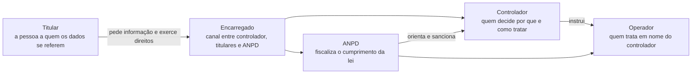
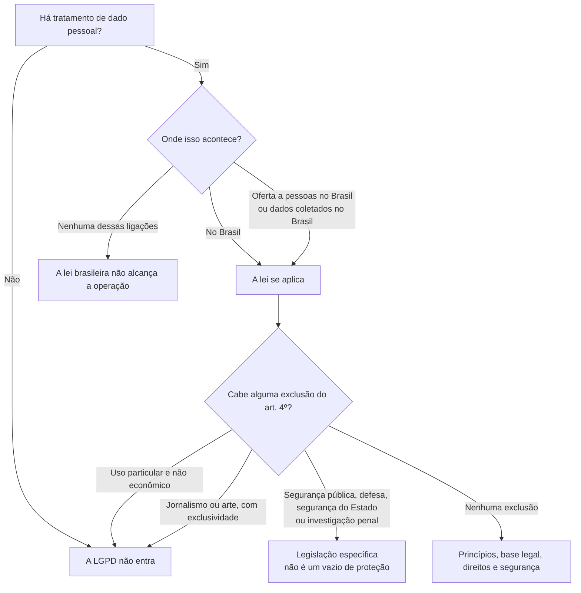
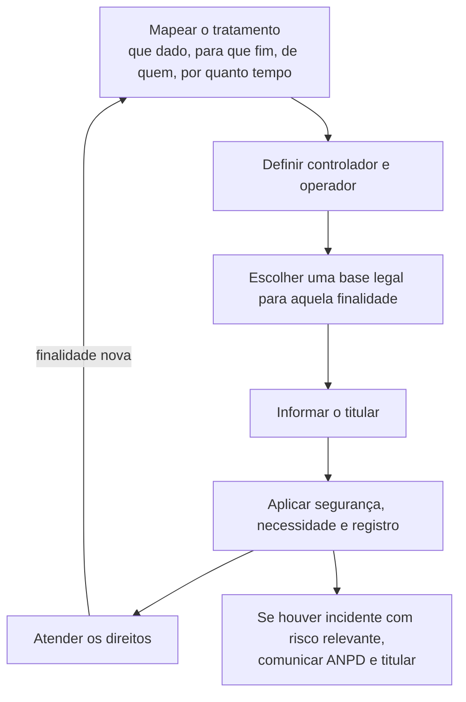
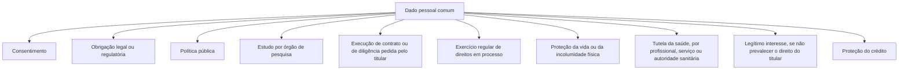
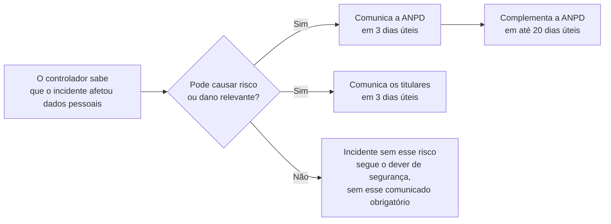

# LGPD

A Lei Geral de Proteção de Dados Pessoais é a **Lei nº 13.709, de 14 de agosto de 2018**. Ela disciplina o tratamento de dados pessoais, em papel ou em meio digital, feito por pessoa natural ou por pessoa jurídica, pública ou privada.

O objetivo da lei é proteger os direitos fundamentais de liberdade e de privacidade e o livre desenvolvimento da personalidade. Ao mesmo tempo, a própria lei coloca entre os seus fundamentos o desenvolvimento econômico, a inovação, a livre iniciativa e a defesa do consumidor. Proteger a pessoa e permitir o uso legítimo dos dados são as duas pontas do mesmo texto.

A lei entrou em vigor, no geral, em 18 de setembro de 2020. As sanções administrativas da Autoridade passaram a poder ser aplicadas em 1º de agosto de 2021. Desde 25 de fevereiro de 2026, pela Lei nº 15.352, a fiscalização cabe à **Agência Nacional de Proteção de Dados (ANPD)**, autarquia especial ligada ao Ministério da Justiça e Segurança Pública, com autonomia funcional, técnica, decisória, administrativa e financeira.

Estas anotações resumem a lei e os regulamentos da ANPD. O texto oficial prevalece sobre o resumo.

## O que é

Dado pessoal é informação relacionada a pessoa natural identificada ou identificável. Nome, CPF, e-mail corporativo que aponte uma pessoa, localização, identificador de dispositivo e um conjunto de dados que, juntos, identifiquem alguém entram nessa definição. Dado de pessoa jurídica, como um CNPJ isolado, fica de fora. Dado de pessoa natural dentro da pessoa jurídica entra.

Dado pessoal sensível é uma categoria mais estreita: origem racial ou étnica, convicção religiosa, opinião política, filiação a sindicato ou a organização religiosa, filosófica ou política, saúde, vida sexual, dado genético e dado biométrico, quando ligados a uma pessoa natural.

Dado anonimizado é aquele em que a pessoa não pode mais ser identificada com meios técnicos razoáveis e disponíveis na hora do tratamento. Se a identificação voltar a ser possível, o dado volta a ser pessoal.

Tratamento é qualquer operação com dado pessoal: coleta, uso, acesso, armazenamento, classificação, transmissão, compartilhamento, modificação, eliminação e as demais operações que a lei enumera. Guardar também é tratar.

Há quatro papéis que organizam o resto da lei.

- **Titular.** A pessoa natural a quem os dados se referem.
- **Controlador.** Quem toma as decisões sobre o tratamento.
- **Operador.** Quem trata em nome do controlador, segundo as instruções dele.
- **Encarregado.** Pessoa indicada pelo controlador e pelo operador para servir de canal com os titulares e com a ANPD. A identidade e o contato são públicos, de preferência no site do agente.

Controlador e operador, juntos, são os agentes de tratamento.

A lei se aplica quando o tratamento ocorre no Brasil, quando a atividade oferece bens ou serviços a pessoas localizadas no Brasil ou trata dados dessas pessoas, ou quando os dados foram coletados no Brasil. Dado coletado no Brasil inclui o caso em que a pessoa estava no Brasil no momento da coleta. A sede da empresa e o país em que o servidor está não afastam a lei se uma dessas condições se cumpre.

Ficam de fora, entre outros casos, o uso por pessoa natural para fins exclusivamente particulares e não econômicos, e o tratamento exclusivo para fins jornalísticos ou artísticos. O tratamento acadêmico também tem regime próprio: os artigos das bases legais continuam aplicáveis. Segurança pública, defesa nacional, segurança do Estado e investigação penal dependem de legislação específica. Empresa privada não usa esse inciso como autorização geral para tratar esses bancos.

## Para que serve

A lei serve para que o titular saiba o que acontece com os dados dele, possa intervir e tenha a quem reclamar. Serve também para que o agente que precisa dos dados — um hospital, uma loja, um órgão público, um aplicativo — trate com uma base legal, com limite de finalidade e com segurança, em vez de coletar tudo por hábito.

Na prática, a LGPD organiza quatro resultados:

- o tratamento só ocorre se houver uma hipótese prevista na lei;
- a pessoa recebe informação clara e consegue exercer direitos;
- quem trata prova o que fez e protege os dados contra acesso indevido, perda e alteração;
- a ANPD orienta, fiscaliza e aplica sanção administrativa quando a lei é descumprida.

O titular também pode ir ao Judiciário pedir reparação por dano. A sanção da ANPD e a responsabilidade civil andam em trilhos diferentes.

A lei não é um carimbo de “empresa adequada”, no estilo de um certificado ISO. Adequação é o conjunto de decisões, registros, contratos e medidas que mostram o cumprimento no tratamento concreto.

## Como funciona

O funcionamento cabe numa sequência. Cada etapa abaixo é contínua: um tratamento novo recomeça a sequência, e um tratamento antigo é revisto quando a finalidade, o sistema ou o risco mudam.

### Princípios

Todo tratamento observa a boa-fé e estes princípios:

1. **Finalidade.** Propósitos legítimos, específicos, explícitos e informados ao titular. Uso posterior incompatível com essa finalidade fica de fora.
2. **Adequação.** O meio de tratar combina com a finalidade informada.
3. **Necessidade.** Só o mínimo de dados pertinente e proporcional àquela finalidade.
4. **Livre acesso.** Consulta facilitada e gratuita sobre a forma, a duração e a integridade dos dados.
5. **Qualidade.** Dados exatos, claros, relevantes e atualizados na medida do necessário.
6. **Transparência.** Informação clara, precisa e acessível sobre o tratamento e sobre os agentes, ressalvados segredo comercial e industrial.
7. **Segurança.** Medidas técnicas e administrativas contra acesso não autorizado e contra destruição, perda, alteração, comunicação ou difusão acidentais ou ilícitas.
8. **Prevenção.** Medidas para evitar dano antes que ele ocorra.
9. **Não discriminação.** O tratamento não serve a fim discriminatório ilícito ou abusivo.
10. **Responsabilização e prestação de contas.** O agente demonstra que adotou medidas eficazes e que elas funcionam.

A prestação de contas é o princípio que transforma o resto em evidência. Dizer que há política, sem registro de base legal, de operador e de atendimento ao titular, não a realiza.

### Base legal

Dado pessoal comum só pode ser tratado numa das hipóteses do art. 7º. As dez são alternativas: cada finalidade precisa de pelo menos uma. Usar duas ao mesmo tempo para a mesma finalidade, “por garantia”, embaralha o direito do titular, porque consentimento se revoga e contrato não.

O consentimento é manifestação livre, informada e inequívoca para uma finalidade determinada. Autorização genérica é nula. Se for por escrito, vem em cláusula destacada. O ônus de provar que o consentimento foi obtido como a lei manda é do controlador. O titular revoga a qualquer momento, de graça e por meio fácil. O que já foi tratado com base no consentimento anterior permanece válido até que ele peça a eliminação.

Dispensar o consentimento não dispensa princípios, informação e direitos. Dado manifestamente público pelo próprio titular também não vira de uso livre: finalidade, boa-fé e direitos continuam.

O legítimo interesse cabe quando o interesse do controlador ou de terceiro é concreto e os direitos e liberdades fundamentais do titular não prevalecem. A análise desse equilíbrio fica registrada. Dado sensível não usa legítimo interesse.

Dado sensível tem lista própria, mais curta. Ou há consentimento específico e destacado, para finalidades específicas, ou o tratamento é indispensável para uma das hipóteses do art. 11, entre elas obrigação legal, política pública, estudo de órgão de pesquisa, exercício de direitos, proteção da vida, tutela da saúde e prevenção à fraude em identificação e autenticação, neste último caso sem prevalência de direito fundamental que exija a proteção do dado.

Dado de criança e de adolescente é tratado no melhor interesse deles. Para criança, a lei exige consentimento específico e em destaque de pelo menos um dos pais ou do responsável legal. O controlador se esforça, de forma razoável, para verificar se quem consentiu é de fato o responsável. Informação sobre esse tratamento é simples e pública.

Desde 17 de março de 2026 também está em vigor o Estatuto Digital da Criança e do Adolescente (Lei nº 15.211, de 17 de setembro de 2025). Ele não substitui a LGPD. Ele acrescenta deveres próprios para produtos e serviços digitais dirigidos a esse público.

### O que o titular pode exigir

O art. 18 dá ao titular, perante o controlador:

- confirmação de que o tratamento existe;
- acesso aos dados;
- correção de dado incompleto, inexato ou desatualizado;
- anonimização, bloqueio ou eliminação de dado desnecessário, excessivo ou tratado em desconformidade;
- portabilidade a outro fornecedor de serviço ou produto, observados segredo comercial e industrial e a regulamentação;
- eliminação dos dados tratados com base no consentimento;
- informação sobre as entidades públicas e privadas com as quais o controlador compartilhou os dados;
- informação sobre a possibilidade de não consentir e sobre as consequências da negativa;
- revogação do consentimento.

O controlador informa, de forma clara e ostensiva, a finalidade, a forma e a duração, quem é o controlador, o contato, o uso compartilhado, as responsabilidades dos agentes e os direitos do art. 18.

Agente de pequeno porte tem prazo em dobro para atender pedidos do titular, pela Resolução CD/ANPD nº 2, de 27 de janeiro de 2022.

### O que os agentes fazem

- **Registro das operações.** Controlador e operador mantêm registro dos tratamentos que realizam, em especial quando a base é o legítimo interesse.
- **Contrato com o operador.** O operador segue as instruções do controlador. O contrato ou outro instrumento define o que ele pode fazer. Operador que passa a decidir finalidade e meio deixa de ser só operador.
- **Segurança.** Os dois adotam medidas técnicas e administrativas capazes de proteger os dados. A obrigação de segurança continua depois do fim do tratamento, para quem ainda está envolvido com os dados. O sistema usado no tratamento é estruturado para atender a esses requisitos.
- **Encarregado.** A regra geral é indicar encarregado e publicar identidade e contato. Agente de tratamento de pequeno porte não é obrigado a indicar, mas precisa manter um canal com o titular. Indicar, mesmo sem obrigação, conta como boa prática na dosimetria da sanção.
- **Relatório de impacto (RIPD).** É o documento do controlador que descreve tratamentos capazes de gerar risco às liberdades civis e aos direitos fundamentais, e as salvaguardas para reduzir esse risco. A ANPD pode determinar a elaboração, inclusive sobre dado sensível. Agente de pequeno porte, quando a simplificação se aplica, pode fazê-lo de forma simplificada.
- **Fim do tratamento e eliminação.** O tratamento termina, entre outras causas, quando a finalidade se cumpre, os dados deixam de ser necessários, o titular revoga o consentimento ou a ANPD determina, quando houver violação. Dados são eliminados, com as exceções legais, como cumprimento de obrigação legal e uso exclusivo do controlador, com acesso vedado a terceiro, desde que anonimizados.

Agente de pequeno porte, na Resolução nº 2/2022, inclui microempresa, empresa de pequeno porte, startup, pessoa jurídica sem fins lucrativos e situações previstas naquele regulamento. Tratamento de alto risco fica de fora da simplificação. Porte pequeno com dado sensível em larga escala, por exemplo, não herda o regime facilitado inteiro.

### Incidente de segurança

Incidente que possa acarretar risco ou dano relevante aos titulares é comunicado à ANPD e aos titulares. A Resolução CD/ANPD nº 15, de 24 de abril de 2024, fixa o prazo: **3 dias úteis**, contados do conhecimento, pelo controlador, de que o incidente afetou dados pessoais. Informações complementares podem ser enviadas, de forma fundamentada, em até **20 dias úteis** depois da comunicação inicial. Para agente de pequeno porte, esses prazos contam em dobro.

A comunicação à ANPD descreve a natureza dos dados, o número de titulares afetados, as medidas de proteção usadas antes e depois do incidente e as demais informações do regulamento. Segredo comercial e industrial são preservados. A comunicação é do controlador, pelo encarregado ou por representante com poderes, pelo formulário da ANPD.

### Transferência internacional

Transferir dado pessoal para país estrangeiro ou para organismo internacional só cabe numa hipótese do art. 33. As principais são:

- o destino proporciona grau de proteção adequado ao da LGPD, conforme decisão da ANPD;
- o controlador oferece garantias, como cláusulas contratuais específicas, cláusulas-padrão contratuais, normas corporativas globais ou selos e códigos de conduta;
- o titular dá consentimento específico e em destaque, informado antes sobre o caráter internacional da operação;
- a transferência é necessária para situações que a lei lista, como proteção da vida, cooperação jurídica internacional, política pública ou hipóteses expressamente remetidas ao art. 7º.

A Resolução CD/ANPD nº 19, de 23 de agosto de 2024, regulamenta essa transferência e aprova o conteúdo das cláusulas-padrão. A Resolução CD/ANPD nº 32, de 26 de janeiro de 2026, reconhece a União Europeia, os países do Espaço Econômico Europeu que a decisão alcança (Islândia, Liechtenstein e Noruega) e as instituições da União Europeia como destino adequado, com base no art. 33, inciso I. Essa adequação não cobre transferência feita exclusivamente para segurança pública, defesa nacional, segurança do Estado ou investigação criminal. Na mesma linha, em decisão própria, a Comissão Europeia reconheceu o nível de proteção do Brasil. As duas decisões são autônomas.

### Fiscalização e sanção

A ANPD zela, implementa e fiscaliza a lei em todo o território nacional. Pode, entre outras medidas, advertir, multar, tornar pública a infração, bloquear ou eliminar dados e suspender ou proibir o tratamento.

A multa simples administrativa chega a 2% do faturamento da pessoa jurídica de direito privado, do grupo ou do conglomerado no Brasil no último exercício, excluídos os tributos, com teto de R$ 50 milhões por infração. A Resolução CD/ANPD nº 4, de 24 de fevereiro de 2023, regula a dosimetria. Entram nessa conta, entre outros fatores, a gravidade, a reincidência, a cooperação com a ANPD, a correção do problema e a existência de política de boas práticas e governança. Para o agente de pequeno porte, indicar encarregado, mesmo sem obrigação, conta como essa boa prática.

## Pontos de atenção

1. **Consentimento não é a única porta de entrada.** Há dez bases para dado comum. Escolher consentimento quando a base real é o contrato produz uma revogação que a operação não consegue cumprir, e um consentimento que não foi livre.
2. **Cada finalidade tem a sua base.** A base que autoriza emitir a nota fiscal não autoriza, sozinha, enviar propaganda. Finalidade nova pede análise nova.
3. **Dado sensível não aceita legítimo interesse.** A lista do art. 11 é fechada. Biometria, saúde e dado genético não entram pelo interesse comercial do controlador.
4. **Dado público continua protegido.** O titular que tornou o dado manifesto ainda tem princípios e direitos. Coletar perfil aberto de rede social para outra finalidade, sem olhar boa-fé e necessidade, descumpre a lei.
5. **Anonimizar de mentira continua sendo dado pessoal.** Se um meio razoável e disponível reidentifica a pessoa, a anonimização não ocorreu. Mascarar o nome e manter o CPF é o caso típico.
6. **Operador que decide vira controlador.** Terceirizar o sistema não terceiriza a decisão sobre a finalidade. O contrato escreve a instrução. Quem está fora do contrato e passa a escolher o uso dos dados assume o papel de controlador.
7. **Pequeno porte não apaga a lei.** A Resolução nº 2/2022 tira a obrigação de indicar encarregado, dobra prazos e simplifica o relatório. Princípios, base legal, segurança e direitos permanecem. Alto risco fica fora do regime simplificado.
8. **RIPD não é um formulário para toda planilha.** Ele descreve tratamento que pode afetar liberdades civis e direitos fundamentais, e as medidas para reduzir esse risco. A ANPD pode exigi-lo. Produzir um relatório genérico, sem o tratamento real, não cumpre a definição.
9. **Nem todo incidente gera o prazo de três dias.** O gatilho é risco ou dano relevante aos titulares, e o relógio começa quando o controlador sabe que dados pessoais foram afetados. Esperar o laudo completo para dar a primeira comunicação estoura o prazo. O complemento cabe nos 20 dias úteis seguintes.
10. **Segurança é dos dois agentes e sobrevive ao fim do tratamento.** Controlador e operador respondem pelas medidas. Apagar o contrato com o fornecedor sem tratar a cópia que ficou com ele deixa dado pessoal sem controle.
11. **A sanção da ANPD não esgota o prejuízo.** O titular pode pedir indenização. Um incidente pode gerar os dois: processo administrativo e ação civil.
12. **Transferir para fora do Brasil é tratamento com regra própria.** Servidor no exterior, suporte estrangeiro e grupo multinacional que acessa a base brasileira precisam de uma hipótese do art. 33. A adequação da União Europeia, desde janeiro de 2026, cobre esse destino. Ela não cobre qualquer outro país nem o uso para investigação penal.
13. **Criança e adolescente não são o mesmo requisito.** Os dois são tratados no melhor interesse. O consentimento específico dos pais ou do responsável, na LGPD, é exigido para o dado de criança. O Estatuto Digital da Criança e do Adolescente acrescenta deveres ao serviço digital e não revoga essa distinção.
14. **A lei não se prova com uma política na intranet.** Prestação de contas é registro de tratamento, base legal, contratos de operador, evidência de segurança, canal do titular e resposta aos pedidos. A política só vale se essas peças existirem.
15. **ISO não substitui a LGPD, e a LGPD não certifica o SGSI.** A ISO/IEC 27001 organiza a segurança da informação. A ISO 31000 organiza a gestão de riscos. Quando o dado é pessoal, a base legal, os direitos do titular e a comunicação de incidente vêm da lei. Há anotações em `ISO-IEC-27001.md` e em `ISO-IEC-31000.md`.

## Onde ler o texto oficial

- [Lei nº 13.709/2018 no Planalto](https://www.planalto.gov.br/ccivil_03/_ato2015-2018/2018/lei/l13709.htm), no texto consolidado.
- [Atos normativos da ANPD](https://www.gov.br/anpd/pt-br/acesso-a-informacao/institucional/atos-normativos/regulamentacoes_anpd), entre eles as Resoluções nº 2/2022, nº 4/2023, nº 15/2024, nº 19/2024 e nº 32/2026.
