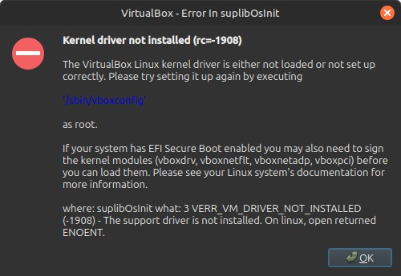

# Soluções para problemas comuns no VirtualBox

## Kernel drive not installed

### Contexto

Eu instalei o virtualbox no Linux Mint 22.1 Cinnamon, e instalei uma maquina virtual nela. Quando iniciei a maquina pra fazer a instalação, esse erro apareceu. Pesquisando, descobri que quando o **Secure Boot** esta ativado na BIOS/UEFI, ele impede que os modulos kernel sejam carregados, porque nao estão assinados com uma chave reconhecida pelo sistema.

Apesar do script do virtualbox assinar  os modulos, esse processo falha ou nao é o suficiente pra passar pelo secure boot sem uma configuração manual mais profunda.

### solução

A solução é desativar o **Secure Boot**:

- 1. Reiniciar o computador;
- 2. Acessar a bios;
- 3. Acessar a opção de Secured Boot;
- 4. E selecionar Disable;
- 5. Depois salve as alterações e saia.

Quando o sistema for iniciar ele vai te mostrar uma janela com opções de escrever um `codigo que aparece na janela e apertar enter` pra ativar as alterações ou ir de `Esc` e cancelar as alterações. Vai de codigo e Enter. Após isso o sistema vai iniciar normalmente. Quando o sistema inciar abra o **terminal** e insira o comando que aparece na janela de erro `sudo /sbin/vboxconfig`

### sudo /sbin/vboxconfig

Esse comando é responsavel por compilar e carregar os modulos Kernels do virtualbox. Os modulos `vboxdrv`, `vboxnetflt`, `vboxnetadp` e `vboxpci`são partes do software que atuam como uma ponte de comunicação entre o sistema operacional hospedeiro e os sistemas convidados. Eles são responsaveis por permitir acesso aos recursos de hardwares nescessários para gerenciar as maquinas virtuais. Geralmente é usado após a instalação do virtualbox, após atualizações do kernel e no nosso caso, quando ocorre o erro que registramos aqui `Kernel driver not installed (rc=-1908)`.

### FInalizando

Depois de rodar esse codigo, reinstale a maquina virtual novamente e o virtualbox deverá ser capaz de carrega-la.