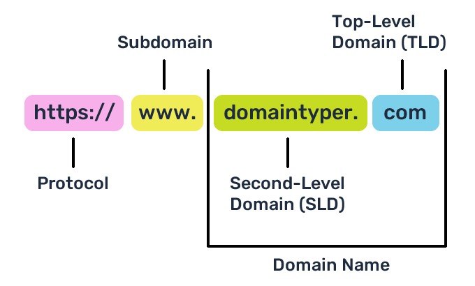

# DNS (Domain Name System)

O DNS ou domain Name System é um sistema que ajuda a nos comunicarmos com diferente dispositivos. Todos os dispositivos em uma rede tem um endereço, O IP Address como esse: 105.32.56.221. São 4 conjuntos de digitos que vao de 0 a 255 separados por um pornto ".". O DNS funciona como uma lista telefonica, dando nomes ou Dominios para cada IP, identificando-os.

## Hierarquias

### TLD (Top-Level domain)

Um TDL é a parte que define a finalidade do dominio. Existem dois tipos, o gTLD (Generic Top Level) que define a area de atuação do dominio. Por exemplo, .com é comercial, .mil é militar, .edu é educação, .gov é governamental e etc. Também tem o ccTLD que é usados para fins geograficos definindo para qual publico ele foi destinado geograficamente, como .br no Brasil, ou .ca no Canada, ou .UK (United Kingdom) no Reino Unido e etc. Devido a essa demanada, surgiram novos gTLD como .online, .club, .website, .biz e muitos outros.

## Second-Level Domain

Tomando google.com por exemplo, o TLD é .com, o "google" é o Second-level domain. Ao registrar, um dominio de segundo nivel é limitado a 63 caracteres mais o TLD e só pode usar os caracteres a-z, 0-9 e hífens (mas nao pode começar com hífen ou ter dois consecutivos.)

## Subdominios

Subdominios fica a esquerda do dominio de segundo nivel, sendo separado por ponto admin.google.com. As regras para criar um subdominio são as mesmas da criação de um dominio de segundo nivel, sendo possivel criar quantos dominios quiser contantoi que nao ultrapasse os 253 caracteres.

## Uma requisição DNS

- 1. Local: Quando você solicita um dominio, seu computador verifica localmente se você ja acessou esse mesmo dominio anteriormente. Todo computador tem um regostro local de dominios.

- 2. Servidor DNS Recursivo: Se não encontrar ele irá fazer essa solicitação para o servidor DNS do seu provedor de internet.

- 3. Servidor DNS Root: Se no caso de nao conseguir a informação, seu computador vai solicitar a um Root DNS Server que vai analizar o TLD da solicitação para encaminha-los ao servidor correto.

- 4. Servidor Autoritativo: O servidor TLD contem registro de onde encontrar um servidor autoritativo para responder a solicitação DNS. O servidor Autoritativo também é cohecido como servidor de nomes de dominio.

- 5. Um servidor autoritativo é o servidor responsavel por armazenar os registros DNS de um nome dominio e onde quaisquer atualizações nos registros DNS dos nomes de dominio seriam feitas. Uma copia desse registro vai ser enviado para o servidor recursivo e também vai ser guardada em cache na maquina para caso aja solicitações futuras. Todos os registros DNS tem um valor TTL (time to live). Esse valor representa o tempo em segundos para o qual a resposta deve ser salva localmente até que precise busca-la novamente.