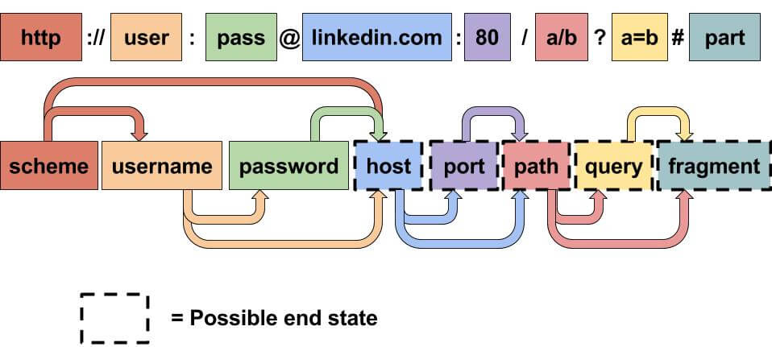

# Anotações sobre HTTP e HTTPS

## HTTP(S)

### HTTP
HTTP (HyperText Transfer Protocol) é um protocolo ou um conjunto de regras, usados para comunicação com servidores web para paginas web, imagens e videos. Foi criado por Tim Berner-Lee e sua equipe entre 1989 e 1991.

### HTTPS

HTTPS é uma versao mais segura do HTTP. Os dados do HTTPS sao criptografados para nao apenas impedir que os dados sejam vistos por trerceiros, mas também, garante que você esta falando com o servidor web correto.

## Requisição e Resposta

Ao acessar um site, o navegador precisa fazer solicitaçpões a um servidor web, para receber html, imagens e respostas. É nescessário informar o navegador como e onde acessar esses recursos, e é aqui que entra o URL.

### URL Uniform Resource Locator



- Scheme: esse é o protocolo usado para acessar os recursos.
- User: Login. Alguns serviços precisam de autenticação.
- Password: Senha.
- host: Dominio ou endereço de IP.
- Port: Porta à qual você irá se conectar.
- Path: Nome do caminho ou local do recurso que você esta tentando acessar.
- Query: Bits extras de informação que podem ser enviados para o caminho solicitado.
- fragment: Essa é uma referencia a um local na pagina real solicitada.

## Metodos HTTP

Os metodos HTTP são a maneira do cliente dizer qul ação pretendida com a solicitação. Existem varios, mas na maioria, é usado apenas Get e Post.

- GET Request: Usado para pegar informação dom servidor web.
- Post Request: Isso é usado para enviar dados para o servidor web.
- Put Request: Usados para enviar dados e atualizar informações.
- Delete: excluir registros do servidor web.


## HTTP Status

### Referencia de codigos

Em uma resposta HTTP a primeira linha é sempre um codigo de status sobre a solicitação e potencialmente como lidar com isso. Estes codigos podem ser divididos em 5 modelos diferentes.

````
 - De 100 a 199 - Respostas e informações: Esse informam o cliente que a primeira parte da solicitação foi aceita e que eles podem continuar com a solicitação. Esses não são muito comuns.

 - De 200 a 299 - Sucesso: Esse é um codigo de status para uma solicitação bem sucedida.

 - De 300 - 399 - Redirecionamento: Este indica o direcionamento da solicitação para outro recurso. Pode ser uma pagina web diferente ou um site diferente.

 - De 400 - 499 - Erros de cliente: Usado para informar que existe um erro com a solicitação.

 - De 500 - 599 - Erros de servidor: Este status é reservado para o lado do servidor. Indica erros por parte do servidor que manipula a solicitação. 
````

### Codigos mais comuns

Aqui segue alguns dos codigos mais comuns:

- 200: Ok.
- 201: Um recurso foi criado, como um usuario ou uma postagem.
- 301: Este redireciona o navegador do cliente para uma nova pagina da web ou informa o mecanismo de pesquisa esta mudança.
- 302: Igual ao de cima, mas é apenas uma mudança temporartia, podendo também mudar novamente no futuro.
- 400: Esse diz ao navegador que algo esta errado ou faltando. As vezes pode ser usado se o servidor esperava um parametro que não estava definido para ser enviado.
- 401: Você não esta autorizado a visualizar esse recurso. Falta de Autenticação.
- 403: Voce nao esta autorizado a ver esse recurso, mesmo autenticado.
- 404: Pagina nao encontrada. O recurso que voce solicitou nao existe.
- 405: Metodo nao permitido. Por exemplo quando um get é enviado no lugar de um post por exemplo. Verifique se o metodo esta correto.
- 500: O servidor encontrou algum tipo de erro com o qual nao sabe lidar.
- 503: Este servidort nao pode lidar com a solicitação por estar sobrecarregado ou inativo.

## Cabeçalhos

Headers são bit adicionais enviados em requisições. Eles não são obrigatorios, mas são comumente usandos.

### Headers de solicitações comuns

Esses são cabeçalhos de solicitação mais comuns:
- Host: Alguns servidores web hospedam varios sites, fornecendo o host, o server consegue saber qual site esta sendo solicitado. Caso contrario, ele apresentará o site padrão.

- User-Agent: Esse é o software do navegador e a versão. ele também ajuda a formatar o site e informa os elemento e tecnologia disponiveis em sua versão.

- Constent-Length: Ao enviar a solicitação, informamos a quantidade de dados estão sendo enviados, para que o servidor consiga garantir que nao falta nada.

- Accept-Encoding: informa os formatos de compactação, para que os dados possam ser compactados para a transmissao.

- Coockies: Dados enviados ao servidor para ajudar o servidor a lembrar de suas informações.


### Headers de respostas comuns

Set-cookies: Informações a serem armazanadas que devem ser enviadas ao web server em cada solicitação.

Cache-Control:Por quanto tempo armazenar o conteudo da resposta do cache, antes de solicita-las novamente.

Content-Type: Informa ao cliente que tipo de dado esta sendo retornado, HTML, CSS, JS, Iagem, PDF, videos, etc.

Content-Encoding: Qual metodo foi usado para compactar os dados enviados.

## Cookies

Você provavelmente ja ouviu falar de cookies antes. Os Cookies sao salvos quando quando você recebe um cabeçalho "Set-Cookie" de um servidor web. Em seguida, a cada solicitação adicional que você fizer, você enviará dados de cookie para o servidor web. Os coockies podem ser usado para muitas finalidades, mas sao mais usados para autenticidades em sites.
O valor do cookie geralmente é um token.


