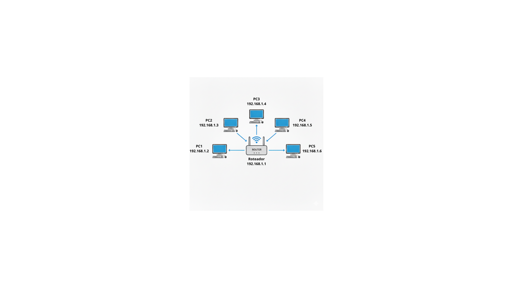

# Anotações sobre estudos de IPs

O Ip, é um endereçamento de dispositivos em uma rede de computador. Ele pode ser dinamico ou estatico. O dinamico quer dizer que ele mudará com o tempo a medida que se diconectar e reconetar com a rede. Mesmo dispositivo, mas Ip diferente. Ja o estático quer dizer que dentro de uma rede especifica, o iup desse dispositivo está reservado somente pra ele.

## IPV4

O IPV4 é