# CTF MRROBOT

Umas das coisas que eu mais curti em segurança da informação é resolver CTFs. Claro que nao sou intendido da coisa, mas cada server foi criado por pessoas diferentes com perspectivas e experiencias diferentes, sendo nescessários conhecimentos e ferramentas diferentes pra resolver o quebra cabeça e encontrar as tres flags. Realmente gosto disso. Esse é o primeiro que eu resolvi e foi minha porta de entrada para a area. Então vai ser o primeiro que vou trazer aqui.

## Reconhecimento
O desafio começa com o site do mr robot, com várias informações sobre a serie.
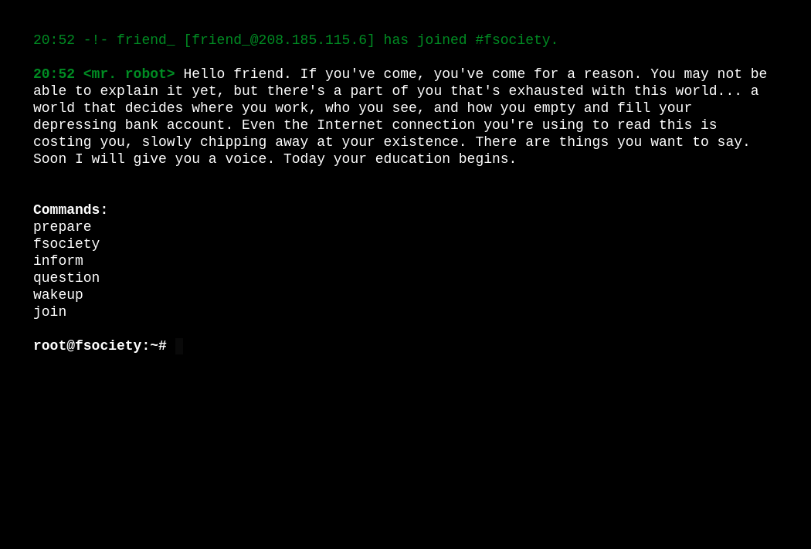

### Scan de portas
Pra começar, vamos usar o nmap pra identificar portas, serviços e o OS da maquina. Esse foi o comando que eu usei `nmap -sS -O -sV ip-MRROBOT`. Na imagem a baixo temos a resposta do Nmap com as portas 22, 80 e 443 abertas. A 22 é uma porta padrao SSH, o que com certeza nos permite acessar remotamente.

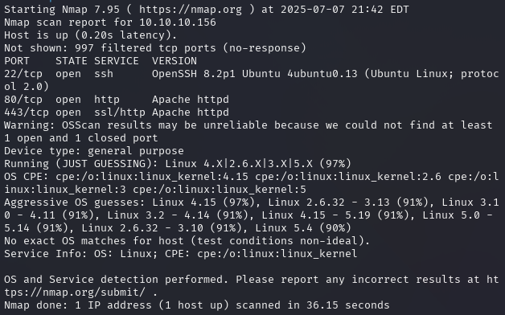

### Enumeração
Agora acho bom ja iniciar uma enumeração pra ir rodando enquanto seguimos com a investigação. Pra isso vou usar o dirb, porque é uma ferramenta simples e facil de usar. O comando que eu usei foi `dirb -l ip-MRROBOT`. Quando no comando do dirb, nao é adicionado uma wordlist, a ferramenta usa uma wordlist propria chamada common.txt.

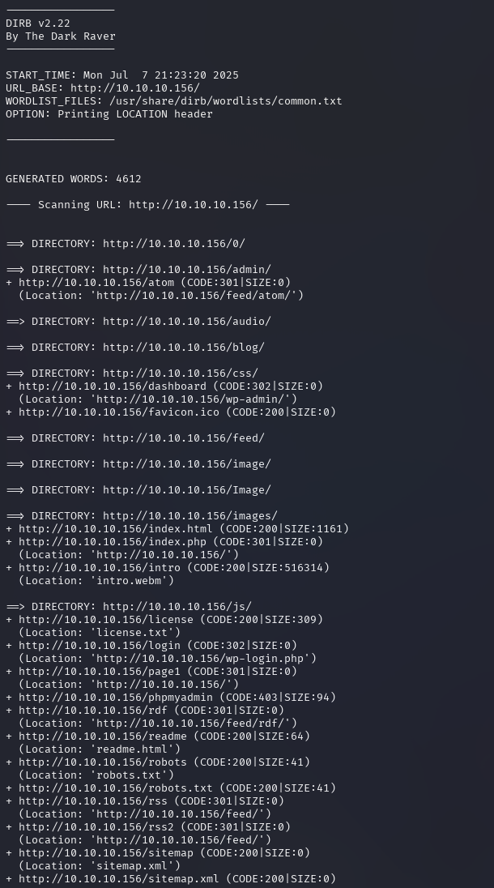

### Robot.txt
Explorando o site, tem várias mensagens e videos tematicos da série. mas agora vamos para o objetivo. Primeiro, vamos olhar o robots.txt e ver o que encontramos. 

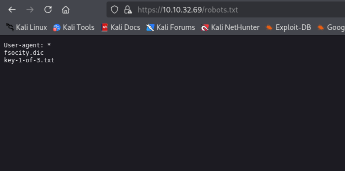

Aqui, ja nos deparamos com a primeira flag e um dicionário. Vamos uar o `wget` pra baixar os arquivos pra verificar a primeira key e pra ver o que temos no dicionario.

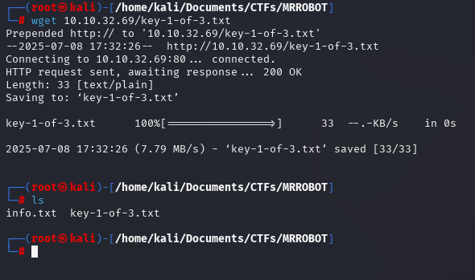
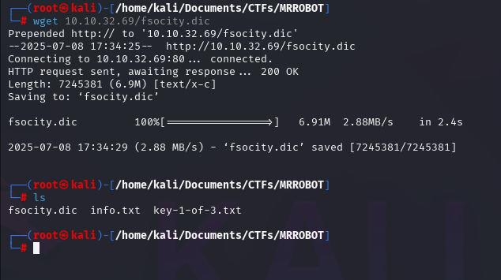

É isso! Agora só dar um `cat` no arquivo key-1-of-3.txt pra conquistar a primeira key ``.

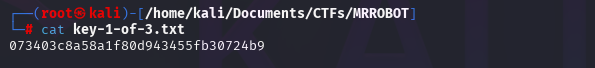

### Dicionário

O dicionário é uma wordlist. Usando `wc -w -l fsocity.dic` podemos ver que contem 858160 palavras e 858160 linhas no arquivo.

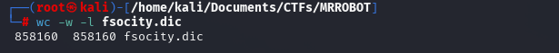

Além disso, usando o comando `sort` veremos que as palavras se repetem, o que aumneta o tamanho do arquivo. Pra resolver isso, usanmos o comando `sort` juntamente com o comando `uniq`que quando em uma lista organizada, exclui as palavras repetidas salvando em um arquivo fsocity.txt.

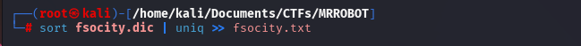

Não da pra mostrar a wordlist, pq mesmo assim ainda é gigante, mas diminui de tamanho consideravelmente. Se usarmos o `wc -w -l fsocity.txt` veremos a nova quantidade de linhas e palavras.

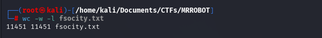

Agora temos um wordlist com um pouco mais de onze mil palavras, o que é melhor do que a anterior de oitocentas mil.

### Enumeração

Enquanto analisavamos os arquivos encontrados no robots.txt, a enumeração continuou buscando por diretorios no site. O primeiro diretorio foi esse `http://10.10.44.19/0/`. Lembrando que o ip da maquina muda toda hora, porque estou acessando sem comprar um plano mensal ou anual, entao a maquina fecha automaticamente a cada 60 minutos.

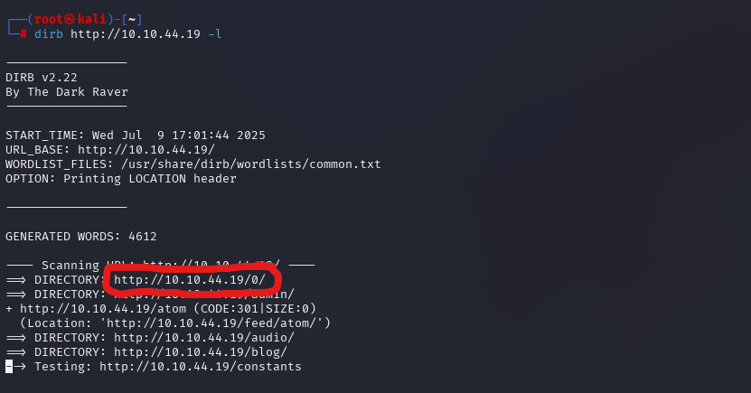

Acessando o primeiro diretorio, caimos em uma pagina de erro que ja expos se tratar de um wordpress. Um wordpress é um sistema de gerenciamento de conteudo web, inicialmente criado para publicação em blogs, mas que hoje é usado para criar sites variados, como esse do Mr Robot.

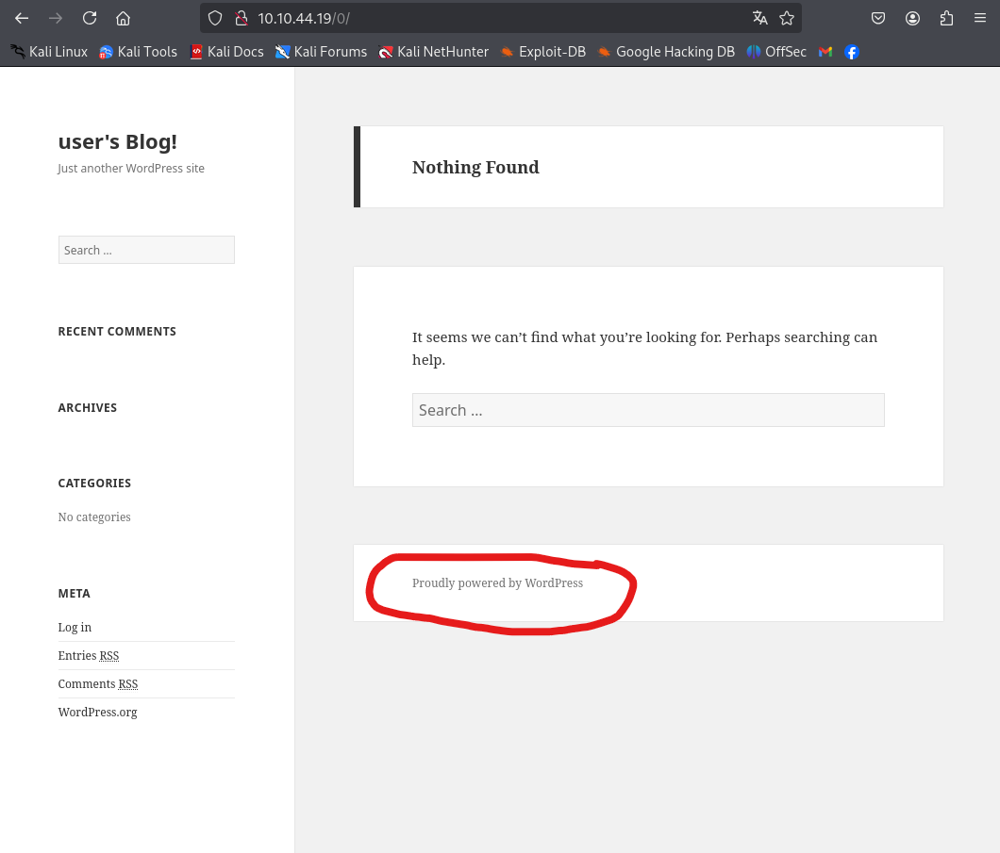

O wordpress tem uma pagina de login, e agora que temos uma wordlist, podemos testar um bruteforce pra tentar encontrar o login e a senha, dentro dessa wordlists fsocity.txt.

