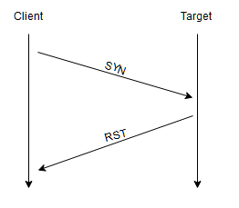

### AQUI UM RESUMO DA SALA NMAP DO TRY HACK ME
### O INSTUITO DESSA ANOTAÇÃO É SER CAPAZ DE ENTENDER MELHOR SOBRE A FERRAMENTA E SEU 
### PROPOSITO.

## 1. INTRODUÇÃO

Quando falamos de Hacking, conhecimento é a chave. Quanto mais sabermos sobre o alvo, mais
possibilidades de testes podemos ter. Inicialmente entender quais portas e serviços estao rodando 
no sistema ou rede alvo, pode ser um bom jeito de começar.O primeiro passo é fazer uma varredura de 
portas. As portas são uma construção de rede que determina, o ponto de partida e chegada de uma 
informação. O seu computador abre uma porta para cada serviço que ele solicita, sendo capaz de abrir 
até 65535 disponiveis, mas muitas delas são portas padrão. Um serviço HTTP por exemplo usa por padrão 
a porta 443, o NETBIOS do Windowns na 139, o SMB na 445. Em um ambiente de Capture The Flag, essas 
portas podem mudar, tornando mais nescessário ainda uma enumeração para identificar as portas ativas.
Uma porta pode estar aberta fechada ou filtrada (geralmente por um firewall).

O primeiro passo em uma varredura, é saber quantas portas estao abertas e qual serviço essas portas 
oferecem. O Nmap é uma ferramenta poderosa e uma das principais no mercado para essa tarefa.

## 2. Nmap Switches

O Nmap é usado através do terminal. Ele tem versões para Linux e windows. Para ver as opções de Switches,
você pode usar o comando $ nmap -h ou o comando man nmap.
Usando apenas o comando:
```
$sudo nmap 10.10.3.24, (no caso esse ip é um numero aleatório pra testar) a resposta
seria algo como:
└─$ nmap 10.10.3.24
Starting Nmap 7.94SVN ( https://nmap.org ) at 2025-01-09 18:59 EST
Nmap scan report for 10.10.3.24
Host is up (0.23s latency).
Not shown: 995 filtered tcp ports (no-response)
PORT     STATE SERVICE
21/tcp   open  ftp
53/tcp   open  domain
80/tcp   open  http
135/tcp  open  msrpc
3389/tcp open  ms-wbt-server

Nmap done: 1 IP address (1 host up) scanned in 17.71 seconds
```
Só com isso ele ja mostra muita informação Util, como as portas abertas, juntamente com os protocolos do serviço,
o estado da porta, no caso, mostrou apenas as abertas "aberta", e o serviço que esta rodando em cada uma delas,
como ftp, http, entre outros.

Também é possivel usar alguns switches que permite um escaneamento especifico pra um proposito.
Por exemplo o comando abaixo:
`-$sudo nmap -O 10.10.208.224`
Sudo, é um comando ultilizado para dar privilégio de administrador a um comando, ja o "-O" especifica que você deseja
escanear o alvo para entender qual é o sistema operacional do servidor, trazendo a resposta a baixo.

```
$ sudo nmap -O 10.10.208.224
Starting Nmap 7.94SVN ( https://nmap.org ) at 2025-01-09 19:27 EST
Nmap scan report for 10.10.208.224
Host is up (0.21s latency).
Not shown: 997 filtered tcp ports (no-response)
PORT    STATE  SERVICE
22/tcp  closed ssh
80/tcp  open   http
443/tcp open   https
Aggressive OS guesses: Linux 5.4 (90%), Linux 3.10 - 3.13 (89%), Linux 3.10 - 4.11 (88%), Linux 3.12 (88%), 
Linux 3.13 (88%), Linux 3.13 or 4.2 (88%), Linux 3.2 - 3.5 (88%), Linux 3.2 - 3.8 (88%), Linux 4.2 (88%), Linux 4.4 (88%)
No exact OS matches for host (test conditions non-ideal).

OS detection performed. Please report any incorrect results at https://nmap.org/submit/ .
Nmap done: 1 IP address (1 host up) scanned in 21.14 seconds
```


## 3. Visão Geral:

Quando escanear portas com Nmap, existem 3 tipos de escaneamento.
- TCP Connect Sacn (-sT)
- SYN Scan "semi-abertas" (-sS)
- UDP Scan (-sU)

Além disso, existem vários tipos de varreduras de porta menos comuns:
- TCP Null Scan (-sN)
- TCP FIN Scan (-sF)
- TCP Xmas Scan (-sX)

## 4. TCP Connect Scans (-sT)

Um scan TCP conect funciona executando um handshake onde um pacote SYN é enviado 
esperando um ACK como respostas para dar seguimento, porém se a porta responder como
RST (Reset) definida no lugar de ACK (Aknowledgement), significa que a porta esta fechada.



Se a porta estiver aberta responderá com um ACK normal, dando sequencia no handshake.
No entanto tem uma terceira opção. Se a porta estiver aberta, mas escondida por de tras de 
um firewall, depois do pacote SYN ter sido enviado, ela nao retornará nada e o nmap vai 
considera-la como uma porta filtrada.Por outro lado, é possivel configurar um firewall para 
responder com um pacote TCP RST, fazendo com que a porta pareça fechada. Pode se usar o 
iptables no linux com o comando a baixo:

`$ iptables -I INPUT -p tcp --dport <port> -j REJECT --reject-with tcp-reset`


## 5. SYN Scan (-sS)

Os escaneamentos SYN, muitas vezes são chamadas de "Half-open" scans, ou "Stealth" scans.
Um escaneamento TCP faz um handshake de 3 vias, como ja vimos antes. Ele manda um pacote SYN
para o servidor que devolve um SYN/ACK para o cliente e o cliente por sua vez, finaliza o processo
com um ACK. Em um escaneamento SYN, o cliente manda um SYN para o servidor que devolve para o cliente
um SYN/ACK, mas ai vem a mudança, pq o Nmap enviado um RST para o servidor impedindo que a conecção 
seja realizada.

Há algumas vantagens em usar um escaneamento SYN:
- Pode ser usado para contornar sistemas de detecção mais antigos, pois esses sistemas esperam por 
um handshake de 3 vias. Mas esse não é o caso de IDS modenas.
- As varreduras SYN não são detectadas pela maioria de aplicativos que escutam as portas abertas, pois
elas esperam a conexao ser completada.
- Por nao ter a nescessidade de completar a conexao, o scaneamento SYN é bem mais rapido que um TCP normal.

Há também desvantagens:
- Pra usar, é nescessário permissao sudo para funcioanr corretamente no linux. (No caso de esquecer da 
autorização sudo, o Nmap, vai usar o escaneamento TCP normal.)
- Muitas vezes os serviços instaveis são destivados para escaneamentos SYN.

### 6. UDP Scan (-sU)
Ao contrario do TCP, as conexoes UDP nao tem estado. Isso significa que não faz o handshake 
para conferir se a conexao foi estabelecida, o Nmap envia os dados e quando não chegar 
resposta, ele assume que a porta esta aberta, mas ela também pode estar sendo protegida pelo 
firewall. Ele entao envia o pacote uma segunda vez e se nao ouver resposta ele marca como open/
filtered e segue em frente.

Quando o nmap envia para uma porta UDP fechada, o alvo responde com um pacote ICMP (ping) 
contendo a mensagem que a porta esta inacessivel. O Nmap entao, marca a porta como fechada.
Por causa dessa dificuldade de identificar se essa porta UDP está realmente aberta, 
os escaneamentos UDP sao mais demorados o que leva a usar algumas taticas de escaneamentos 
como filtrar as 20 portas UDP mais usadas, com a opção --top-ports. Essa opção faz com que o 
nmap filtre as portas mais usadas, em vez de escanear todas elas.
O comando correto seria:
`$nmap -sU --top-ports 20<ip ou dominio>`


### 7. NULL, FIN e Xmas
Esses tres tipos de escaneamentos são menos usados, mas ainda sim, são relevantes por serem mais furtivos,
mesmo, comparado ao modelo SYN.

- Scan NULL: Scan null é quando uma requizição TCP é enviada sem nenhum silanizador definido. Sinalizador
é claro, falo de SYN, ACK, RST. Nesse caso, o dispositivo de destino deve responder RST.

- Scan FIN: Scan Fin é quando uma requizição tem o sinalizador FIN, que é usado para fechar uma conexão ativa.
Também retorna RST se a porta estiver fechada.

- Scan Xmas: O Xmas, envia uma pacote TCP mal formado, com as flags PSH, URG e FIN. Elas ficam piscando como 
uma arvore de natal, quando vista de uma captura de pacotes como o wireshark.

No caso de uma porta aberta a resposta será a mesma de uma conexao UDP, onde não haverá resposta. O que 
também pode significar uma porta filtrada por um firewall.


### 8. Escaneamento de rede ICMP 
Na primeira conexão de uma rede inde destinoerna, nosso primeiro objetivo é obter um mapa de rede, ou melhor, queremos 
saber quais redes tem hosts ativos e quais nao.
Uma maneira de fazer isso é usar o Nmap para fazer varreduras de ping. O Nmap envia pacotes ICMP para cada
endereço IP possivel na rede. Quando ele rece uma resposta ele marca esse IP como ativo.
Nem sempre isso é preciso, mas serve como base pra iniciar uma investigação em uma rede. Esse escaneamento 
pode ser feito com "-sn" usando "sudo" ou como root.

`$ nmap -sn 192.168.0.1-254`
ou
`$ nmap -sn 192.168.0.1/24`

Essa opção "-sn" diz para o nmap nao escanear nenhuma porta, apenas confiar em pacotes eco ICMP (ou ARP em uma rede 
local, com sudo ou root) para identificar alvos. Além das solicitações eco ICMP, o -sn faz com que o nmap envie um 
pacote SYN para a porta 443 do alvo, bem como um pacote TCP ACK ( ou TCP SYN, se nao for executado como root) para 
a porta 80 do alvo.


### 9. NSE Script
O NSE ou Nmap Scripting Engine, é uma adição poderosa ao Nmap. Os Scripts NSE são escritos com a linguagem Lua e 
podem fazer uma variedade de coisas. Desde verificação de vulnerabilidades até automação para elas. O NSE é
particularmente util para reconhecimento, mas é importante entender o quao extensa é sua biblioteca.

Existem algumas categorias disponiveis. Algumas categorias uteis incluem:

- safe não afetará o alvo;
- intrusive: Não seguro, provavelmente afetará o alvo;
- vuln: Verificar Vulnerabilidades;
- exploit: Tentativa de explorar a vulnerabilidade;
- auth: Tentativa de ignorar a autentiucação para serviços em execução (por exemplo, fazer login em servidor FTP anonimamente)
- brute: Tentativa de forçar credenciais para serviços em execução.
- discovery: Tente consultar serviços em execução para obter informações sobre a rede(por exemplo, consultar um servidor SNMP)

Uma lista mais completa pode ser encontrada [aqui](https://nmap.org/book/nse-usage.html)


Trabalhando com NSE:

Para executar um script especifico `--script=<script-name>`, exemplo: `--script=http-fileupload-eploiter`.


