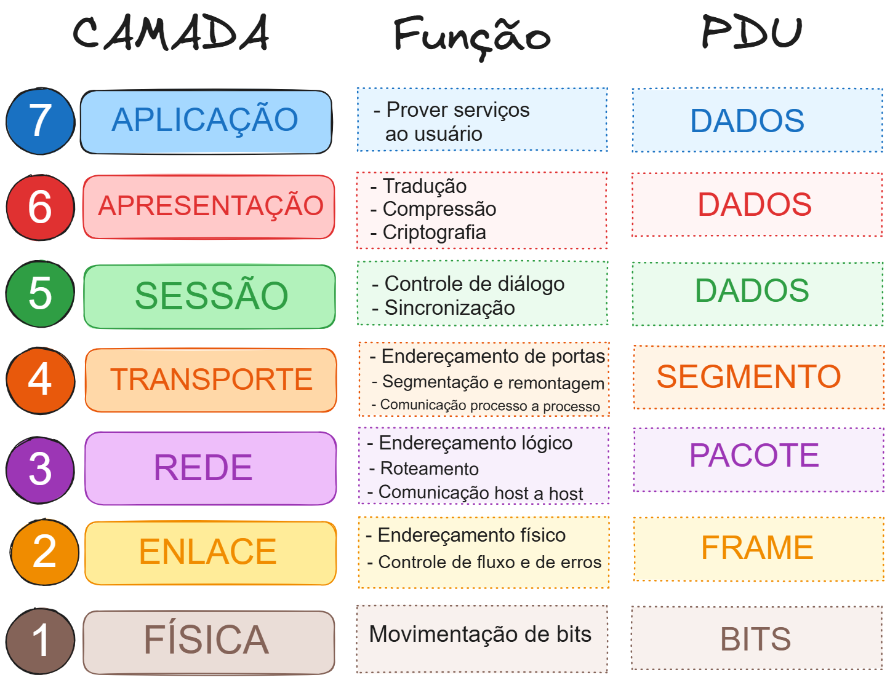

# ANOTAÇÕES SOBRE MODELO OSI (OPEN SYSTEMS INTERCONNECTION)

- O modelo OSI é um modelo essencial usado em redes. Esse modelo é a estrutura que determina como todos os dispositivos em rede enviarão, receberão e interpretarão os dados. Um dos beneficios do modelo OSI é que independente do tipo de dispositivo, eles podem comunicar-se entre si, contanto que usem esse modelo de comunicação.

- O modelo OSI consiste em sete camadas, cada camada tem um conjunto de responsabilidades onde processos especificos ocorrem e informações são adicionadas a esses dados.

## Camada 7 Aplicação

Essa camada, é a camada que define qual protocolo e regras devem determinar como o usuario interage com o envio e o recebimento da informação.Toda aplicação como email, browsers ou servidores de arquivos tem uma interface grafica usada pelos usuarios para interagir com os dados, enviados e recebidos.

## Camada 6 Apresentação

Nessa camada que começa a padronização. Como os softwares podem ser criados de varias formas diferentes, essa padronização de trasmissão de informaçoes garante que a informação conssiga ser transmitida independente de qual dispositivo ou software sai ou chega. Essa camada atua como uma TRADUTORA para a camada 7, de aplicação. Recursos de segurança, como criptografia de dados (HTTPS), ocorrem nessa camada.

## Camada 5 Sessão

Uma vez que a camada 6 de apresentação traduzir e formatar os dados, a camada 5 vai estabelecer uma sessão ou uma conexão melhor dizendo, com o dispositivo de destino. Quando uma sessão é estabelecida uma conexão é criada. A camada de sessão também pode encerrar a conexão se ela ficar muito tempo sem ser usada. Verificando caso aja perda de conexão apenas os dados mais recentes dseriam enviados, o que economizaria banda.

## Camada 4 Transport

A camada 4 da OSI desempenha um papel importante na comunicação entre dispositivos. Para se comunicar é nescessário um dos dois tipos de protocolos de comunicação.

- TCP
- UDP

### TCP

Tranmission Control Protocol (TCP). Esse protocolo foi criado com o objetivo de garantir uma conexão confiavel e estavel entre dispositivos. O TCP é capaz de criar uma conexão estavel e constante entre os dispositivos, verificando se há algum erro nos pacotes de dados e garantindo que eles sejam remontados na mesma ordem. O TCP é usado para compartilhamento de arquivos, navegação web, e envio de email, garantindo que os dados cheguem precisos e completos.

### UDP

User Datagram Protocol (UDP). Esse protocolo não fornece a estabilidade, confiabilidade e segurança do TCP. Ele simplesmente envia os pacotes de dados independente se os dados irão chegar ou nao. Não há nenhuma sincrionização entre os dispositivos ou qualquer garantia.

## Camada 3 Network

Network é a camada de rede que decide o caminho ideal que as informações dever percorrer pra chegar ao destino. Esse protocolo usa o OSPF (Open Shortest Path First) e RIP (Routing Information Protocol).

###### Os fatores que decidemn qual rota será tomada são os seguintes:
- Qual o caminho mais curto? Ou seja, tem menor quantiodade de dispositivo para o pacote percorrer.
- Qual o caminho mais confiavel? Ou seja, Algum pacote foi perdido no caminho.
- Qual o caminho tem a conexão fisica mais rapida? 

Nesta camada tudo é tratado por meio de endereços de IP.

## Camada 2 Data Link

Aqui é onde o endereçamento é carregado. Aqui é carregado um pacote de camada de rede que contem um endereço MAC (Media Access Control) fisico do endpoint do recebimento. Dentro de todo e qualquer computador tem uma placa de interface de rede (NIC) que vem com um endereço MAC exclusivo para indentifica-lo.

###### MAC
Os endereços MAC são definidos pelo fabricante e literalmente gravados no cartao; eles não podem ser alterados, mas podem ser falsificados.

## Camada 1 Fisica

Essa é a camada mais simples de entender. Essa camada faz referencia aos componentes fisicos usados para a transmissao. Como cabos Ethernet.