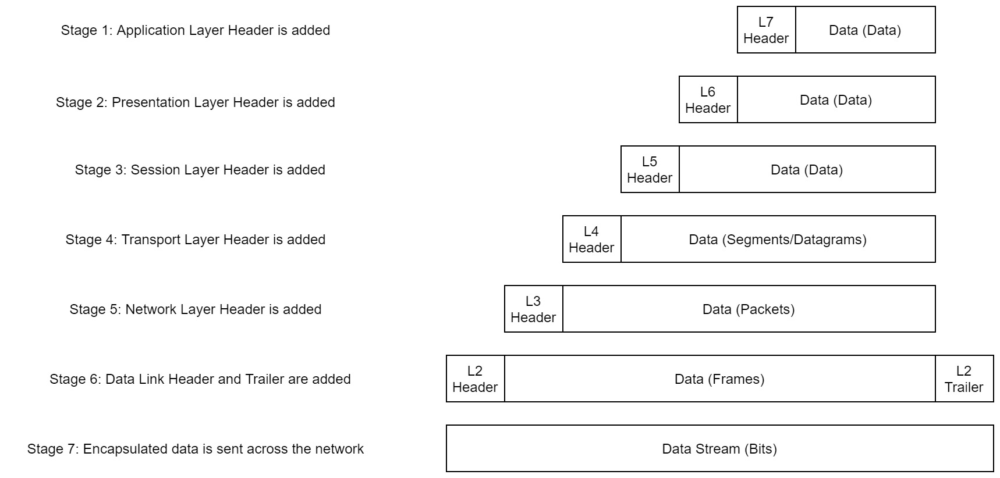
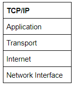
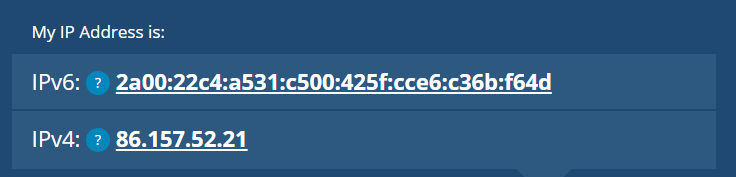
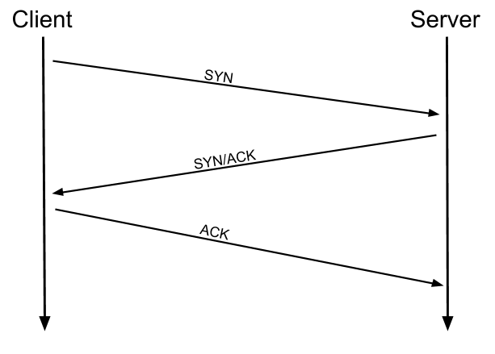

# AQUI SEGUE UM RESUMO DA SALA INTRODUCTORY NETWORKING DO TRY HACK ME.
# Essa sala fala sobre OSI, TCP/IP e ferramentas de rede.

## 1.1 OSI model: 

A OSI( Open System Interconnection) é um modelo padronizado que usamos para demonstrar a teoria por 
tras das redes de computadores. Ná pratica, é na verdade o modelo TCP/IP mais compacto no qual a 
rede do mundo real se baseia. O modelo OSI é mais pratico de se comompreender.

O modelo OSI consiste em 7 camadas:

OSI:
1. Aplication
2. Presentation
3. Session
4. Transport
5. Network
6. Data Link
7. Physical

Exitem muitos mnemonicos flutuante para ajudar a aprender as camadas do modelo OSI - pesquise até 
encontrar um que você goste.

Eu pessoalmente favoreço: Anxoius Pale Shakespeare Treated Nervous Drunk Patiently

Vamos olhar cada camada:

###  Camada 7 Aplicação:
A camada de aplicação do modelo OSI fornece essencialmente opções de rede para programas executados 
em um computador. Funciona quase exclusivamente com aplicativos, fornecendo uma ninterface para eles 
usarem para transmitir dados. Quando os dados são fornecidos a camada de aplicação, eles são passados 
para a camada de apresentação.

### Camada 6 Apresentação:

A camada de apresentação recebe dados da camada de aplicação. Esses dados tendem a estar em 
um formato que o aplicativo entende , mas nao nescessáriamente em um formato padronizado que possa 
ser entendido pela camada do aplicativo no computador do receptor. A camada de apresentração traduz 
os dados em um formato padronizado, além de lidar com qualquer criptografia, cmpactação ou outras 
transformações nos dados. Com isso concluido, os dados são passados para a camada de sessao.

### Camada 5 Sessão:

Quando a camada de sessão rcebe os dados da camada de apresentação, ele verifica se pode configurar 
uma conexao, se nao puder, ele retorna um erro. Se uma sessao puder ser estabelecida, ela deve manter e sincronizar 
a comunicação. Essa sessao criada é exclusiva para a comunicação, permitindo que você faça solicitações para 
diferentes endpoints simultaneamente sem que todos dados se misturem (como quando vc abre duas guias simultaneamente 
para se conectar). Se a conexao for bem sossedida entre o host e o computador remoto, os dados são passados para a 
camada de transporte.

### Camada 4 Transporte:

A camada de transporte tem várias funções. A primeira é definir qual o protocolo deve ser ultilizado. As mais
comuns são o TCP (Transmission Controll Protocol) e UDP (User Datagram Protocol). TCP é um protocolo para manter a 
conexao estavel, garantindo que ela se mantenha durante a transmissao de dados, ja a UDP é um protocolo de 
transmissoa rápido, onde todos dados são tranmitidos sem garantir a conexão ou o recebimento. UDP é geralmente 
usado em chamadas e reprodução de videos, onde os dados são enviados continuamente, ja se o destinátário recebe 
nao, é problema dele. Com o protocolo selecionado, a camada de transporte divide a transmissao em partes pequenas(
em TCP são chamados de segmentos, ja em UDP são chamados de datagramas.)

### camada 3 Rede:
A camada de rede é responsavel por localizar o destino da sua solicitação. Quando você  deseja solicitar 
informações de uma pagina da web, é a camada de rede que pega o endereço IP da pagina e descobre o melhor caminho 
a seguir. Nessa fase estamos falando de endereçamento logico ou seja endereçamento de IP. Os endereços logicos são 
usados para fornecer ordens as redes, categorizando-as e permitindo-nos classofica-las adequadamete. Atualmente, a 
forma mais comum de endereçamento lógico é o formato IPV4.

### Camada 2 Link de Dados:

A camada de link de dados se concentra no endereçamento fisico da transmissão. Ele recebe um pacote da camada 
de rede que inclui o Ip do computador remoto e adiciona o endereço fisico (MAC) do endpoint. Cada computador 
habilitado para rede que é um network Interface Card (NIC) que vem com um endereço MAC (Media Access Control) 
exclusivo para indentifica-lo. Os endereços MAC são definidos pelo fabricante e literalmente gravados na placa; 
Eles não pedem se alterados - embora possam ser falsificados. Quando as informações são enviadas por uma rede, na 
verdade é o endereço fisico usado para identificar exatamente para onde enviar as informações.n Além disso o link 
de dados tem como função formatar os dados em um modelo adequado para a transmissao. O link de dados tambem
verifica verificam as informações recebidas para garantir que nao foram corrompidas.

### Camada 1 Física:

A camada fisica é o hardware do computador. Aqui os pulsos eletricos que compoem a transferencia de dados 
por uma rede sao enviados e recebidos. Também é função da camada fisica converter os dados para binario  quando 
recebidos e converter os binarios em dados de transmissao quando for envia-los.

## 2. Encapsulação:

A medida que os dados são passados para cada camada do modelo, mais informações contendo detalhes especificos da 
camada em questao são adicionadas ao inicio da transmissao. Por exemplo, o cabçalho adicionado pela Camada de Rede, 
incluiria coisas como os enderços de IP de origens e destino, e o cabeçalho adicionado pela camada de transporte 
incluiria entre outras coisas, informações especificas do protocolo que esta sendo usado. A Camada de Data Link 
adiciona uma peça no final da transmissao, que é usada para verificar se os dados nao forem corrompidos  na transmissao.
Porque os dados nao podem ser interceptados e adulterados sem quebnrar o trailer. Todo esse processo é chamado de 
encapsulamento. 

Observe que os dados encapsilados recebem um nome diferente em diferentes etapas do processo. Nas camadas 7,6 e 5 os 
dados são chamados simplesmente de dados. Na camada de transporte, os dados encapsulados são chamados de segmento ou 
de datagramas dependendo do protocolo de conexao escolhido. Na camada de rede, os dados são chamados de pacote. 
Quando o pacote é passado para a camada de enlace de dados, ele se torna um frame e, no momento em que é transmitido 
por uma rede, o frame é dividido em bits.

Quando a mensagem é recebida, ele inverte o processo, começando da camada fisica indo até a camada da aplicação, 
removendo as informações adicionais a medida que avança. Isso é conhecido como desencapsulamento. Qualquer 
dispositivo independente do sistema operacional, seguirão esse processos, permitindo que qualquer dispositivo 
conectado em rede, possa se comunicar com os demais.

## 3. Modelo TCP/IP

O modelo TCP/IP é, em muitos aspectos, muitos semelhantes ao modelo OSI.  Esse modelo consiste em 4 camadas: 
aplicativo, Transporte, Internet e Interface de rede. Apesar de ter menos camadas, eles combrem a mesma gama de funções.

O modelo OSI apesar de nao ser usado no mundo real, abrange melhor os aspectos que compoem as funbções dos protocolos 
de transmissão. Desa forma todo o processo fica mais facil de ser analisado e compreendido. Se comparado os modelos, eles
seriam colocados nessa foto da imagem abaixo:

Ambos os modelo OSI e TCP/IP funcionam da mesma maneira, sendo adicionado um cabeçalho em cada passo no processo e o mesmo
quando falando de desencapsulação. Visualmente, essa ideia de camadas facilita o entendimento, mas estamos falando de um
conjunto de protocolos quem compoem o TCP/IP. O proprio nome TCP/IP é a junção dos dois mais importantes: Transmission 
Control Protocol que controla o fluxo de dados entre os endpoints, e o Internet Protocol que controla como os pacotes sao 
endereçadas e enviadas.

O TCP é um protocolo baseado em conexão, ou seja, antes de qualquer dado ser enviado, é nescessário formar uma conexao 
estável entre os dispositivos. O processo que forma essa conexão é chamado de Handshake.

Em um handshake, o dispositivo envia uma solicitação indicando que deseja inicializar uma conexão. Essa solicitação
contem algo chamado bit Syn (abreviação de sinchronise), que é o primeiro contato para o processo de conexao. Em resposta 
o servidor ou dispositivo enviará também um bit SYN, juntamente com um bit ACK de "Aknowledgement" de volta ao dispositivo 
que iniciou a conexão, indicando que é possivel se conectar. E entao, o dispositivo que iniciou a conexão, por sua vez 
responderá enviando de volta um bit ACK, firmando a conexao. Uma vez que o handshake for formalizado a conexao é estabelecida 
e os dispositivos podem trocar informações de forma segura, se alguma informação se corromper durante a transmissão, esse 
pacote corrompido é reenviado.

## 4. Ping

O comando ping é uma ferrmaneta para testar se um alvo tem conexão. Geralmente o alvo é um web site ou um dispositivo na rede
interna. O ping funciona usando um protocolo ICMP, que é um dos protocolos dentro do modelo de conexao TCP/IP. A sintaxe
basica pra usar o comando é no terminal digitar ping e o dominio do alvo ou um ip nocaso de um dispositivo na rede interna.
Em um linux, você pode usar o comando man ping, para ver no manual as opções que especifica as buscas.

## 5. Traceroute

O tracerout pode acompanhar o caminho logico que uma solicitação percorre a medida que se dirige para a maquina de 
destino. A internet é composta de varios servidores e endpoints que se conectam em rede uns aos outros. Significa 
que para chegar no destino, antes vc passa por varios servidores. A sintaxe padrão em um linux é digitar tracerout e 
o ip ou dominio de destino. Você pode ver o manual do tracer route digitando: man traceroute 

## 6. whois:

Graças aos dominio, não é preciso decorar cada ip de cada serviço, como youtube, google, ou facebook. Mas e se 
precisarmos descobnrir o ip de um dominio. Nesse caso, usamos o Whois. Além do ip, essa ferrmaneta fornece,
varias informações sobre quem registrou o dominio. O comando para tester, é digitar: whois e o dominio de destino.
Também é possivel ver o manual com: man whois.

## 7. Dig:

    
