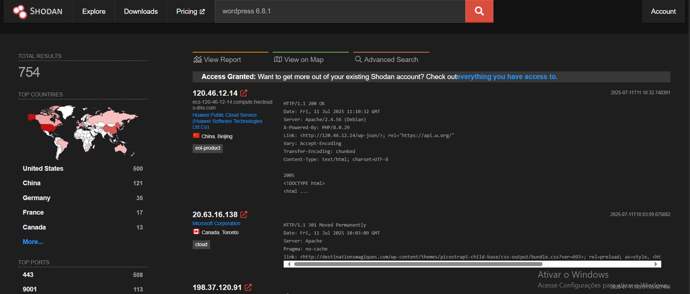
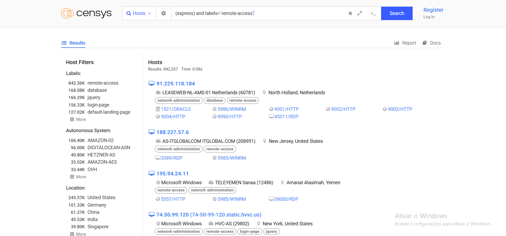

# Search Skills

Essas anotações é sobre habilidades de pesquisas na internet da sala Search Skill do tryhackme. Aprendendo a fazer tanto como fazer as pesquisas, mas também como filtrar fontes confiaveis.

## Avaliação de Resultados de Pesquisa

É impotante em uma pesquisa online filtrar as informações, uma vez que qualquer pessoa pode postar ou alterar uma informação online a partir de seus proprios fundamentos sem coesão ou consideração aos fatos reais. Nosso trabalho também é avaliar informações a fim de nao se basear em informações falsas.

- Fonte:Identificar o autor ou organização que publica as informações. Considere se eles são responsáveis e autoridade sobre o assunto. Publicar uma postagem em um blog, nao faz de alguem autoridade no assunto.
- Evidencias e raciocinio: Verifique se as alegações são apoiadas por evidencias confiaveis e raciocinio logico. Buscamos fatos concretos e argumentos solidos.
- Objetividade: Se as informações são apresentadas de forma imparcial e racional, refletindo multiplas perspectivas. Não nos interessa autores que promovam agendas obscuras, seja para promover um produto ou atacar um rival.
- Corroboração e consistencia: Valide as informações apresentadas por corroboração de várias fontes ndependentes. Verifique se fontes confiaveis e respeitaveis concordam com as reividicações centrais.

## Motores de Buscas

Quase todos os mecaniscmos de buscas na internet nos permitem realizar pesquisas avançadas. Como por exemplo:

- [Google](https://www.google.com/advanced_search)
- [Bing](https://support.microsoft.com/en-us/topic/advanced-search-options-b92e25f1-0085-4271-bdf9-14aaea720930)
- [DuckDuckGo](https://duckduckgo.com/duckduckgo-help-pages/results/syntax)

Baseando-se na estrutura de pesquisa avançadas do google, vamos ver alguns operadores:

- `"Aspas"`: As aspas impoem ao motor de pesquisa do google, que ele busque palavras ou frases exatamente como foram escritas, por exemplo `"HABILIDADES-DE-PESQUISA"`.
- `site`: Este operador permite fechar o escopo de pesquisa a um dominio especifico, `site:github.com Eduardo-Domiciano` neste caso, os resultados da busca Eduardo-Domiciano, serão todos somente do site do github.com.
- `- ifen`: Esse operador é usado para omitir resultados de pesquisas que contenham palavras especificas, como por exemplo buscar `HP -Harry Potter`.
- `filetype`: Este operador de pesquisa nos permite buscar por tipos de arquivos, como Portable Document Format (PDF), Microsoft Word Document (DOC), Excel Spreadsheet (XLS) e Microsoft PowerPoint (PPT).

Para mais informações sobre motores de buscas, segue um repositorio do Github sobre o tema [Aqui!](https://github.com/cipher387/Advanced-search-operators-list)

## Mecanismos de Pesquisas Especializados

Existem algumas ferramentas de pesquisas especializadas na internet, importantes o suficiente para anotar, mas provavelmente vou fazer uma anotação exclusiva pra cada uma devido suas funcionalidades e capacidades.

### Shodan

O [Shodan](https://www.shodan.io/dashboard) é um mecanismo de busca para dispositivos conectados online. Ele permite a busca de tipos e versões especificos de servidores,equipamentos de rede, sistema de controle insdustrial e dispositivos IoT (Internet of Things).

### Cencys

O [Cencys](https://search.censys.io/) é um mecanismo de pesquisa semelhante ao Shodan. Mas o Shodan busca dispositivos, como servidores, cameras, roteadores e dispositivos de internet das coisas (IoT). O cencys busca por hosts, sites, certificados e outros ativos conectados na internet. Alguns casos de uso incluem enumerar dominio em uso, auditar portas e serviços abertos e descobrir ativos nao autorizados na rede.

### 