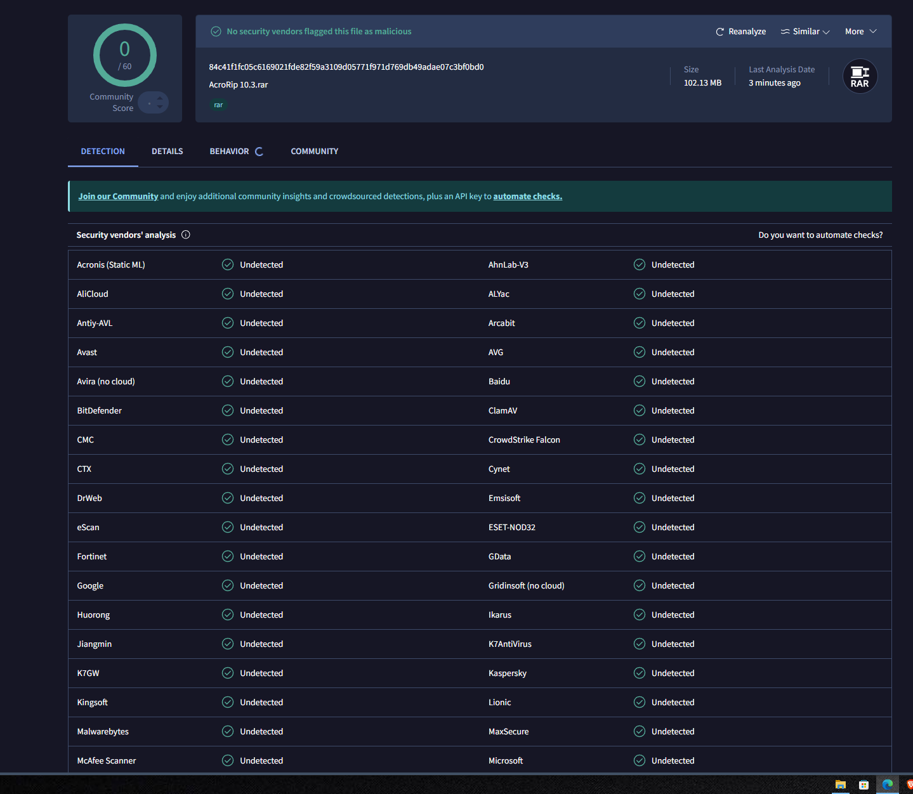
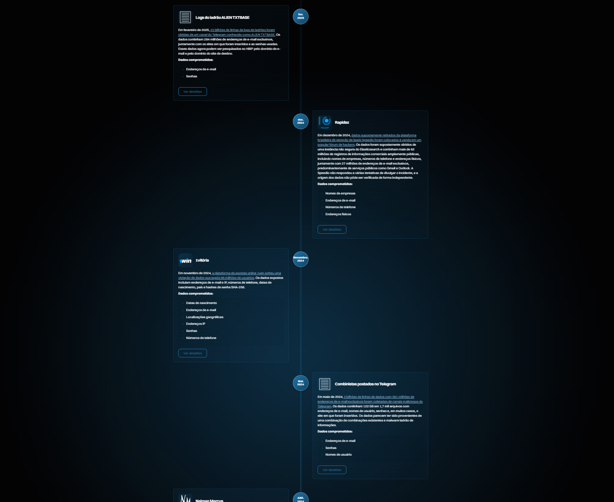
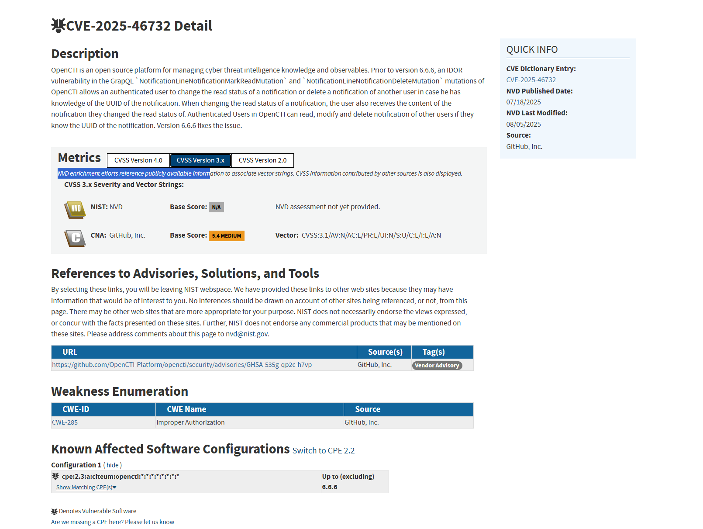
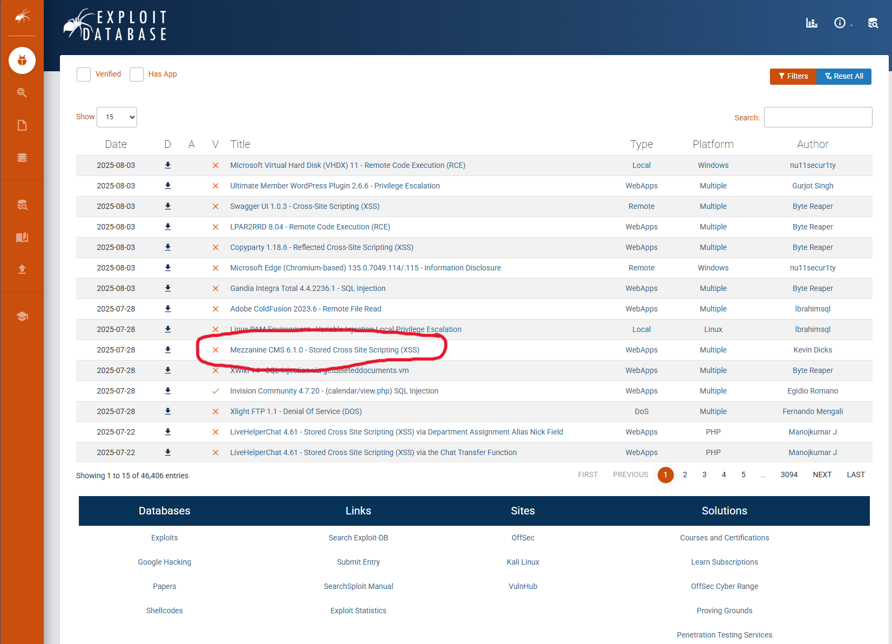
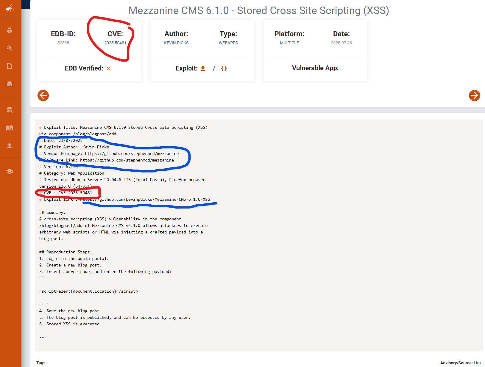
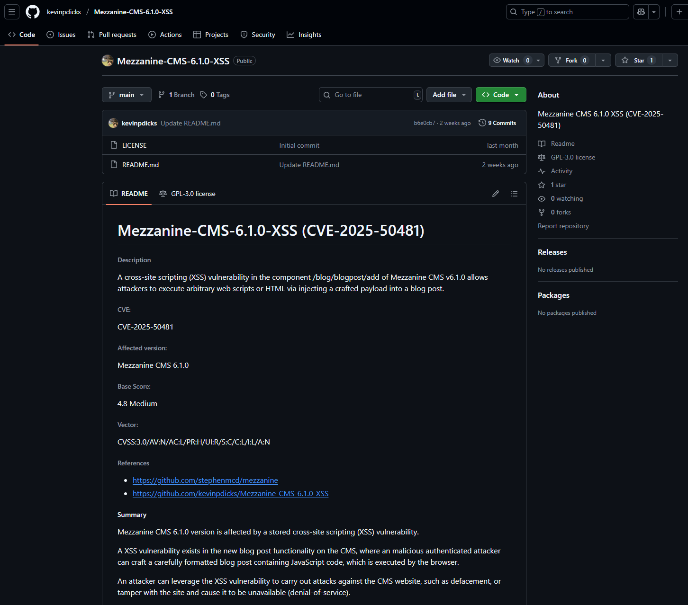

# Search Skills

Essas anotações é sobre habilidades de pesquisas na internet da sala Search Skill do tryhackme. Aprendendo a fazer tanto como fazer as pesquisas, mas também como filtrar fontes confiaveis.

## Avaliação de Resultados de Pesquisa

É impotante em uma pesquisa online filtrar as informações, uma vez que qualquer pessoa pode postar ou alterar uma informação online a partir de seus proprios fundamentos sem coesão ou consideração aos fatos reais. Nosso trabalho também é avaliar informações a fim de nao se basear em informações falsas.

- Fonte:Identificar o autor ou organização que publica as informações. Considere se eles são responsáveis e autoridade sobre o assunto. Publicar uma postagem em um blog, nao faz de alguem autoridade no assunto.
- Evidencias e raciocinio: Verifique se as alegações são apoiadas por evidencias confiaveis e raciocinio logico. Buscamos fatos concretos e argumentos solidos.
- Objetividade: Se as informações são apresentadas de forma imparcial e racional, refletindo multiplas perspectivas. Não nos interessa autores que promovam agendas obscuras, seja para promover um produto ou atacar um rival.
- Corroboração e consistencia: Valide as informações apresentadas por corroboração de várias fontes ndependentes. Verifique se fontes confiaveis e respeitaveis concordam com as reividicações centrais.

## Motores de Buscas

Quase todos os mecaniscmos de buscas na internet nos permitem realizar pesquisas avançadas. Como por exemplo:

- [Google](https://www.google.com/advanced_search)
- [Bing](https://support.microsoft.com/en-us/topic/advanced-search-options-b92e25f1-0085-4271-bdf9-14aaea720930)
- [DuckDuckGo](https://duckduckgo.com/duckduckgo-help-pages/results/syntax)

Baseando-se na estrutura de pesquisa avançadas do google, vamos ver alguns operadores:

- `"Aspas"`: As aspas impoem ao motor de pesquisa do google, que ele busque palavras ou frases exatamente como foram escritas, por exemplo `"HABILIDADES-DE-PESQUISA"`.
- `site`: Este operador permite fechar o escopo de pesquisa a um dominio especifico, `site:github.com Eduardo-Domiciano` neste caso, os resultados da busca Eduardo-Domiciano, serão todos somente do site do github.com.
- `- ifen`: Esse operador é usado para omitir resultados de pesquisas que contenham palavras especificas, como por exemplo buscar `HP -Harry Potter`.
- `filetype`: Este operador de pesquisa nos permite buscar por tipos de arquivos, como Portable Document Format (PDF), Microsoft Word Document (DOC), Excel Spreadsheet (XLS) e Microsoft PowerPoint (PPT).

Para mais informações sobre motores de buscas, segue um repositorio do Github sobre o tema [Aqui!](https://github.com/cipher387/Advanced-search-operators-list)

## Mecanismos de Pesquisas Especializados

Existem algumas ferramentas de pesquisas especializadas na internet, importantes o suficiente para anotar, mas provavelmente vou fazer uma anotação exclusiva pra cada uma devido suas funcionalidades e capacidades.

### Shodan

O [Shodan](https://www.shodan.io/dashboard) é um mecanismo de busca para dispositivos conectados online. Ele permite a busca de tipos e versões especificos de servidores,equipamentos de rede, sistema de controle insdustrial e dispositivos IoT (Internet of Things).

### Cencys

O [Cencys](https://search.censys.io/) é um mecanismo de pesquisa semelhante ao Shodan. Mas o Shodan busca dispositivos, como servidores, cameras, roteadores e dispositivos de internet das coisas (IoT). O cencys busca por hosts, sites, certificados e outros ativos conectados na internet. Alguns casos de uso incluem enumerar dominio em uso, auditar portas e serviços abertos e descobrir ativos nao autorizados na rede.

### Virus TOTAL

O Virus Total é um site qque fornece um serviço online de verificação de virus para arquivos e URLs usando varios mecanismos antivirus diferentes. Elesw podem até identificar arquivos verificados anteriormente.

Como pode ser visto na imagem, o virus total combina a busca de varios antivirus diferentes para maximizar o escaneamento, diminuindo a chance de um virus passar despercebido.

### Have I been Pwned

HIBP se um endereço de email aparece em uma violação de dados vazada. Isso permite saber se seu email ja foi vazado alguma vez na internet. Isso sognifica que suas informações, talvez até mesmo senhas, foram espostas.

HIBP mostra em quantos vazamentos seu email estava presente e quais as datas e ocasiões igual mostrado a baixo. Lembrando que esse é um email aleatório que eu testei.

## Vulnerabilidades e Exploits

### CVE (Common Vulnerabilities and Exposures)

A CVE é um tipo de dicionário de vulnerabilidades. Fornece um identificador padronizado para vulnerbilidades e problemas de segurança produtos e hardwares. Ele é identificado da seguinte forma CVE-ano-id. Abaixo segue a pagina da CVE: CVE-2025-46732.

A MITRE Corporation mantem o sistema CVE. Mais informações sobre CVEs podem ser encontrado em [Programa CVE](https://www.cve.org/) e em [National Vulnerabilities Database](https://nvd.nist.gov/).

### Exploit Database

Pra facilitar a exploração de vulnerabilidades, existe um banco de dados de Exploits. Nesse site é possivel encontrar scripts que testam vulnerabilidades, usados por pesquisadores de segurança em seus testes.

### Github

É claro que o proprio github é uma ótima plataforma de pesquisa, codigos usados por desenvolvedores e pesquisadores de varias areas podem ser uteis nos estudos sobre vulnerabilidades. Na imagem a cima eu marquei um dos exploits que é um (XSS) Cross Site Scripting. Clicando nele vamos pra pagina do exploit que mostra varios dados sobre o exploit incluindo dados do pesquisador que encontrou, e a CVE-2025-50481 ao qual a vulnerabilidade pertence. Também tem os links do github do pesquisador, onde ele expõe a falha.

Se vc pesquisar o codigo de identificação da CVE no Github, vc vai encontrar vários links de exploit dessa vulnerabilidade. Como essa CVE usada foi descoberta recentemente, só há como resultado, a pagina do proprio pesquisador.

### Documentação

Todo software, aplicação ou seja la o que for, tem documentação. Como no caso das CVEs que tem um tutorial ou artigo falando sobre, sempre há dosumentações pra estudar. Documentações são uma forma oficial, clara e confiavel de estudar sobre alguma serviço ou ferramenta. Ler é chato, mas nem todas as informações essenciais para o seu desenvolvimento poderão ser testadas na pratica. Ler, reler e anotar, ainda é a melhor forma de aprender e ter uma fonte de dados para pesquisar mais tarde.

