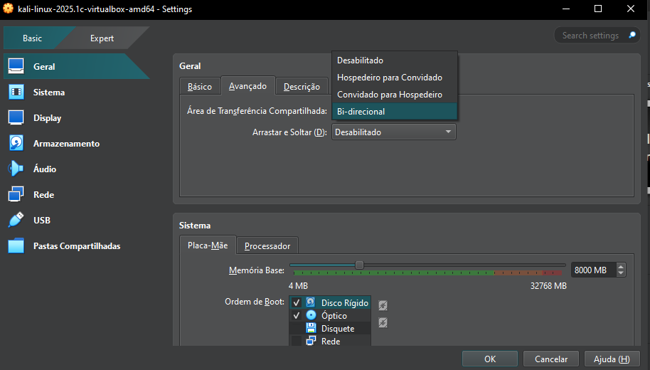
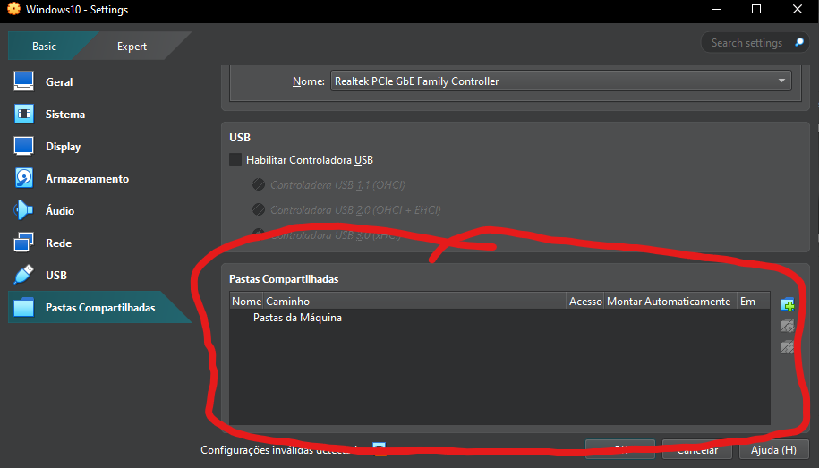
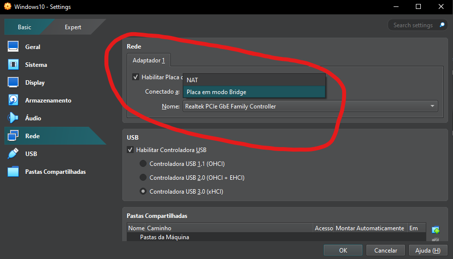
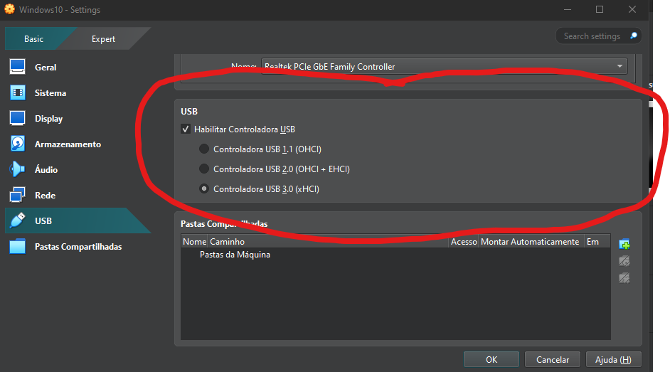

# Anotações sobre configuração de Maquinas Virtuais para Analise de Malware

Criei essas anotações para guardar as configurações basicas de uma maquina virtual para analise de malware e softwares crackeados. Ainda nao sei bem o que estou fazendo com isso, por isso mesmo quero juntar algumas informações pra entender melhor como isso funciona antes de aplicar.
## Configurações de 

- Area de transferencia

Desligar o compartilhamento de area de trasferencia entre a VM e a Maquina que hospeda a VM. Pra que isso nao seja uma porta de acesso a maquina que hospedeira.

- Pasta Compartilhada

Garanta que não há pastas compartilhadas ativas. Por padrão, o virtualbox, nao permite pastas ativas, mas é bom checkar na ferramneta de virtualização que vc esta usando.

- Adaptador de Rede

Quando vc criar a maquina, vc tera que baixar os softwares para instalar. Nesse ponto você precisa de internet, então primeiro instalar o que for nescessário e então depois de pronto desabilitar a internet da VM.

- Controlador USB

Eu não tenho certeza como funciona essa controladora USB, mas por enquanto vou deixar uma anotação para desativar e vou estudar mais sobre comno funciona.

