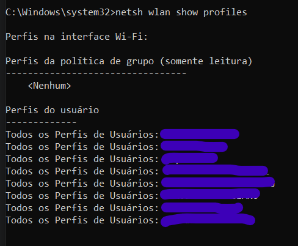
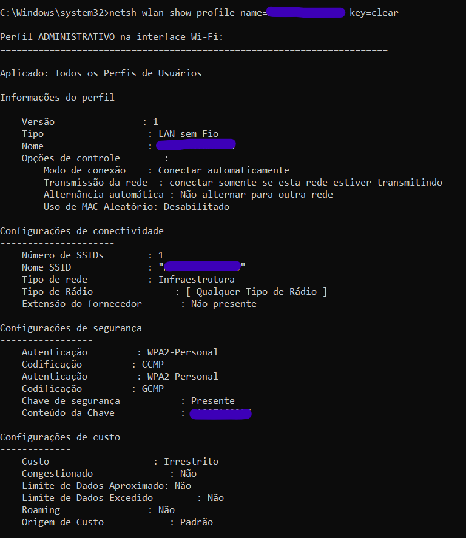

# Ultilidades e Atalhos do Windows

Segue algumas dicas de atalhos e facilidades em operar ou configurar um sistema operacional Windows.

## Buscando senhas de Wifi cadastradas pela maquina

Abra o prompt como administrador e adicione o seguinte comando:

Onde marquei como azul, são os nomes das redes de wifi que o dispositivo ja esta cadastrado. Agora identificamos a rede da qual queremos a senha para usar no comando seguinte. O comando fica entao: `netsh wlan show profile name=Nome-Da-Rede key=clear`

Os valores nas chaves "Nome" e "SSID" são referente ao nome da rede. E o valor na chave "conteudo da chave" é a senha que buscamos. Simples assim. Lembrando que identificamos redes que o dispositivo tem acesso, se o dispositivo nao tem acesso a rede, ele nao estará cadastrado.