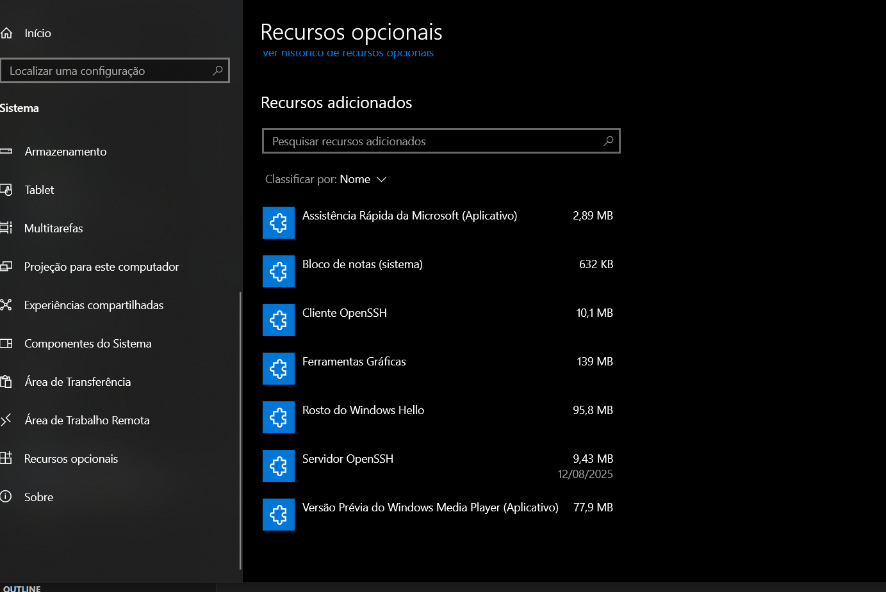
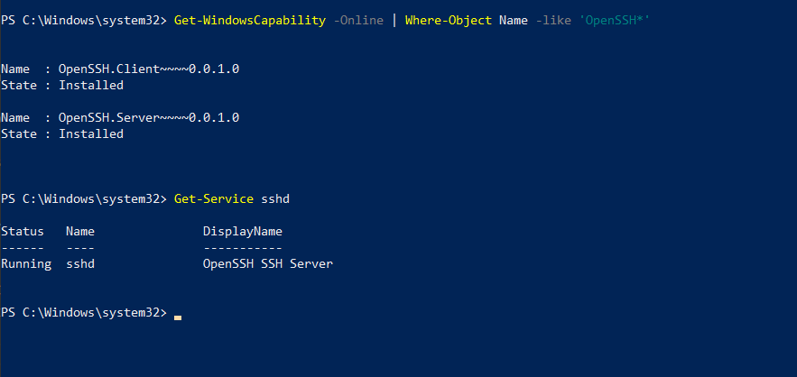
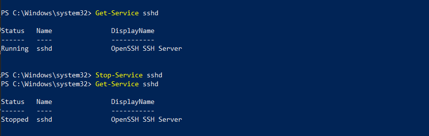
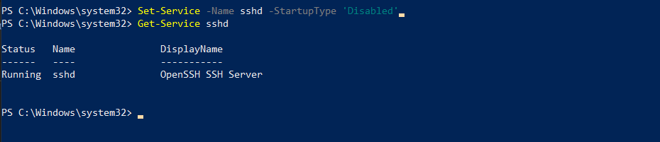

# Ultilidades e Atalhos do Windows

Segue algumas dicas de atalhos e facilidades em operar ou configurar um sistema operacional Windows.

## Buscando senhas de Wifi cadastradas pela maquina

Abra o prompt como administrador e adicione o seguinte comando:

Onde marquei como azul, são os nomes das redes de wifi que o dispositivo ja esta cadastrado. Agora identificamos a rede da qual queremos a senha para usar no comando seguinte. O comando fica entao: `netsh wlan show profile name=Nome-Da-Rede key=clear`

Os valores nas chaves "Nome" e "SSID" são referente ao nome da rede. E o valor na chave "conteudo da chave" é a senha que buscamos. Simples assim. Lembrando que identificamos redes que o dispositivo tem acesso, se o dispositivo nao tem acesso a rede, ele nao estará cadastrado.

## Ativar o SSH pelo Power Shell no Windows 10

SSH ou (Secure Shell) é um protocolo de conexão muito usado para acessar maquinas remotamente. Ele nao vem ativo por padrão, sendo nescessário ser ativado. Pra verificar se o Power Shell está ativo, você pode acessar as configurações --> Sistema --> Recursos Opcionais e ali vai uma lista de recursos ativos.

Em recursos opicionais fica descrito como "Client OpenSSH" e "Servidor OpenSSH". Pra fazer isso via Power Shell você pode usar os comando `Get-WindowsCapability -Online | Where-Object Name -like 'OpenSSH*'`. Nesse caso, dois comando foramusados juntos sendo separados por "|".

### INstalação via Power Shell

- 1. Abra o Power Shell como Administrador. Em seguida use o comando `Add-WindowsCapability -Online -Name OpenSSH.Client~~~~0.0.1.0` para instalar o cliente. Você pode usar o comando `Get-WindowsCapability -Online` para checar se o serviço está ativo. O cliente é como um convidado, ele serve para permitir acesso remoto de seu computador em outras maquinas. Isso funciona através de seu processo sshd (Secure Shell Daemon) que é o software que escuta e aceita a conexão em uma maquina remota. 

- 2. Agora instalamos o Server com o comando `Add-WindowsCapability -Online -Name OpenSSH.Server~~~~0.0.1.0`. O server é como um anfitrião que permite que outras maquinas sejam capaz de acessar a sua. Também é possivel verificar se o serviço esta ativo com `Where-Object Name -like 'OpenSSH*`. O recsultado desse comando será o mesmo que aparece na imagem acima de checagem de recursos ativos.

- 3. Uma vez que o comando está instalado, ele ainda precisa ser ativado manualmente com o comando `Start-Service sshd`, mas se sentir a nescessidade de manter o serviço ativo automaticamente, você pode usar o comando `Set-Service -Name sshd -StartupType 'Automatic'`, que mantera o serviço continuamente ativo na sua maquina. Você pode verificar se ele esta rodando automatico com o comando `Get-Service sshd`.

Por padrão o firewall do windows bloqueará qualquer tentativa de conexão com a porta 22, porta padrão para conexões SSH. Por isso é nescessário configura-la.

- 4. O que precisamos aqui é um comando que crie uma regra que permita uma conexão TCP na porta 22. O comando seria esse `New-NetFirewallRule -Name sshd -DisplayName 'OpenSSH Server (sshd)' -Enabled True -Direction Inbound -Protocol TCP -Action Allow -LocalPort 22`. Lembrando que o Secue Shell usa o protocolo TCP pra se conectar.

Uma vez que esses passos tenham sido concluidos, a maquina será capaz de fazer e receber conexões remotas a partir de uma conexão Secure Shell.

### Mas e se eu quiser desativar essas configurações?

Não priemos Canico, a primeira coisa a se fazer é checar se os serviços estão instalado e ativos como mostrados antes com os comandos `Get-WindowsCapability -Online | Where-Object Name -like 'OpenSSH*'`. Podemos checar também se o serviço esta funcionando no automatico com `Get-Service sshd`.

- 1. Inicialmente você pode apenas desativar o serviço com o comando `Stop-Service sshd`. Perceba pela imagem a baixo que eu rodei pra ver se o serviço esta rodando, logo depois, usei o comando de parada e rodei o comando pra ver se o serviço estava rodando de novo, e ele esta parado.

- 2. Depois de definir que o ssh fique ativado automaticamente, mesmo parando o serviço ele seria ativado caso a maquina seja reiniciada, nesse caso, devemos rodar um comando que desabilita a configuração de ativação automatica que rodamos la atras, no inicio das anotações, o comando é `Set-Service -Name sshd -StartupType 'Disabled'`. Você pode usar o comando `Get-Service sshd` mais uma vez pra checar se a desativação foi concluida com exito.

Importante notar que apesar de roda o comando para desativar o serviço automatico, o sshd ainda esta rodando. Esse comando apenas seta a configuração de que o serviço nao será iniciado automaticamente. Ou seja se eu parar o serviço ou reiniciar a maquina o serviço nao reiniciará automaticamente.

- 3. A ultima coisa nescessária para ser desativada se nescessário é a regra de conexão da porta 22 configurada no firewall. Usando o comando `Remove-NetFirewallRule -Name sshd` você remove a regra sshd que ativamos anteriormente.

Eu entendo que nao fui muito explicativo sobre os comando e como eu estou estudando sobre isso, realmente é uma informação que faz falta quando busco um tutorial ou uma explicação. Mas estou implementando isso agora em uma maquina, então queria uma anotação rapida pra caso precise disso de novo. Devo voltar a isso em algum momento.