#   Anotações sobre os fundamentos do windows.

## New Technology File System (NTFS)

O sistema de arquivos usado nas versoes mais modernas do windows é o New Technology File System. Antes do NTFS existinha o FAT16/FAT32 (File Allocation Table) e o HPFS (High Performance File System). Ainda é possivel ver o modelo FAT implantado em dispositivos USBs e MicroSDs, mas nao mais em windows OS. O NTFS é conhecido como um sistema de registros de arquivos diarios. Em caso de falha, o sistema pode reparar automaticamente as pastas ou arquivos do disco usando as informações armazenadas em um arquivo de log. Isso nao é possivel no FAT.

### Permissões NTFS

É possivel conceder ou negar permissoes de acesso a pastas e arquivos. As permissoes são:

- Full Control
- Modify
- Read & Execute
- List Folder Content
- Read
- Write

credito imagem: microsoft
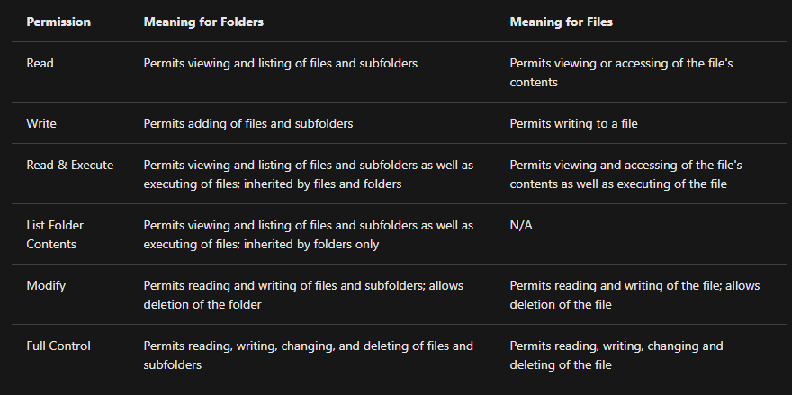

Se quiser ver as permissões:

- Clicar com o  botao direito do mause na pasta
- Propriedades
- Segurança
- Em grupos e nomes de usuarios, você visualisa o grupo ou nome de usuario que tem a permissao.
- Em permissões de usuario, você ve qual permissão o grupo e o usuario tem para essa pasta.

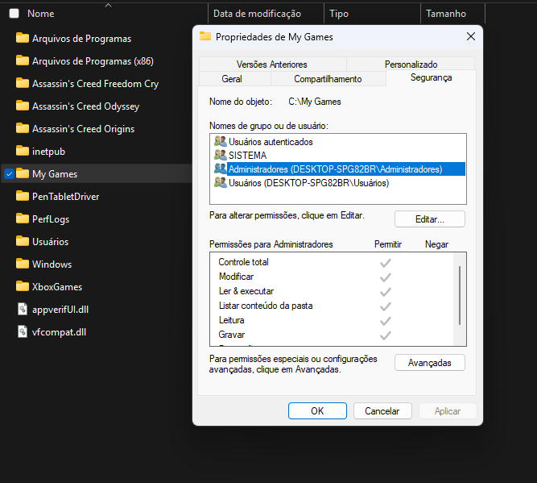

Outro recurso do NTFS é o Alternative Data Streams (ADS). O ADS é um atributo esécifico do windows NTFS. Cada arquivo tem pelo meno um fluxo de dados (`$DATA`), e o ADS permite que os arquivos contenham mais de um fluxo de dados. Nativamente o windows explorer não exibe ADS para o usuario. Existem executraveis de terceiro que podem visualizar esses dados, mas o power shell tem a capacidade de visualizar esses dados. Hacker criadores de malware usam ADS para ocultar dados. Você pode saber mais sobre malware com ADS [aqui](https://www.malwarebytes.com/blog/101/2015/07/introduction-to-alternate-data-streams).

## Usuarios

Existem dois tipos de contas no windows, Usuario padrão e Administrador. Cada tipo determina o que o usuario poderá executar no sistema.

- Um administrador pode fazer alterações no sistema: Adicionar ususarios, excluir, modificar grupos, configuraçõesdo sistemas e etc.
- Um usuario padrao só poderá fazer alterações em pastas/arquivos atribuidos ao usuario e nao pode fazer alterações no sistema, como instalar programas por exemplo.

No menu de contas do windows, apenas o administrador poderá ver as opções de alterar tipo de conta, exluir, adicionar conta e etc. Cada usuario criado tera uma lista de pastas exclusivo para esse usuario especifico.
- Área de trabalho
- Documentos
- Downloads
- Musica
- Fotos

Outra forma de gerenciar ususarios é usar o "Gerenciamento de Usuarios e Grupos Locais". para acessar use Win + R e aparecerá a caixa de menu executar. Insira o comando `lusrmgr.msc`

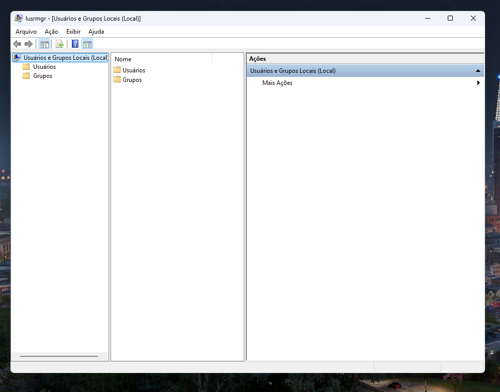

Aqui há 2 pastas, Usuários e Grupos. Clicando em grupos, verá todos os grupos locais, juntamente com as descrições. Cada grupo tem permissões especificas definidas para eles, e os usuários são atribuidos a cada grupo pelo administrador. Quando um usuario é atribuido a um grupo, ele herda as pemissões desse grupo.

## UAC (User Account Control)

A maioria dos usuarios domesticos do windows, usam o sistema como administradores locais. Como dito antes qualquer administrador local pode fazer alterações no sistema. Um usuario comum nao precisa ter o nivel de privilégio de um administrador, capaz de alterar o sistema ou fazer instalações de softwares duvidosos.

### Executando como usuario

Quando um usuario faz uma ação, essa ação é feita a partir dos privilégios desse usuario, ou seja, se ele nao tiver o privilégio de instalar um programa duvidoso ou nao, ele nao conseguirá fazer isso sem a autenticação de um usuario que tem esse privilégio.

### UAC

Para proteger o usuario local usando dessa limitação de privilegios, a microsoft introduziu o UAC (User Account Control). Introduzindo inicialmente no Windows Vista, se manteve nas versoes posteriores. O UAC obviamente nao se aplica ao Administrador, mas a todos os demais usuarios. 
- Quando um usuario como administrador loga no sistema, ele nao loga com os privilegios de execução, se um software for instalado, um prompt aparece pedindo autorização para executar essas ações que requerem privilegios mais altos.

- Quando um usuario padrão loga no sistema, sempre que algum software for instalado, um prompt vai aparecer pedindo uma senha para essa ação ser executada. Quando vc também nao esta lgado como usuario padrão, os icones que precisam ser executados como administrador tem o simbolo do escudo de segurança para alerta-lo da nescessidade desse priovilegio para executar essa ação.

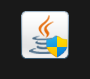

O icone do escudo amarelo e azul indica a nescessidade de uma autorização de administrador para executar o arquivo.

## Genrenciamento do computador

O gerenciamento do computador pode ser acessado clicando com o botão direito do mause no botao iniciar do windows e selecionando "Gerenciamento do Computador". Ele tem 3 sessoes principais, Ferramentas do sistema, armazenamento e serviços de aplicativo.

### Ferramentas do Sistema

Começando com "Agendamento de tarefas". Essa ferramenta, permite que possamos criar e gerenciar tarefas que o computador realizra em hortarios especificos. Ele poderá executar  aplicativos, scrpts e etc., podendo ser programado para qualquer momento.

### Visualizador de eventos

Visualizador de eventos, nos permite ver registros de eventos que ocorreram no computador. Essas informações são uteis pra diagnosticar problemas  e investigar ações executadas no sistema.

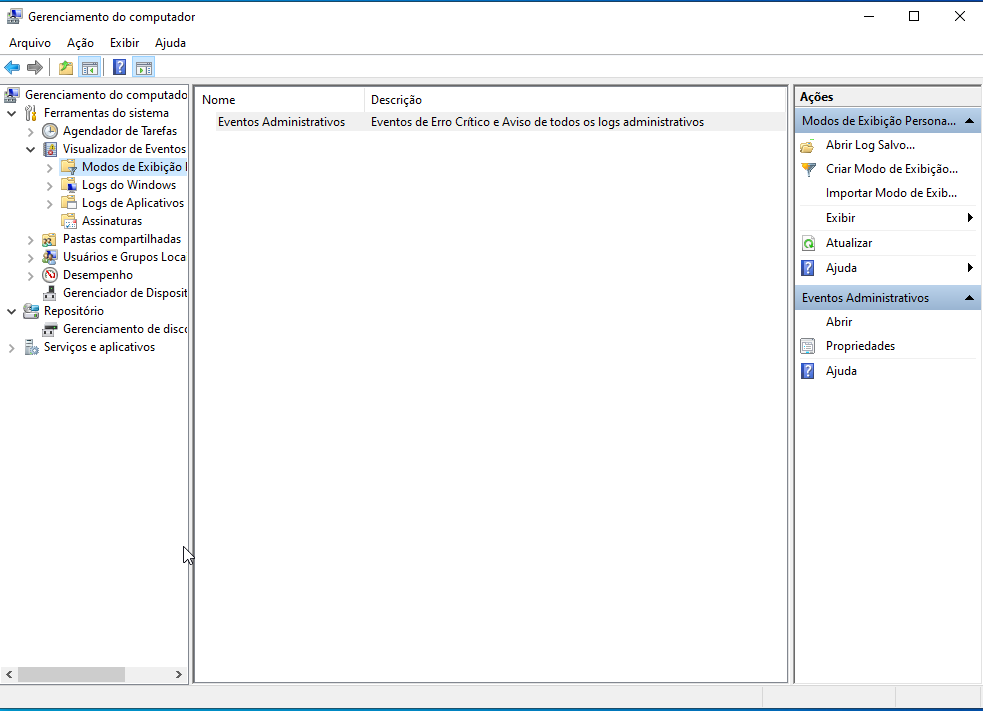

- O painel a esquerda fonrcece uma lista hieraq2uica de arvores de provedores de logs de eventos.
- O painel no meio exibirá uma visão geral e um resumo dos eventos especificos de um provedor selecionado.
- O painel a direita é o painel de ações.

Há cinco tipos de logs de eventos, descritos a baixo. Os tipos de logs, ficam na primeira coluna definidos como "Nivel". Imagem de https://learn.microsoft.com/en-us/windows/win32/eventlog/event-types

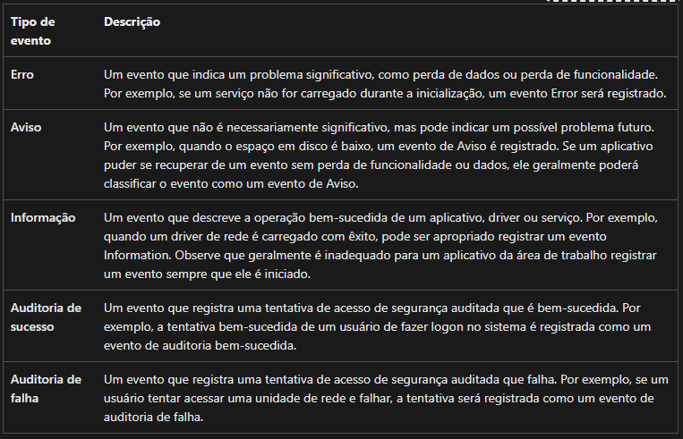

Ja o padrao dos logs, define o contexto. Deixei em ingles, porque aparece em ingles na janela. Imagem de https://learn.microsoft.com/en-us/windows/win32/eventlog/eventlog-key

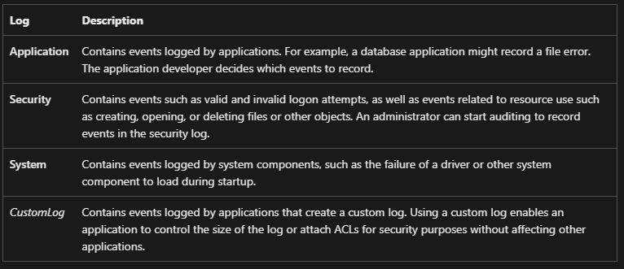

Segue a janela de visualização de eventos.

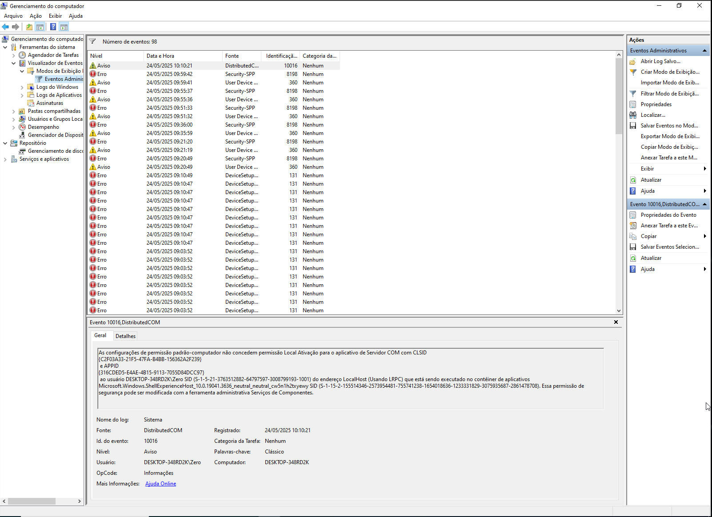

### Pastas Compartilhadas

- Em pastas compartilhadas você pode ver pastas as pastas que uma maquina especifica compartilha na rede, podendo ser acessadas pelas demais. Eu ainda vou fazer um bloco de anotações aqui somente para compartilhamento de pastas. Explicando como funciona o compartilhamento, segurança e as configurações nescessárias.

- Em sessão podemos ver os usuarios conectados ao compartilhamento no momento.

- Em Arquivos abertos, todas as pastas ou arquivos que os usuarios conectados acessam , serão listados.

### Usuarios e Grupos  (lusmgr.msc)

Ja fiz anotações sobre isso aqui, no topico de usuarios. Mas futuramente devo complementar com mais informações aqui.

### Desempenho  (perfmon)

Essa ferramenta serve para ver dados de desempenho em tempo real ou de um arquivo de log. Bem útil para solucionar problemas de desempenho em sistema de computador, seja local ou remoto.

### Gerenciador de dispositivo

Essa ferramenta serve pra visualizar e configurar qualquer hardware conectado ao computador.

### Repositório

Em repositório esta o beckup do windows e o grenciamento de disco. Eu ainda vou estudar mais sobre isso pra fazer anotrações aqui.

### Serviços e aplicações

Aqui você pode ver serviços, habilitar e desabilitar. O interessante aqui é que cada serviço tem uma descrição de pra que ele é usado pelo sistema. É um bom lugar pra conferir serviços e como eles funcionam.

## Informações do Sistema (msinfo32)

O windows tem uma ferramenta chamada Microsoft System Informnation (msinfo32) capaz de mostrar informações mais completas sobre o hardware da maquina. Essa ferramenta é dividida em 3 sesões, Recursos de Hardware, Componentes e Ambiente de Software. Mas antes, vou falar aqui do Resumo do sistema.

### Resumo do sistema

Aqui mostra especificações tecnicas do computador como informações de processador, memoria ram e sistema operacional.

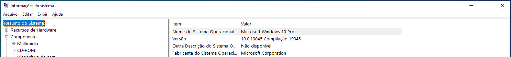

Há mais informações que devem ser obervadas detalhadamente em resumo do sistema no futuro.

## Monitor de recursos

O monitor de recursos exibe informações de processos relacionado a CPU, Disco, Rede e Memoria.

## Prompt de Comando

Apesar da interface grafica ser a forma mais comum de operar uma maquina windows, hoje em dia ainda há muitas vantagens em umar o prompt de comando. Seja pra executar comandos ou apenas buscar informações de forma rapida e facil em vez de acessar varias janelas e botões.

- O comando Hostname imprimi o nome da maquina.

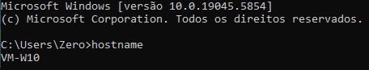

- O comando Whoami imprimirá o nome do usuario
- O comando ipconfig imprimirá as configurações de rede
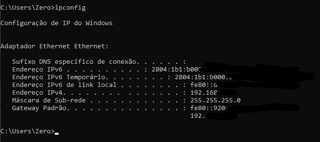

Vou fazer uma anotação especifica para comandos mais usado como cd, mkdir, netstat, router entre outros. Tem muita coisa útil que da pra fazer uma anotação só pra isso. De qualquer forma tem uma lista dos comandos de prompt !

## Registro do Windows (regedit)

O regstro do windows é um banco de dados central usado para armazenar informações nescessárias para configurar o sistema para um ou mais usuarios, aplicativos ou dispositivos de hardware. Alguns topicos em o windows faz referencia são:

- Perfis de cada ususario
- Aplicativos instalados em cada computador e os documentos que podem ser criados por cada um.
- configuração das propriedades para ada tipo de aplicativo.
- Qual hardware existe no sistema.
- As portas que estao sendo abertas.

AVISO: Essas configurações são pra usuarios avançados. fazer alterações nos registros afetarão as operações do computador.

Existem várias maneiras de editar os registros, uma delas é o editor de registro.

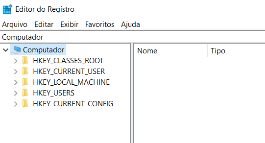

Para mais informações sobre o registro do windows acesse !

