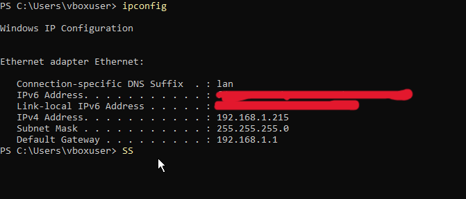
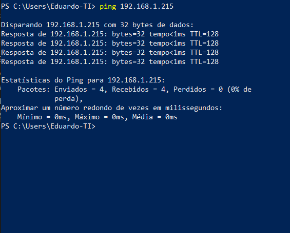
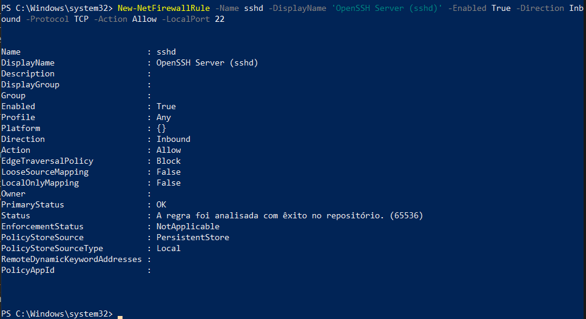

# Anotações de como configurar um Windows Server, aqui usando a versao 2019.

Anda vou pesquisar mais sobre as versoes de Windows para falar mais aqui, mas por enquanto sei que são a Standard, a Essencials e a Datacenter. Se vc nao tiver uma licença para usar o windows Server, vai acabar tendo que fazer seus testes na versão Windows Core, que é a versão gratis do sistema. Ela nao tem interface grafica e tudo é feito pelo terminal de comando. Tem alguns aspectos da instalação, principalmente quando relacionado a uma virtualbox. Eu tive um pouco de trabalho na instalação, mas vou pesquisar mais sobre isso outra hora.

## Primeiros passos para o Windows Server 2019 depois de Instalado.

O windows vem por padrão é bem restrito para receber conexões externas, até mesmo o Ping(Protocolo ICMP). Então vamos começar setando uma regra no firewall pra permitir pingar no server e testar a conexão. **Importante: Eu estou fazendo teste em uma maquina virtual com a placa de rede em modo Bridge, então nao estou usando um servidor DHCP aqui**

### Ping

A primeira coisa então é descobrir qual o ip do server. Vamos usar o comando `ipconfig`.

No terminal abra o power shell com o comando simples `powershell`. Agora no power shell use o comando para criar uma regra para ping no firewall. `New-NetFirewallRule -DisplayName Ping ICMPv4" -Direction Inbound -Protocol ICMPv4 -IcmpType 8 -Action Allow`.

- `DisplayName`: É o nome da regra que esta sendo criada.
- `Direcional: Inbound`: Quer dizer que a regra se aplica ao trafego de entrada.
- `Protocolo ICMPv4`: Especifica o tipo de protocolo usado, no caso aqui, o ICMP versao 4, usado em endereços IPv4, a versao 6 é usado em enderessos IPv6.

- `IcmpType 8`: O tipo certo para solicitação de eco, tipo 8 para ping. Pesquisando eu achei um power point no site da UFRJ sobre ICMP que explica um pouco do protocolo. [ICMP UFRJ Prof. Ana Benso](https://www.inf.pucrs.br/~benso/redes601/2004_2/icmpv4.ppt).

- `Action: Allow`: Depois de definir a regra, esse comando permite o trafego.

Uma vez ativo a regra, o firewall deve permitir o ping na maquina.

Uma vez que sabemos que podemos nos conectar ao server, hora de ativar uma conexão remota para trabalhar com ele.

### Como Habilitar uma conexão SSH no Windows Server:

Como eu ja havia anotado como fazer isso no [Arquivo Ultilidades-Windows](./Ultilidades-Windows.md) vou só fazer um resumo passo a passo aqui.

**Aqui estou só descrevendo como instalar, mas nas anotações ultilidades windows tem como desinstalar e checar a instalação**.

### INstalação via Power Shell

- 1. Abra o Power Shell como Administrador. Em seguida use o comando `Add-WindowsCapability -Online -Name OpenSSH.Client~~~~0.0.1.0` para instalar o cliente. Você pode usar o comando `Get-WindowsCapability -Online` para checar se o serviço está ativo. O cliente é como um convidado, ele serve para permitir acesso remoto de seu computador em outras maquinas. Isso funciona através de seu processo sshd (Secure Shell Daemon) que é o software que escuta e aceita a conexão em uma maquina remota. 

- 2. Agora instalamos o Server com o comando `Add-WindowsCapability -Online -Name OpenSSH.Server~~~~0.0.1.0`. O server é como um anfitrião que permite que outras maquinas sejam capaz de acessar a sua. Também é possivel verificar se o serviço esta ativo com `Where-Object Name -like 'OpenSSH*`. O recsultado desse comando será o mesmo que aparece na imagem acima de checagem de recursos ativos.

- 3. Uma vez que o comando está instalado, ele ainda precisa ser ativado manualmente com o comando `Start-Service sshd`, mas se sentir a nescessidade de manter o serviço ativo automaticamente, você pode usar o comando `Set-Service -Name sshd -StartupType 'Automatic'`, que mantera o serviço continuamente ativo na sua maquina. Você pode verificar se ele esta rodando automatico com o comando `Get-Service sshd`.

Por padrão o firewall do windows bloqueará qualquer tentativa de conexão com a porta 22, porta padrão para conexões SSH. Por isso é nescessário configura-la.

- 4. O que precisamos aqui é um comando que crie uma regra que permita uma conexão TCP na porta 22. O comando seria esse `New-NetFirewallRule -Name sshd -DisplayName 'OpenSSH Server (sshd)' -Enabled True -Direction Inbound -Protocol TCP -Action Allow -LocalPort 22`. Lembrando que o Secue Shell usa o protocolo TCP pra se conectar.

Uma vez que esses passos tenham sido concluidos, a maquina será capaz de fazer e receber conexões remotas a partir de uma conexão Secure Shell.

